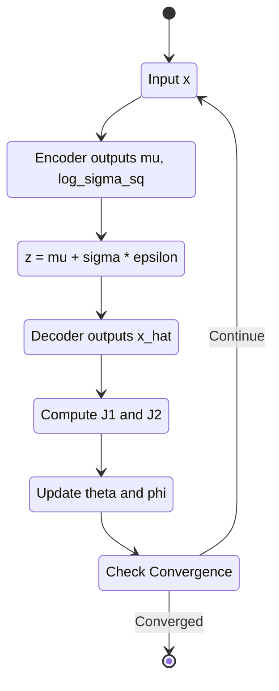
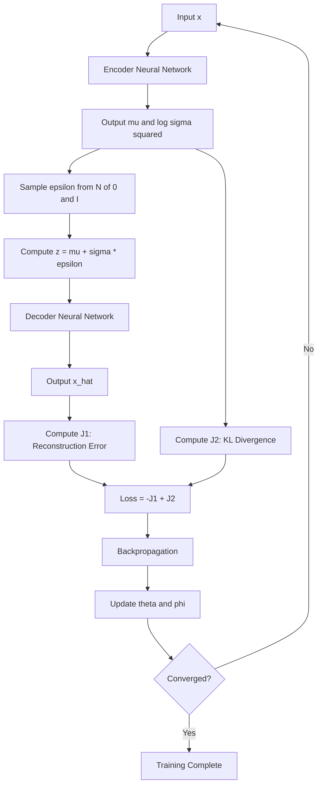
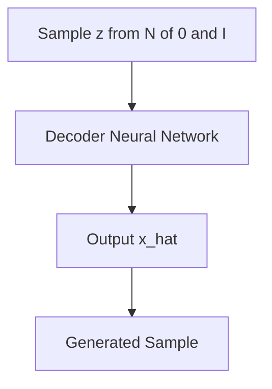

# VAE (Variational Autoencoder)

## Prior Distribution of Latent Variables

In VAE, we assume that the latent variable $$\boldsymbol{z}$$ is generated from a standard normal distribution.

$$
p(\boldsymbol{z}) = \mathcal{N}(\boldsymbol{z}; \boldsymbol{0}, \boldsymbol{I})
$$

Setting the prior distribution to a standard normal distribution has several advantages: sampling is straightforward, no parameters need to be prepared, and the KL divergence in the loss function (explained later) can be solved analytically. There are also reported examples[^1] where the approximate distribution of the prior is modeled with a neural network.

## Formulation of the Generative Model

The goal of VAE is to model the distribution of observed data $$p(\boldsymbol{x})$$.
However, the output of a neural network is a vector and is obtained deterministically. This means we cannot directly output a probability density function. Therefore, we define the likelihood as a normal distribution with the decoder output $$\hat{\boldsymbol{x}}$$ as the mean.

$$
\hat{\boldsymbol{x}} = \text{NeuralNet}(\boldsymbol{z}; \boldsymbol{\theta})
$$

$$
p_{\boldsymbol{\theta}}(\boldsymbol{x}\mid\boldsymbol{z}) = \mathcal{N}(\boldsymbol{x}; \hat{\boldsymbol{x}}, \boldsymbol{I})
$$

This allows the decoder to define the probability density of generating $$\boldsymbol{x}$$ given the latent variable $$\boldsymbol{z}$$.

## EM Algorithm

When trying to apply the EM algorithm to VAE, we need to compute the posterior distribution $$p_{\boldsymbol{\theta}}(\boldsymbol{z}\mid\boldsymbol{x})$$ in the E-step. From Bayes' theorem,

$$
p_{\boldsymbol{\theta}}(\boldsymbol{z}\mid\boldsymbol{x}) = \frac{p_{\boldsymbol{\theta}}(\boldsymbol{x}\mid\boldsymbol{z}) p(\boldsymbol{z})}{p_{\boldsymbol{\theta}}(\boldsymbol{x})}
$$

Here, the marginal likelihood $$p_{\boldsymbol{\theta}}(\boldsymbol{x})$$ can be written as the marginalization over the latent variable:

$$
p_{\boldsymbol{\theta}}(\boldsymbol{x}) = \int p_{\boldsymbol{\theta}}(\boldsymbol{x}\mid\boldsymbol{z}) p(\boldsymbol{z}) d\boldsymbol{z}
$$

In the chapter on the EM algorithm, $$z$$ was a discrete value indicating which component of the Gaussian mixture to select, but now $$\boldsymbol{z}$$ is continuous and the integral spans the entire high-dimensional latent space. Furthermore, $$p_{\boldsymbol{\theta}}(\boldsymbol{x}\mid\boldsymbol{z})$$ is defined by a neural network, making it impossible to compute the integral analytically. Therefore, we cannot compute the posterior distribution $$p_{\boldsymbol{\theta}}(\boldsymbol{z}\mid\boldsymbol{x})$$, which means we cannot directly apply the EM algorithm that computes $$q^{new} = p_{\boldsymbol{\theta}}(\boldsymbol{z}\mid\boldsymbol{x})$$ to minimize the KL divergence.
Solving this problem is the theme of VAE.

## Derivation of the Loss Function

### Review of the EM Algorithm

We introduce an arbitrary distribution $$q(\boldsymbol{z})$$ and transform the log-likelihood. This is similar to the EM algorithm.

$$
\log p_{\boldsymbol{\theta}}(\boldsymbol{x}) = \log \int p_{\boldsymbol{\theta}}(\boldsymbol{x}, \boldsymbol{z}) d\boldsymbol{z}
$$

$$
\log p_{\boldsymbol{\theta}}(\boldsymbol{x}) = \log \int q(\boldsymbol{z}) \frac{p_{\boldsymbol{\theta}}(\boldsymbol{x}, \boldsymbol{z})}{q(\boldsymbol{z})}  d\boldsymbol{z}
$$

From Jensen's inequality,

$$
\log p_{\boldsymbol{\theta}}(\boldsymbol{x}) \geq \int q(\boldsymbol{z}) \log \frac{p_{\boldsymbol{\theta}}(\boldsymbol{x}, \boldsymbol{z})}{q(\boldsymbol{z})}  d\boldsymbol{z}
$$

This lower bound is the ELBO.

$$
\mathcal{L}(\boldsymbol{\theta}, q) = \mathbb{E}_{q(\boldsymbol{z})} \left[ \log \frac{p_{\boldsymbol{\theta}}(\boldsymbol{x}, \boldsymbol{z})}{q(\boldsymbol{z})} \right]
$$

When we explicitly show the relationship between the log-likelihood and ELBO, the KL divergence term appears. Decomposing the joint distribution as $$p_{\boldsymbol{\theta}}(\boldsymbol{x}, \boldsymbol{z}) = p_{\boldsymbol{\theta}}(\boldsymbol{x}\mid\boldsymbol{z}) p(\boldsymbol{z})$$,

$$
\log p_{\boldsymbol{\theta}}(\boldsymbol{x}) = \mathcal{L}(\boldsymbol{\theta}, q) + D_{\text{KL}}(q(\boldsymbol{z}) \mid p_{\boldsymbol{\theta}}(\boldsymbol{z}\mid\boldsymbol{x}))
$$

Since the log-likelihood on the left side is a constant that doesn't depend on $$q$$, increasing the ELBO decreases the KL divergence, meaning $$q(\boldsymbol{z})$$ approaches the true posterior distribution $$p_{\boldsymbol{\theta}}(\boldsymbol{z}\mid\boldsymbol{x})$$. As mentioned earlier, the posterior distribution cannot be computed directly.

### Parametrization of the Variational Distribution

Since we cannot directly compute the true posterior distribution $$p_{\boldsymbol{\theta}}(\boldsymbol{z}\mid\boldsymbol{x})$$, we approximate $$q(\boldsymbol{z})$$ with a Gaussian distribution having parameters $$\boldsymbol{\psi}$$. Here, $$\boldsymbol{\psi} = (\boldsymbol{\mu}, \boldsymbol{\sigma})$$.

$$
q_{\boldsymbol{\psi}}(\boldsymbol{z}) = \mathcal{N}(\boldsymbol{z}; \boldsymbol{\mu}, \text{diag}(\boldsymbol{\sigma}^2))
$$

By choosing a Gaussian distribution, the KL divergence with the prior distribution $$p(\boldsymbol{z})$$ can be computed analytically, and gradient computation through sampling becomes possible via the Reparameterization Trick described later.

Rewriting the ELBO with $$q_{\boldsymbol{\psi}}(\boldsymbol{z})$$, we get the following. I'll write out the detailed derivation later.

$$\mathcal{L}(\boldsymbol{\theta}, \boldsymbol{\psi}) = \mathbb{E}_{q_{\boldsymbol{\psi}}(\boldsymbol{z})} \left[ \log p_{\boldsymbol{\theta}}(\boldsymbol{x}\mid\boldsymbol{z}) \right] - D_{\text{KL}}(q_{\boldsymbol{\psi}}(\boldsymbol{z}) \mid p(\boldsymbol{z}))$$

The first term represents the expected value of transforming $$\boldsymbol{z}$$ sampled from $$q_\psi(\boldsymbol{z})$$ into the observed data $$\boldsymbol{x}$$ through the decoder $$\log p_{\boldsymbol{\theta}}(\boldsymbol{x}\mid\boldsymbol{z})$$, and can be interpreted as reconstruction error. The second term becomes 0 when $$q_\psi(\boldsymbol{z})$$ matches the prior distribution (standard normal distribution in this case) $$p(\boldsymbol{z})$$, so it can be interpreted as a regularization term. In VAE training, we maximize this ELBO with respect to both $$\boldsymbol{\theta}$$ and $$\boldsymbol{\psi}$$ simultaneously. Unlike the EM algorithm, $$\boldsymbol{\theta}$$ and $$\boldsymbol{\psi}$$ are parameters of separate networks, so they can be optimized simultaneously via backpropagation.

{: .prompt-tips }
> - Variational calculus: A method for optimizing functionals by varying functions
> - Variational inference: An inference method that minimizes KL divergence by varying distributions
> - Variational distribution: A distribution introduced to approximate the true posterior distribution in variational inference

### Amortized Inference

In the formulation above, we need to optimize independent variational parameters $$\boldsymbol{\psi}^{(i)} = (\boldsymbol{\mu}^{(i)}, \boldsymbol{\sigma}^{(i)})$$ for each data point $$\boldsymbol{x}^{(i)}$$. If there are 100 million data points, we would need to prepare 100 million $$\boldsymbol{\psi}$$, which is inefficient. Therefore, in the VAE encoder, we replace the individual optimization for each data point with a single neural network.

$$
\boldsymbol{\mu}, \boldsymbol{\sigma} = \text{NeuralNet}(\boldsymbol{x}; \boldsymbol{\phi})
$$

$$
q_{\boldsymbol{\phi}}(\boldsymbol{z}\mid\boldsymbol{x}) = \mathcal{N}(\boldsymbol{z}; \boldsymbol{\mu}, \text{diag}(\boldsymbol{\sigma}^2))
$$

This technique is called Amortized Inference.
In accounting, depreciation refers to investing heavily upfront in equipment and then recovering that cost over an extended period.
Similarly, this method amortizes inference costs for new data points through the initial investment of training the encoder.
This enables VAE to train on large-scale datasets.

### Recalculating the ELBO

Let's rewrite the ELBO explicitly using the encoder $$q_{\boldsymbol{\phi}}(\boldsymbol{z}\mid\boldsymbol{x})$$, decoder $$p_{\boldsymbol{\theta}}(\boldsymbol{x}\mid\boldsymbol{z})$$, and prior distribution $$p(\boldsymbol{z})$$.
Note that:

- Encoder: $$q_{\boldsymbol{\phi}}(\boldsymbol{z}\mid\boldsymbol{x}) = \mathcal{N}(\boldsymbol{z}; \boldsymbol{\mu}_{\boldsymbol{\phi}}(\boldsymbol{x}), \text{diag}(\boldsymbol{\sigma}_{\boldsymbol{\phi}}^2(\boldsymbol{x})))$$
- Decoder: $$p_{\boldsymbol{\theta}}(\boldsymbol{x}\mid\boldsymbol{z}) = \mathcal{N}(\boldsymbol{x}; \boldsymbol{\mu}_{\boldsymbol{\theta}}(\boldsymbol{z}), \boldsymbol{I})$$
- Prior distribution: $$p(\boldsymbol{z}) = \mathcal{N}(\boldsymbol{z}; \boldsymbol{0}, \boldsymbol{I})$$

Starting from the log-likelihood:

$$
\log p_{\boldsymbol{\theta}}(\boldsymbol{x}) = \log \int p_{\boldsymbol{\theta}}(\boldsymbol{x}, \boldsymbol{z}) , d\boldsymbol{z}
$$

$$
\log p_{\boldsymbol{\theta}}(\boldsymbol{x}) = \log \int q_{\boldsymbol{\phi}}(\boldsymbol{z}\mid\boldsymbol{x}) \frac{p_{\boldsymbol{\theta}}(\boldsymbol{x}, \boldsymbol{z})}{q_{\boldsymbol{\phi}}(\boldsymbol{z}\mid\boldsymbol{x})} , d\boldsymbol{z}
$$

To separate the ELBO from both sides, we use the following identity:

$$\log p_{\boldsymbol{\theta}}(\boldsymbol{x}) = \mathbb{E}_{q_{\boldsymbol{\phi}}(\boldsymbol{z}\mid\boldsymbol{x})} \left[ \log p_{\boldsymbol{\theta}}(\boldsymbol{x}) \right]$$

$$= \mathbb{E}_{q_{\boldsymbol{\phi}}(\boldsymbol{z}\mid\boldsymbol{x})} \left[ \log \frac{p_{\boldsymbol{\theta}}(\boldsymbol{x}, \boldsymbol{z})}{p_{\boldsymbol{\theta}}(\boldsymbol{z}\mid\boldsymbol{x})} \right]
$$

$$= \mathbb{E}_{q_{\boldsymbol{\phi}}(\boldsymbol{z}\mid\boldsymbol{x})} \left[ \log \frac{p_{\boldsymbol{\theta}}(\boldsymbol{x}, \boldsymbol{z})}{q_{\boldsymbol{\phi}}(\boldsymbol{z}\mid\boldsymbol{x})} \cdot \frac{q_{\boldsymbol{\phi}}(\boldsymbol{z}\mid\boldsymbol{x})}{p_{\boldsymbol{\theta}}(\boldsymbol{z}\mid\boldsymbol{x})} \right]$$

$$= \mathbb{E}_{q_{\boldsymbol{\phi}}(\boldsymbol{z}\mid\boldsymbol{x})} \left[ \log \frac{p_{\boldsymbol{\theta}}(\boldsymbol{x}, \boldsymbol{z})}{q_{\boldsymbol{\phi}}(\boldsymbol{z}\mid\boldsymbol{x})} \right] + \mathbb{E}_{q_{\boldsymbol{\phi}}(\boldsymbol{z}\mid\boldsymbol{x})} \left[ \log \frac{q_{\boldsymbol{\phi}}(\boldsymbol{z}\mid\boldsymbol{x})}{p_{\boldsymbol{\theta}}(\boldsymbol{z}\mid\boldsymbol{x})} \right]$$

$$= \mathcal{L}(\boldsymbol{\theta}, \boldsymbol{\phi}; \boldsymbol{x}) + D_{\text{KL}}(q_{\boldsymbol{\phi}}(\boldsymbol{z}\mid\boldsymbol{x}) \mid p_{\boldsymbol{\theta}}(\boldsymbol{z}\mid\boldsymbol{x}))$$

Substituting $$p_{\boldsymbol{\theta}}(\boldsymbol{x}, \boldsymbol{z}) = p_{\boldsymbol{\theta}}(\boldsymbol{x}\mid\boldsymbol{z}) p(\boldsymbol{z})$$ into the ELBO and expanding further:

$$\mathcal{L}(\boldsymbol{\theta}, \boldsymbol{\phi}; \boldsymbol{x}) = \mathbb{E}_{q_{\boldsymbol{\phi}}(\boldsymbol{z}\mid\boldsymbol{x})} \left[ \log \frac{p_{\boldsymbol{\theta}}(\boldsymbol{x}\mid\boldsymbol{z}) p(\boldsymbol{z})}{q_{\boldsymbol{\phi}}(\boldsymbol{z}\mid\boldsymbol{x})} \right]$$

$$= \mathbb{E}_{q_{\boldsymbol{\phi}}(\boldsymbol{z}\mid\boldsymbol{x})} \left[ \log p_{\boldsymbol{\theta}}(\boldsymbol{x}\mid\boldsymbol{z}) \right] + \mathbb{E}_{q_{\boldsymbol{\phi}}(\boldsymbol{z}\mid\boldsymbol{x})} \left[ \log \frac{p(\boldsymbol{z})}{q_{\boldsymbol{\phi}}(\boldsymbol{z}\mid\boldsymbol{x})} \right]$$

$$= \mathbb{E}_{q_{\boldsymbol{\phi}}(\boldsymbol{z}\mid\boldsymbol{x})} \left[ \log p_{\boldsymbol{\theta}}(\boldsymbol{x}\mid\boldsymbol{z}) \right] - D_{\text{KL}}(q_{\boldsymbol{\phi}}(\boldsymbol{z}\mid\boldsymbol{x}) \mid p(\boldsymbol{z}))$$

The ELBO has been decomposed into two terms: reconstruction error and KL divergence.

$$\mathcal{L}(\boldsymbol{\theta}, \boldsymbol{\phi}; \boldsymbol{x}) = \underbrace{\mathbb{E}_{q_{\boldsymbol{\phi}}(\boldsymbol{z}\mid\boldsymbol{x})} \left[ \log p_{\boldsymbol{\theta}}(\boldsymbol{x}\mid\boldsymbol{z}) \right]}_{\text{Reconstruction Error: }J_1} - \underbrace{D_{\text{KL}}(q_{\boldsymbol{\phi}}(\boldsymbol{z}\mid\boldsymbol{x}) \mid p(\boldsymbol{z}))}_{\text{Regularization Term:}J_2}$$

It is shown in the book that both $$J_1$$ and $$J_2$$ can be solved analytically.

## Reparameterization Trick

In training the model, we need to compute the gradient with respect to $$\boldsymbol{\phi}$$ to calculate the gradient of the ELBO.

$$\nabla_{\boldsymbol{\phi}} \mathbb{E}_{q_{\boldsymbol{\phi}}(\boldsymbol{z}\mid\boldsymbol{x})} \left[ \log p_{\boldsymbol{\theta}}(\boldsymbol{x}\mid\boldsymbol{z}) \right]$$

However, the sampling operation $$\boldsymbol{z} \sim q_{\boldsymbol{\phi}}(\boldsymbol{z}\mid\boldsymbol{x})$$ is not differentiable. Because this operation makes the distribution $$q_{\boldsymbol{\phi}}(\boldsymbol{z}\mid\boldsymbol{x})$$ of the expectation itself depend on the parameters $$\boldsymbol{\phi}$$, we cannot compute the gradient.

$$\nabla_{\boldsymbol{\phi}} \mathbb{E}_{q_{\boldsymbol{\phi}}(\boldsymbol{z}\mid\boldsymbol{x})} [f(\boldsymbol{z})] \neq \mathbb{E}_{q_{\boldsymbol{\phi}}(\boldsymbol{z}\mid\boldsymbol{x})} [\nabla_{\boldsymbol{\phi}} f(\boldsymbol{z})]$$

To address this, the Reparameterization Trick was devised to replace the expectation with sampling from a different variable.

Instead of sampling $$\boldsymbol{z}$$ directly from $$q_{\boldsymbol{\phi}}(\boldsymbol{z}\mid\boldsymbol{x})$$, we compute $$\boldsymbol{z}$$ deterministically using $$\boldsymbol{\epsilon}$$ sampled from a parameter-independent distribution. $$\odot$$ denotes the Hadamard product.

$$\boldsymbol{\epsilon} \sim \mathcal{N}(\boldsymbol{0}, \boldsymbol{I})$$

$$\boldsymbol{z} = \boldsymbol{\mu} + \boldsymbol{\sigma} \odot \boldsymbol{\epsilon}$$

Written component-wise:

$$z_k = \mu_k + \sigma_k \cdot \epsilon_k, \quad k = 1, \ldots, K$$

Through this transformation, the randomness is concentrated in the sampling of $$\boldsymbol{\epsilon}$$, and $$\boldsymbol{z}$$ becomes a deterministic function of $$\boldsymbol{\mu}$$, $$\boldsymbol{\sigma}$$, and $$\boldsymbol{\epsilon}$$. Denoting the $$\boldsymbol{z}$$ computed using the sampled $$\boldsymbol{\epsilon}$$ as $$g_{\boldsymbol{\phi}}(\boldsymbol{\epsilon}, \boldsymbol{x})$$:

$$\boldsymbol{z} = g_{\boldsymbol{\phi}}(\boldsymbol{\epsilon}, \boldsymbol{x}) = \boldsymbol{\mu}_{\boldsymbol{\phi}}(\boldsymbol{x}) + \boldsymbol{\sigma}_{\boldsymbol{\phi}}(\boldsymbol{x}) \odot \boldsymbol{\epsilon}$$

Rewriting the expectation calculation:

$$\mathbb{E}_{q_{\boldsymbol{\phi}}(\boldsymbol{z}\mid\boldsymbol{x})} [f(\boldsymbol{z})] = \mathbb{E}_{\boldsymbol{\epsilon} \sim \mathcal{N}(\boldsymbol{0}, \boldsymbol{I})} [f(g_{\boldsymbol{\phi}}(\boldsymbol{\epsilon}, \boldsymbol{x}))]$$

Since the expectation on the right side is with respect to a distribution that doesn't depend on $$\boldsymbol{\phi}$$ (the distribution that $$\boldsymbol{\epsilon}$$ follows), we can now interchange the order of the gradient and expectation. This allows us to compute the gradient with respect to $$\boldsymbol{\phi}$$.

$$\nabla_{\boldsymbol{\phi}} \mathbb{E}_{\boldsymbol{\epsilon} \sim \mathcal{N}(\boldsymbol{0}, \boldsymbol{I})} [f(g_{\boldsymbol{\phi}}(\boldsymbol{\epsilon}, \boldsymbol{x}))] = \mathbb{E}_{\boldsymbol{\epsilon} \sim \mathcal{N}(\boldsymbol{0}, \boldsymbol{I})} [\nabla_{\boldsymbol{\phi}} f(g_{\boldsymbol{\phi}}(\boldsymbol{\epsilon}, \boldsymbol{x}))]$$

The implementation is available in the [deep-learning-from-scratch-5 repository](https://github.com/oreilly-japan/deep-learning-from-scratch-5), so I'll omit it here.

## Overall VAE Flow
I had AI generate a mermaid flow diagram from the explanation above.

### Training

### Generation

## Reference
[^1]: Tomczak, Jakub, and Max Welling. "VAE with a VampPrior." _International conference on artificial intelligence and statistics_. PMLR, 2018.
