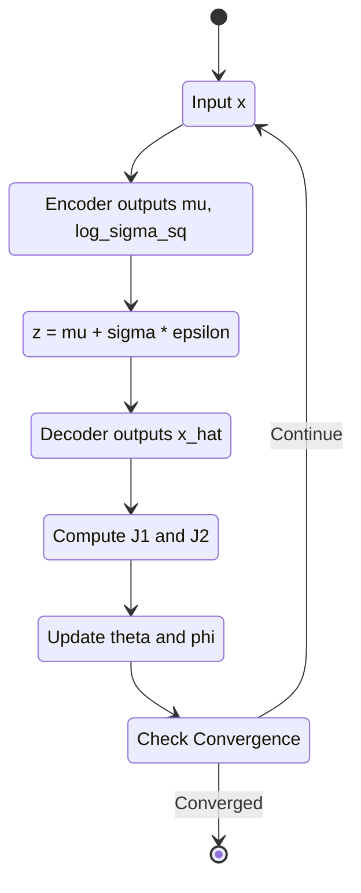
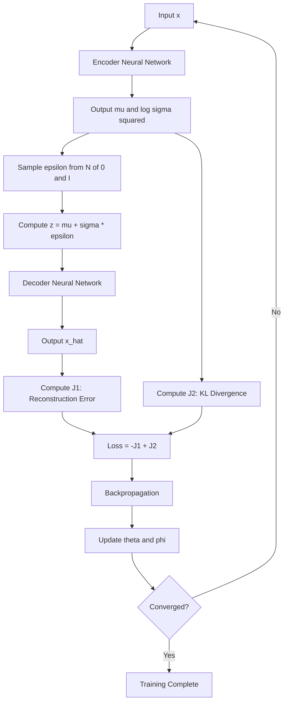
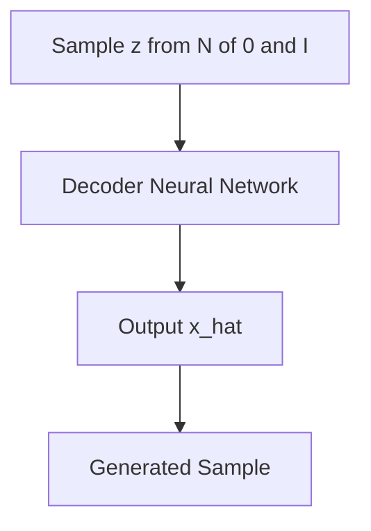

# VAE（Variational Autoencoder）

## 潜在変数の事前分布

VAEでは、潜在変数 $$\boldsymbol{z}$$ が標準正規分布から生成されると仮定します。

$$
p(\boldsymbol{z}) = \mathcal{N}(\boldsymbol{z}; \boldsymbol{0}, \boldsymbol{I})
$$

事前分布を標準正規分布に設定することで、サンプリングが簡単、パラメータを用意する必要がない、後に説明する損失関数でのKLダイバージェンスを解析的に解くことができる等のメリットがあります。事前分布の近似分布をニューラルネットワークでモデル化した例[^1]も報告されています。

## 生成モデルの定式化

VAEの目標は観測データの分布 $$p(\boldsymbol{x})$$ をモデル化することです。
しかし、ニューラルネットワークの出力はベクトルであり、determinisitcに得られます。このままでは確率密度関数を直接出力することはできません。そこで、デコーダの出力 $$\hat{\boldsymbol{x}}$$ を平均とする正規分布として尤度を定義します。

$$
\hat{\boldsymbol{x}} = \text{NeuralNet}(\boldsymbol{z}; \boldsymbol{\theta})
$$

$$
p_{\boldsymbol{\theta}}(\boldsymbol{x}\mid\boldsymbol{z}) = \mathcal{N}(\boldsymbol{x}; \hat{\boldsymbol{x}}, \boldsymbol{I})
$$

これにより、デコーダは潜在変数$$\boldsymbol{z}$$ が与えられたときに $$\boldsymbol{x}$$ が生成される確率密度を定義できるようになりました。

## EMアルゴリズム

EMアルゴリズムをVAEに適用しようとすると、E-stepで事後分布 $$p_{\boldsymbol{\theta}}(\boldsymbol{z}\mid\boldsymbol{x})$$ を計算する必要があります。ベイズの定理より、

$$
p_{\boldsymbol{\theta}}(\boldsymbol{z}\mid\boldsymbol{x}) = \frac{p_{\boldsymbol{\theta}}(\boldsymbol{x}\mid\boldsymbol{z}) p(\boldsymbol{z})}{p_{\boldsymbol{\theta}}(\boldsymbol{x})}
$$

ここで、周辺尤度 $$p_{\boldsymbol{\theta}}(\boldsymbol{x})$$ は、潜在変数の周辺化として以下のように書けます。

$$
p_{\boldsymbol{\theta}}(\boldsymbol{x}) = \int p_{\boldsymbol{\theta}}(\boldsymbol{x}\mid\boldsymbol{z}) p(\boldsymbol{z}) d\boldsymbol{z}
$$

EMアルゴリズムの章では、$$z$$ は混合ガウス分布のどの成分を選択するかという離散な値でしたが、今回の$$\boldsymbol{z}$$ 連続であり、かつ高次元の潜在空間全体にわたる積分になっています。さらに、$$p_{\boldsymbol{\theta}}(\boldsymbol{x}\mid\boldsymbol{z})$$ はニューラルネットワークで定義されており、解析的に積分を計算することができません。したがって、事後分布$$p_{\boldsymbol{\theta}}(\boldsymbol{z}\mid\boldsymbol{x})$$ を計算できないという事になり、$$q^{new} = p_{\boldsymbol{\theta}}(\boldsymbol{z}\mid\boldsymbol{x})$$ を計算してKLダイバージェンスを最小化するEMアルゴリズムをそのまま適用することはできません。
この問題を解決するのがVAEのテーマです。

## 損失関数の導出

### EMアルゴリズムの復習

任意の分布 $$q(\boldsymbol{z})$$ を導入し、対数尤度を変形します。EMアルゴリズムのときと同様です。

$$
\log p_{\boldsymbol{\theta}}(\boldsymbol{x}) = \log \int p_{\boldsymbol{\theta}}(\boldsymbol{x}, \boldsymbol{z}) d\boldsymbol{z}
$$

$$
\log p_{\boldsymbol{\theta}}(\boldsymbol{x}) = \log \int q(\boldsymbol{z}) \frac{p_{\boldsymbol{\theta}}(\boldsymbol{x}, \boldsymbol{z})}{q(\boldsymbol{z})}  d\boldsymbol{z}
$$

Jensenの不等式から、

$$
\log p_{\boldsymbol{\theta}}(\boldsymbol{x}) \geq \int q(\boldsymbol{z}) \log \frac{p_{\boldsymbol{\theta}}(\boldsymbol{x}, \boldsymbol{z})}{q(\boldsymbol{z})}  d\boldsymbol{z}
$$

この下界がELBOでした。

$$
\mathcal{L}(\boldsymbol{\theta}, q) = \mathbb{E}_{q(\boldsymbol{z})} \left[ \log \frac{p_{\boldsymbol{\theta}}(\boldsymbol{x}, \boldsymbol{z})}{q(\boldsymbol{z})} \right]
$$

対数尤度とELBOの関係を明示的に示すと、KLダイバージェンス項が出てきます。同時分布を $$p_{\boldsymbol{\theta}}(\boldsymbol{x}, \boldsymbol{z}) = p_{\boldsymbol{\theta}}(\boldsymbol{x}\mid\boldsymbol{z}) p(\boldsymbol{z})$$ と分解すると、

$$
\log p_{\boldsymbol{\theta}}(\boldsymbol{x}) = \mathcal{L}(\boldsymbol{\theta}, q) + D_{\text{KL}}(q(\boldsymbol{z}) \mid p_{\boldsymbol{\theta}}(\boldsymbol{z}\mid\boldsymbol{x}))
$$

左辺の対数尤度は $$q$$ に依存しない定数なので、ELBOを大きくするほどKLダイバージェンスは小さくなり、つまり $$q(\boldsymbol{z})$$ が真の事後分布 $$p_{\boldsymbol{\theta}}(\boldsymbol{z}\mid\boldsymbol{x})$$ に近づくことになります。先に述べた通り、このままでは事後分布が計算できません。

### 変分分布のParametrization

真の事後分布 $$p_{\boldsymbol{\theta}}(\boldsymbol{z}\mid\boldsymbol{x})$$ を直接計算できないため、$$q(\boldsymbol{z})$$ をパラメータ $$\boldsymbol{\psi}$$ を持つガウス分布で近似します。ここで、 $$\boldsymbol{\psi} = (\boldsymbol{\mu}, \boldsymbol{\sigma})$$ です。

$$
q_{\boldsymbol{\psi}}(\boldsymbol{z}) = \mathcal{N}(\boldsymbol{z}; \boldsymbol{\mu}, \text{diag}(\boldsymbol{\sigma}^2))
$$

ガウス分布を選ぶことで、事前分布 $$p(\boldsymbol{z})$$ とのKLダイバージェンスが解析的に計算でき、後述のReparameterization Trickにより、サンプリングを通じた勾配計算が可能になります。

ELBOを $$q_{\boldsymbol{\psi}}(\boldsymbol{z})$$ で書き直すと、以下のようになります。後で真面目に途中式を書きます。

$$\mathcal{L}(\boldsymbol{\theta}, \boldsymbol{\psi}) = \mathbb{E}_{q_{\boldsymbol{\psi}}(\boldsymbol{z})} \left[ \log p_{\boldsymbol{\theta}}(\boldsymbol{x}\mid\boldsymbol{z}) \right] - D_{\text{KL}}(q_{\boldsymbol{\psi}}(\boldsymbol{z}) \mid p(\boldsymbol{z}))$$

第1項は、$$q_\psi(\boldsymbol{z})$$ からサンプリングした $$\boldsymbol{z}$$ をデコーダ $$\log p_{\boldsymbol{\theta}}(\boldsymbol{x}\mid\boldsymbol{z})$$ で観測データ$$\boldsymbol{x}$$に変換できる期待値を表しているため、再構成誤差として解釈できます。第2項は、$$q_\psi(\boldsymbol{z})$$ が、事前分布（今回の場合は標準正規分布）$$p(\boldsymbol{z})$$ と一致するときに 0 になるため、正則化項として解釈できます。VAEの学習では、このELBOを $$\boldsymbol{\theta}$$ と $$\boldsymbol{\psi}$$ について同時に最大化します。EMアルゴリズムとは異なり、 $$\boldsymbol{\theta}$$ と $$\boldsymbol{\psi}$$ はそれぞれ別のネットワークのパラメータであるため、誤差逆伝播法で同時に最適化できます。

{: .prompt-tips }
> - 変分法: 関数を動かして汎関数を最適化する手法
> - 変分推論: 分布を動かしてKLダイバージェンスを最小化する推論手法
> - 変分分布: 変分推論において、真の事後分布を近似するために導入する分布

### Amortized Inference

上記の定式化では、データ点 $$\boldsymbol{x}^{(i)}$$ ごとに独立した変分パラメータ $$\boldsymbol{\psi}^{(i)} = (\boldsymbol{\mu}^{(i)}, \boldsymbol{\sigma}^{(i)})$$ を最適化する必要があります。もしデータ点が 1億個あれば、1億個の $$\boldsymbol{\psi}$$ を用意することになり、非効率です。そこで、VAE
のエンコーダでは、各データ点に対する個別の最適化を単一のニューラルネットワークで置き換えます。

$$
\boldsymbol{\mu}, \boldsymbol{\sigma} = \text{NeuralNet}(\boldsymbol{x}; \boldsymbol{\phi})
$$

$$
q_{\boldsymbol{\phi}}(\boldsymbol{z}\mid\boldsymbol{x}) = \mathcal{N}(\boldsymbol{z}; \boldsymbol{\mu}, \text{diag}(\boldsymbol{\sigma}^2))
$$

このような手法を、Amortized Inference（償却推論）と呼びます。
会計用語の減価償却は、設備投資など初期に大きなコストをかけて設備を導入し、その費用を長期間にわたって分割して回収することを指します。
同様に、この手法ではエンコーダの学習という初期投資を行うことで、新しいデータ点に対する推論コストを償却することから Amortized Inference と言われています。
これにより、VAEは大規模データセットでも学習が可能です。

### ELBOの再計算

エンコーダ $$q_{\boldsymbol{\phi}}(\boldsymbol{z}\mid\boldsymbol{x})$$ 、デコーダ $$p_{\boldsymbol{\theta}}(\boldsymbol{x}\mid\boldsymbol{z})$$、事前分布 $$p(\boldsymbol{z})$$ を明示的に用いて、ELBOを書き直してみます。
ただし、

- エンコーダ: $$q_{\boldsymbol{\phi}}(\boldsymbol{z}\mid\boldsymbol{x}) = \mathcal{N}(\boldsymbol{z}; \boldsymbol{\mu}_{\boldsymbol{\phi}}(\boldsymbol{x}), \text{diag}(\boldsymbol{\sigma}_{\boldsymbol{\phi}}^2(\boldsymbol{x})))$$
- デコーダ: $$p_{\boldsymbol{\theta}}(\boldsymbol{x}\mid\boldsymbol{z}) = \mathcal{N}(\boldsymbol{x}; \boldsymbol{\mu}_{\boldsymbol{\theta}}(\boldsymbol{z}), \boldsymbol{I})$$
- 事前分布: $$p(\boldsymbol{z}) = \mathcal{N}(\boldsymbol{z}; \boldsymbol{0}, \boldsymbol{I})$$

です。対数尤度から始めます。

$$
\log p_{\boldsymbol{\theta}}(\boldsymbol{x}) = \log \int p_{\boldsymbol{\theta}}(\boldsymbol{x}, \boldsymbol{z}) , d\boldsymbol{z}
$$

$$
\log p_{\boldsymbol{\theta}}(\boldsymbol{x}) = \log \int q_{\boldsymbol{\phi}}(\boldsymbol{z}\mid\boldsymbol{x}) \frac{p_{\boldsymbol{\theta}}(\boldsymbol{x}, \boldsymbol{z})}{q_{\boldsymbol{\phi}}(\boldsymbol{z}\mid\boldsymbol{x})} , d\boldsymbol{z}
$$

両辺から ELBO を分離するため、以下の恒等式を用います。

$$\log p_{\boldsymbol{\theta}}(\boldsymbol{x}) = \mathbb{E}_{q_{\boldsymbol{\phi}}(\boldsymbol{z}\mid\boldsymbol{x})} \left[ \log p_{\boldsymbol{\theta}}(\boldsymbol{x}) \right]$$

$$= \mathbb{E}_{q_{\boldsymbol{\phi}}(\boldsymbol{z}\mid\boldsymbol{x})} \left[ \log \frac{p_{\boldsymbol{\theta}}(\boldsymbol{x}, \boldsymbol{z})}{p_{\boldsymbol{\theta}}(\boldsymbol{z}\mid\boldsymbol{x})} \right] 
$$

$$= \mathbb{E}_{q_{\boldsymbol{\phi}}(\boldsymbol{z}\mid\boldsymbol{x})} \left[ \log \frac{p_{\boldsymbol{\theta}}(\boldsymbol{x}, \boldsymbol{z})}{q_{\boldsymbol{\phi}}(\boldsymbol{z}\mid\boldsymbol{x})} \cdot \frac{q_{\boldsymbol{\phi}}(\boldsymbol{z}\mid\boldsymbol{x})}{p_{\boldsymbol{\theta}}(\boldsymbol{z}\mid\boldsymbol{x})} \right]$$

$$= \mathbb{E}_{q_{\boldsymbol{\phi}}(\boldsymbol{z}\mid\boldsymbol{x})} \left[ \log \frac{p_{\boldsymbol{\theta}}(\boldsymbol{x}, \boldsymbol{z})}{q_{\boldsymbol{\phi}}(\boldsymbol{z}\mid\boldsymbol{x})} \right] + \mathbb{E}_{q_{\boldsymbol{\phi}}(\boldsymbol{z}\mid\boldsymbol{x})} \left[ \log \frac{q_{\boldsymbol{\phi}}(\boldsymbol{z}\mid\boldsymbol{x})}{p_{\boldsymbol{\theta}}(\boldsymbol{z}\mid\boldsymbol{x})} \right]$$

$$= \mathcal{L}(\boldsymbol{\theta}, \boldsymbol{\phi}; \boldsymbol{x}) + D_{\text{KL}}(q_{\boldsymbol{\phi}}(\boldsymbol{z}\mid\boldsymbol{x}) \mid p_{\boldsymbol{\theta}}(\boldsymbol{z}\mid\boldsymbol{x}))$$

ELBO について、$$p_{\boldsymbol{\theta}}(\boldsymbol{x}, \boldsymbol{z}) = p_{\boldsymbol{\theta}}(\boldsymbol{x}\mid\boldsymbol{z}) p(\boldsymbol{z})$$ を代入してさらに展開します。

$$\mathcal{L}(\boldsymbol{\theta}, \boldsymbol{\phi}; \boldsymbol{x}) = \mathbb{E}_{q_{\boldsymbol{\phi}}(\boldsymbol{z}\mid\boldsymbol{x})} \left[ \log \frac{p_{\boldsymbol{\theta}}(\boldsymbol{x}\mid\boldsymbol{z}) p(\boldsymbol{z})}{q_{\boldsymbol{\phi}}(\boldsymbol{z}\mid\boldsymbol{x})} \right]$$

$$= \mathbb{E}_{q_{\boldsymbol{\phi}}(\boldsymbol{z}\mid\boldsymbol{x})} \left[ \log p_{\boldsymbol{\theta}}(\boldsymbol{x}\mid\boldsymbol{z}) \right] + \mathbb{E}_{q_{\boldsymbol{\phi}}(\boldsymbol{z}\mid\boldsymbol{x})} \left[ \log \frac{p(\boldsymbol{z})}{q_{\boldsymbol{\phi}}(\boldsymbol{z}\mid\boldsymbol{x})} \right]$$

$$= \mathbb{E}_{q_{\boldsymbol{\phi}}(\boldsymbol{z}\mid\boldsymbol{x})} \left[ \log p_{\boldsymbol{\theta}}(\boldsymbol{x}\mid\boldsymbol{z}) \right] - D_{\text{KL}}(q_{\boldsymbol{\phi}}(\boldsymbol{z}\mid\boldsymbol{x}) \mid p(\boldsymbol{z}))$$

以下のように、ELBO が再構成誤差とKLダイバージェンスの2つの項に分解されました。

$$\mathcal{L}(\boldsymbol{\theta}, \boldsymbol{\phi}; \boldsymbol{x}) = \underbrace{\mathbb{E}_{q_{\boldsymbol{\phi}}(\boldsymbol{z}\mid\boldsymbol{x})} \left[ \log p_{\boldsymbol{\theta}}(\boldsymbol{x}\mid\boldsymbol{z}) \right]}_{\text{再構成誤差: }J_1} - \underbrace{D_{\text{KL}}(q_{\boldsymbol{\phi}}(\boldsymbol{z}\mid\boldsymbol{x}) \mid p(\boldsymbol{z}))}_{\text{正則化項:}J_2}$$

これらの $$J_1$$、$$J_2$$ が解析的に解けることが、本の中で示されています。

## Reparameterization Trick

モデルの訓練において、ELBOの勾配を計算するために $$\boldsymbol{\phi}$$ に関する勾配を求める必要があります。

$$\nabla_{\boldsymbol{\phi}} \mathbb{E}_{q_{\boldsymbol{\phi}}(\boldsymbol{z}\mid\boldsymbol{x})} \left[ \log p_{\boldsymbol{\theta}}(\boldsymbol{x}\mid\boldsymbol{z}) \right]$$

しかし、サンプリング操作 $$\boldsymbol{z} \sim q_{\boldsymbol{\phi}}(\boldsymbol{z}\mid\boldsymbol{x})$$ は微分不可能です。この操作のせいで、期待値の分布 $$q_{\boldsymbol{\phi}}(\boldsymbol{z}\mid\boldsymbol{x})$$ 自体がパラメータ $$\boldsymbol{\phi}$$ に依存しているため、勾配を計算することができません。

$$\nabla_{\boldsymbol{\phi}} \mathbb{E}_{q_{\boldsymbol{\phi}}(\boldsymbol{z}\mid\boldsymbol{x})} [f(\boldsymbol{z})] \neq \mathbb{E}_{q_{\boldsymbol{\phi}}(\boldsymbol{z}\mid\boldsymbol{x})} [\nabla_{\boldsymbol{\phi}} f(\boldsymbol{z})]$$

そこで、期待値を別の変数のサンプリングに置き換える Reparametrization Trick が考案されました。

$$\boldsymbol{z}$$ を直接 $$q_{\boldsymbol{\phi}}(\boldsymbol{z}\mid\boldsymbol{x})$$ からサンプリングする代わりに、パラメータに依存しない分布からサンプリングした $$\boldsymbol{\epsilon}$$ を用いて $$\boldsymbol{z}$$ を決定論的に計算します。$$\odot$$ はアダマール積です。

$$\boldsymbol{\epsilon} \sim \mathcal{N}(\boldsymbol{0}, \boldsymbol{I})$$

$$\boldsymbol{z} = \boldsymbol{\mu} + \boldsymbol{\sigma} \odot \boldsymbol{\epsilon}$$

成分ごとに書くと、

$$z_k = \mu_k + \sigma_k \cdot \epsilon_k, \quad k = 1, \ldots, K$$

この変換により、確率性は $$\boldsymbol{\epsilon}$$ のサンプリングに集約され、$$\boldsymbol{z}$$ は $$\boldsymbol{\mu}$$、$$\boldsymbol{\sigma}$$、$$\boldsymbol{\epsilon}$$ の決定論的な関数になります。サンプリングによって得た $$\boldsymbol{\epsilon}$$ を使って計算する $$\boldsymbol{z}$$ を $$g_{\boldsymbol{\phi}}(\boldsymbol{\epsilon}, \boldsymbol{x})$$ とすると、

$$\boldsymbol{z} = g_{\boldsymbol{\phi}}(\boldsymbol{\epsilon}, \boldsymbol{x}) = \boldsymbol{\mu}_{\boldsymbol{\phi}}(\boldsymbol{x}) + \boldsymbol{\sigma}_{\boldsymbol{\phi}}(\boldsymbol{x}) \odot \boldsymbol{\epsilon}$$

期待値の計算を書き換えると、

$$\mathbb{E}_{q_{\boldsymbol{\phi}}(\boldsymbol{z}\mid\boldsymbol{x})} [f(\boldsymbol{z})] = \mathbb{E}_{\boldsymbol{\epsilon} \sim \mathcal{N}(\boldsymbol{0}, \boldsymbol{I})} [f(g_{\boldsymbol{\phi}}(\boldsymbol{\epsilon}, \boldsymbol{x}))]$$

右辺の期待値は $$\boldsymbol{\phi}$$ に依存しない、$$\boldsymbol{\epsilon}$$ が從う分布に関するものであるため、勾配と期待値の順序を交換できるようになりました。これにより、$$\boldsymbol{\phi}$$ に関する勾配が計算可能になります。

$$\nabla_{\boldsymbol{\phi}} \mathbb{E}_{\boldsymbol{\epsilon} \sim \mathcal{N}(\boldsymbol{0}, \boldsymbol{I})} [f(g_{\boldsymbol{\phi}}(\boldsymbol{\epsilon}, \boldsymbol{x}))] = \mathbb{E}_{\boldsymbol{\epsilon} \sim \mathcal{N}(\boldsymbol{0}, \boldsymbol{I})} [\nabla_{\boldsymbol{\phi}} f(g_{\boldsymbol{\phi}}(\boldsymbol{\epsilon}, \boldsymbol{x}))]$$

実装は [deep-learning-from-scratch-5のリポジトリ](https://github.com/oreilly-japan/deep-learning-from-scratch-5)にあるので割愛します。

## VAE全体のフロー
えーあいに上記の説明からmermaidのフロー図を生成してもらいました。

### 学習

### 生成

## Reference
[^1]: Tomczak, Jakub, and Max Welling. "VAE with a VampPrior." _International conference on artificial intelligence and statistics_. PMLR, 2018.
