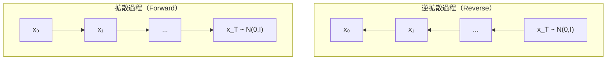

# 拡散モデル

## VAEの復習

前回の記事で、VAE（Variational Autoencoder）について解説しました。VAEでは、EMアルゴリズムと同様に観測データ $$\boldsymbol{x}$$ と潜在変数 $$\boldsymbol{z}$$ の関係をモデル化しましたが、連続な $$\boldsymbol{z}$$ に対して事後分布 $$p(\boldsymbol{z}\mid\boldsymbol{x})$$ が計算できないため、エンコーダ $$q_{\boldsymbol{\phi}}(\boldsymbol{z}\mid\boldsymbol{x})$$ を導入したELBOを使って損失関数を設計しました。

$$ \mathcal{L}(\boldsymbol{\theta}, \boldsymbol{\phi}; \boldsymbol{x}) = \mathbb{E}_{q_{\boldsymbol{\phi}}(\boldsymbol{z}\mid\boldsymbol{x})} \left[ \log p_{\boldsymbol{\theta}}(\boldsymbol{x}\mid\boldsymbol{z}) \right] - D_{\text{KL}}(q_{\boldsymbol{\phi}}(\boldsymbol{z}\mid\boldsymbol{x}) || p(\boldsymbol{z})) $$

- $$q_{\boldsymbol{\phi}}(\boldsymbol{z}\mid\boldsymbol{x})$$：エンコーダ（変分分布）
- $$p_{\boldsymbol{\theta}}(\boldsymbol{x}\mid\boldsymbol{z})$$：デコーダ（生成モデル）
- $$p(\boldsymbol{z})$$：事前分布（標準正規分布）

## 階層型VAE（Hierarchical VAE）

1段階のVAEを拡張し、複数の潜在変数を階層的に導入した手法が報告されています[^1]。

例えば、2段階のVAEでは、潜在変数 $$\boldsymbol{z}_1$$ と $$\boldsymbol{z}_2$$ を導入し、以下のような構造を考えます。

$$ \boldsymbol{x} \rightarrow \boldsymbol{z}_1 \rightarrow \boldsymbol{z}_2 $$

生成過程は逆方向に進みます。

$$ \boldsymbol{z}_2 \rightarrow \boldsymbol{z}_1 \rightarrow \boldsymbol{x} $$

この階層的な構造により、より複雑なデータ分布を表現できるようになります。$$T$$ 段階に一般化すると、潜在変数の系列 $$\boldsymbol{z}_1, \boldsymbol{z}_2, \ldots, \boldsymbol{z}_T$$ を導入し、観測データから徐々に抽象的な表現へと変換していきます。ここは本の中でも詳しく説明されておらず、自分も詳しくないのでここで終わりです。

重要なのは、この階層型VAEに対して以下の制約を課すと、拡散モデルに拡張できるという点です。
- データ点と潜在変数の次元数を一致させる
- エンコーダはパラメータ化せず、固定されたガウスノイズを加えるだけにする

## 拡散モデルの原理

拡散モデルは、2つの確率過程から構成されます。

### 拡散過程 （Forward Process）

拡散過程は、観測データ $$\boldsymbol{x}_0$$ に徐々にノイズを加えていき、最終的に純粋なガウスノイズ $$\boldsymbol{x}_T$$ に変換する過程です。$$T$$が十分に大きければ、$$\boldsymbol{x}_T$$がガウス分布に近づくことが本の中で説明されています。拡散過程はノイズを追加するだけなので、パラメータは存在しません。

$$ \boldsymbol{x}_0 \xrightarrow{\text{ノイズ追加}} \boldsymbol{x}_1 \xrightarrow{\text{ノイズ追加}} \cdots \xrightarrow{\text{ノイズ追加}} \boldsymbol{x}_T \sim \mathcal{N}(\boldsymbol{0}, \boldsymbol{I}) $$

### 逆拡散過程 （Reverse Process）

逆拡散過程は、ノイズ $$\boldsymbol{x}_T$$ から徐々にノイズを除去していき、元のデータ分布に従うサンプル $$\boldsymbol{x}_0$$ を生成する過程です。この過程をニューラルネットワークでモデル化し、学習します。

$$ \boldsymbol{x}_T \xrightarrow{\text{ノイズ除去}} \boldsymbol{x}_{T-1} \xrightarrow{\text{ノイズ除去}} \cdots \xrightarrow{\text{ノイズ除去}} \boldsymbol{x}_0 $$

## 拡散過程の定式化

拡散過程では、各ステップで少量のガウスノイズを加えます。時刻 $$t-1$$ から時刻 $$t$$ への遷移は、以下の条件付き分布で定義されます。

$$ q(\boldsymbol{x}_t \mid \boldsymbol{x}_{t-1}) = \mathcal{N}(\boldsymbol{x}_t; \sqrt{1 - \beta_t} \boldsymbol{x}_{t-1}, \beta_t \boldsymbol{I}) $$

ここで、$$\beta_t \in (0, 1)$$ はノイズスケジュールと呼ばれるハイパーパラメータで、各ステップで加えるノイズの量を制御します。例えば $$\beta_t = 0.01$$ のように設定して、平均と分散に少量のノイズを加えます。

- 平均：$$\sqrt{1 - \beta_t} \boldsymbol{x}_{t-1}$$（前ステップの値を少し縮小）
- 分散：$$\beta_t \boldsymbol{I}$$（少しノイズを追加）

サンプリングは以下のように行います。

$$ \boldsymbol{x}_t = \sqrt{1 - \beta_t} \boldsymbol{x}_{t-1} + \sqrt{\beta_t} \boldsymbol{\epsilon}_t, \quad \boldsymbol{\epsilon}_t \sim \mathcal{N}(\boldsymbol{0}, \boldsymbol{I}) $$

### 任意のtime stepのサンプリング

上記のようにノイズを追加する場合、$$\boldsymbol{x}_0$$ から任意のtime step $$t$$ の $$\boldsymbol{x}_t$$ を直接計算できます（本に途中式あり）。$$\alpha_t = 1 - \beta_t$$ および $$\bar{\alpha}_t = \prod_{s=1}^{t} \alpha_s$$ と定義すると、

$$ q(\boldsymbol{x}_t \mid \boldsymbol{x}_0) = \mathcal{N}(\boldsymbol{x}_t; \sqrt{\bar{\alpha}_t} \boldsymbol{x}_0, (1 - \bar{\alpha}_t) \boldsymbol{I}) $$

これにより、学習時に中間ステップを経由せず、任意の時刻のサンプルを効率的に生成できます。VAEの章で説明した Reparametrization Trick を使うと、以下のように書けます。

$$ \boldsymbol{x}_t = \sqrt{\bar{\alpha}_t} \boldsymbol{x}_0 + \sqrt{1 - \bar{\alpha}_t} \boldsymbol{\epsilon}, \quad \boldsymbol{\epsilon} \sim \mathcal{N}(\boldsymbol{0}, \boldsymbol{I}) $$

## 損失関数の導出：VAEからDiffusionへの拡張

### ELBOの計算

周辺尤度の計算には、すべての潜在変数 $$\boldsymbol{x}_{1:T} = (\boldsymbol{x}_1, \boldsymbol{x}_2, \ldots, \boldsymbol{x}_T)$$ について積分する必要があり、

$$ p_{\boldsymbol{\theta}}(\boldsymbol{x}_0) = \int p_{\boldsymbol{\theta}}(\boldsymbol{x}_{0:T}) d\boldsymbol{x}_{1:T} $$

この積分は解析的に計算できないので、VAEと同様にELBOの最大化を考えます。

---

VAEの章で、対数尤度は以下のように変換できました。

$$ \log p_{\boldsymbol{\theta}}(\boldsymbol{x}) = \mathcal{L}(\boldsymbol{\theta}, \boldsymbol{\phi}; \boldsymbol{x}) + D_{\text{KL}}(q_{\boldsymbol{\phi}}(\boldsymbol{z}\mid\boldsymbol{x}) | p_{\boldsymbol{\theta}}(\boldsymbol{z}\mid\boldsymbol{x})) $$

ここで、ELBOは以下です。

$$ \mathcal{L}(\boldsymbol{\theta}, \boldsymbol{\phi}; \boldsymbol{x}) = \mathbb{E}_{q_{\boldsymbol{\phi}}(\boldsymbol{z}\mid\boldsymbol{x})} \left[ \log \frac{p_{\boldsymbol{\theta}}(\boldsymbol{x}, \boldsymbol{z})}{q_{\boldsymbol{\phi}}(\boldsymbol{z}\mid\boldsymbol{x})} \right] $$

拡散モデルでは、以下のように置き換えます。

- 観測データ：$$\boldsymbol{x} \rightarrow \boldsymbol{x}_0$$
- 潜在変数：$$\boldsymbol{z} \rightarrow \boldsymbol{x}_{1:T} = (\boldsymbol{x}_1, \boldsymbol{x}_2, \ldots, \boldsymbol{x}_T)$$
- 変分分布：$$q_{\boldsymbol{\phi}}(\boldsymbol{z}\mid\boldsymbol{x}) \rightarrow q(\boldsymbol{x}_{1:T}\mid\boldsymbol{x}_0)$$（ノイズを加えるだけなので、パラメータ無し）
- 生成モデル：$$p_{\boldsymbol{\theta}}(\boldsymbol{x}, \boldsymbol{z}) \rightarrow p_{\boldsymbol{\theta}}(\boldsymbol{x}_{0:T})$$ （$$t=T$$ から$$t=0$$へのDenoisingを学習）

この変換を適用すると、対数尤度とELBOの関係は以下のようになります。

$$ \log p_{\boldsymbol{\theta}}(\boldsymbol{x}_0) = \mathcal{L}(\boldsymbol{\theta}; \boldsymbol{x}_0) + D_{\text{KL}}(q(\boldsymbol{x}_{1:T}\mid\boldsymbol{x}_0) | p_{\boldsymbol{\theta}}(\boldsymbol{x}_{1:T}\mid\boldsymbol{x}_0)) $$

KLダイバージェンスは非負であるため、

$$
D_{\text{KL}}(q(\boldsymbol{x}_{1:T}\mid\boldsymbol{x}_0) | p_{\boldsymbol{\theta}}(\boldsymbol{x}_{1:T}\mid\boldsymbol{x}_0)) = \log p_{\boldsymbol{\theta}}(\boldsymbol{x}_0) - \mathcal{L}(\boldsymbol{\theta}; \boldsymbol{x}_0) \geq 0
$$

$$ \log p_{\boldsymbol{\theta}}(\boldsymbol{x}_0) \geq \mathcal{L}(\boldsymbol{\theta}; \boldsymbol{x}_0) $$

拡散モデルのELBOは以下のように表されます。

$$ \mathcal{L}(\boldsymbol{\theta}; \boldsymbol{x}_0) = \mathbb{E}_{q(\boldsymbol{x}_{1:T}\mid\boldsymbol{x}_0)} \left[ \log \frac{p_{\boldsymbol{\theta}}(\boldsymbol{x}_{0:T})}{q(\boldsymbol{x}_{1:T}\mid\boldsymbol{x}_0)} \right] $$

### ELBOの展開

ELBOを展開していきます。

拡散過程（マルコフ連鎖）：
$$ q(\boldsymbol{x}_{1:T}\mid\boldsymbol{x}_0) = \prod_{t=1}^{T} q(\boldsymbol{x}_t \mid \boldsymbol{x}_{t-1}) $$

逆拡散過程（生成モデル）：
$$ p_{\boldsymbol{\theta}}(\boldsymbol{x}_{0:T}) = p(\boldsymbol{x}_T) \prod_{t=1}^{T} p_{\boldsymbol{\theta}}(\boldsymbol{x}_{t-1} \mid \boldsymbol{x}_t) $$

ここで、$$p(\boldsymbol{x}_T)$$ は事前分布です。$$T$$ が十分大きければ、拡散過程の終端 $$q(\boldsymbol{x}_T \mid \boldsymbol{x}_0)$$ はほぼ標準正規分布に近づくため、標準正規分布を事前分布として使用します。

$$p(\boldsymbol{x}_T) = \mathcal{N}(\boldsymbol{x}_T; \boldsymbol{0}, \boldsymbol{I})$$

これらでELBOを展開すると、

$$ \mathcal{L}(\boldsymbol{\theta}; \boldsymbol{x}_0) = \mathbb{E}_{q(\boldsymbol{x}_{1:T}\mid\boldsymbol{x}_0)} \left[ \log \frac{p_{\boldsymbol{\theta}}(\boldsymbol{x}_{0:T})}{q(\boldsymbol{x}_{1:T}\mid\boldsymbol{x}_0)} \right] $$

$$ = \mathbb{E}_q \left[ \log \frac{p(\boldsymbol{x}_T) \prod_{t=1}^{T} p_{\boldsymbol{\theta}}(\boldsymbol{x}_{t-1} \mid \boldsymbol{x}_t)}{\prod_{t=1}^{T} q(\boldsymbol{x}_t \mid \boldsymbol{x}_{t-1})} \right] $$

対数を分解すると、

$$ = \mathbb{E}_{q(\boldsymbol{x}_{1:T}\mid\boldsymbol{x}_0)} \left[ \log p(\boldsymbol{x}_T) + \sum_{t=1}^{T} \log p_{\boldsymbol{\theta}}(\boldsymbol{x}_{t-1} \mid \boldsymbol{x}_t) - \sum_{t=1}^{T} \log q(\boldsymbol{x}_t \mid \boldsymbol{x}_{t-1}) \right] $$

ここで、$$\boldsymbol{\theta}$$ に依存する項と依存しない項を整理します。また、期待値は全ての $$\boldsymbol{x}_{1:T}$$ に関するもですが、実際には $$\boldsymbol{x}_t, \boldsymbol{x}_{t-1}$$ のみが関係するため、簡略化します。

$$ \mathcal{L}(\boldsymbol{\theta}; \boldsymbol{x}_0) = \mathbb{E}_{q(\boldsymbol{x}_{t}, \boldsymbol{x}_{t-1} \mid \boldsymbol{x}_0)} \left[ \sum_{t=1}^{T} \log p_{\boldsymbol{\theta}}(\boldsymbol{x}_{t-1} \mid \boldsymbol{x}_t) \right] + \text{Const} $$

ELBOの最大化において、$$\boldsymbol{\theta}$$ に依存しない項は無視できるため、最適化の対象は逆拡散過程 $$p_{\boldsymbol{\theta}}(\boldsymbol{x}_{t-1} \mid \boldsymbol{x}_t)$$ のみとなります。

## 逆拡散過程のモデル化

逆拡散過程 $$p_{\boldsymbol{\theta}}(\boldsymbol{x}_{t-1} \mid \boldsymbol{x}_t)$$ をニューラルネットワークでモデル化します。VAEと同様に、ニューラルネットワークの出力を平均とするガウス分布として定義します。

ニューラルネットワークは、$$\boldsymbol{x}_t$$ と時刻 $$t$$ を入力として、Denoising後の推定値 $$\hat{\boldsymbol{x}}_{t-1}$$ を出力します。ここで、拡散過程の各ステップでは加えられるノイズの量が異なり、ネットワークはどのtime stepのノイズを除去すべきかという情報を必要するため、$$t$$ をネットワークの入力に与えています。

$$ \hat{\boldsymbol{x}}_{t-1} = \text{NeuralNet}(\boldsymbol{x}_t, t; \boldsymbol{\theta}) $$

この出力を平均、単位行列を分散とするガウス分布で逆拡散過程を定義します。

$$ p_{\boldsymbol{\theta}}(\boldsymbol{x}_{t-1} \mid \boldsymbol{x}_t) = \mathcal{N}(\boldsymbol{x}_{t-1}; \hat{\boldsymbol{x}}_{t-1}, \boldsymbol{I}) $$

## 目的関数の導出

### 対数尤度の計算

逆拡散過程をガウス分布でモデル化したので、対数尤度を具体的に計算できます。

$$D$$ 次元のガウス分布の対数確率密度は、

$$
\mathcal{N}(\boldsymbol{x};\boldsymbol{\mu},\boldsymbol{\Sigma})
=
\frac{1}{(2\pi)^{D/2}|\boldsymbol{\Sigma}|^{1/2}}
\exp \left(
-\frac{1}{2}(\boldsymbol{x}-\boldsymbol{\mu})^\top \boldsymbol{\Sigma}^{-1}(\boldsymbol{x}-\boldsymbol{\mu})
\right)
$$

分散を単位行列とした場合の対数をとると、

$$ \log \mathcal{N}(\boldsymbol{x}; \boldsymbol{\mu}, \boldsymbol{I}) = -\frac{1}{2} \|\boldsymbol{x} - \boldsymbol{\mu}\|^2 - \frac{D}{2} \log(2\pi) $$

ここで、$$x_t$$ から $$x_{t-1}$$ への逆拡散過程を以下のようにガウス分布

$$ p_{\boldsymbol{\theta}}(\boldsymbol{x}_{t-1} \mid \boldsymbol{x}_t) = \mathcal{N}(\boldsymbol{x}_{t-1}; \hat{\boldsymbol{x}}_{t-1}, \boldsymbol{I}) $$

でモデル化してたので、$$\boldsymbol{x}\leftarrow \boldsymbol{x}_{t-1}$$、$$\boldsymbol{\mu}\leftarrow \hat{\boldsymbol{x}}_{t-1}$$ と置き換えて
$$p_{\boldsymbol{\theta}}(\boldsymbol{x}_{t-1} \mid \boldsymbol{x}_t)$$ に適用すると、

$$ \log p_{\boldsymbol{\theta}}(\boldsymbol{x}_{t-1} \mid \boldsymbol{x}_t) = -\frac{1}{2} \|\boldsymbol{x}_{t-1} - \hat{\boldsymbol{x}}_{t-1}\|^2 + \text{Const} $$

この結果をELBOに代入します。

$$ \mathcal{L}(\boldsymbol{\theta}; \boldsymbol{x}_0) = \mathbb{E}_q \left[ \sum_{t=1}^{T} \log p_{\boldsymbol{\theta}}(\boldsymbol{x}_{t-1} \mid \boldsymbol{x}_t) \right] + \text{Const} $$

$$ = \mathbb{E}_q \left[ \sum_{t=1}^{T} \left( -\frac{1}{2} \|\boldsymbol{x}_{t-1} - \hat{\boldsymbol{x}}_{t-1}\|^2 \right) \right] + \text{Const} $$

$$ = -\frac{1}{2} \sum_{t=1}^{T} \mathbb{E}_q \left[ \|\boldsymbol{x}_{t-1} - \hat{\boldsymbol{x}}_{t-1}\|^2 \right] + \text{Const} $$

ここで $$\hat{\boldsymbol{x}}_{t-1} = \text{NeuralNet}(\boldsymbol{x}_t, t; \boldsymbol{\theta})$$ です。

この式では、time step $$t$$ についての和が含まれています。モンテカルロ法を用いて期待値を近似する場合、各学習ステップで $$t$$ をランダムにサンプリングし、1つの $$t$$ に対する損失を計算することができます。

$$t$$ を $$\{1,\dots,T\}$$ 上の一様分布からサンプリングする確率変数
$$
t \sim \mathrm{Unif}\{1,\dots,T\}
$$
とします。このとき一般に
$$
\sum_{t=1}^{T} a_t \;=\; T\,\mathbb{E}_{t \sim \mathrm{Unif}\{1,\dots,T\}}\!\left[a_t\right]
$$
が成り立つので、ELBOは次のように期待値の形に書き直せます。

$$
\mathcal{L}(\boldsymbol{\theta}; \boldsymbol{x}_0) =
-\frac{T}{2}\,\mathbb{E}_{t \sim \mathrm{Unif}\{1,\dots,T\},\, q}
\left[
\left\|\boldsymbol{x}_{t-1}-\hat{\boldsymbol{x}}_{t-1}\right\|^2
\right]
+\text{Const}
$$

以上により、ニューラルネットワークの出力 $$\hat{\boldsymbol{x}}_{t-1}$$ と、実際の $$\boldsymbol{x}_{t-1}$$ との二乗誤差（L2ノルム）を最小化するという問題に帰着されました。

## 2回のサンプリングによる学習

上記の損失関数を計算するには、期待値 $$\mathbb{E}_{q(\boldsymbol{x}_{t-1}, \boldsymbol{x}_t \mid \boldsymbol{x}_0)}$$ をモンテカルロ法で近似する必要があります。素朴な方法として、拡散過程から $$\boldsymbol{x}_{t-1}$$ と $$\boldsymbol{x}_t$$ を別々にサンプリングし、$$ p_{\boldsymbol{\theta}}(\boldsymbol{x}_{t-1} \mid \boldsymbol{x}_t) $$ を計算する方法が考えられます。

冒頭で説明したように、拡散過程では $$\boldsymbol{x}_0$$ から任意の時刻のサンプルを直接生成できます。

$$ \boldsymbol{x}_{t-1} = \sqrt{\bar{\alpha}_{t-1}} \boldsymbol{x}_0 + \sqrt{1 - \bar{\alpha}_{t-1}} \boldsymbol{\epsilon}_{t-1}, \quad \boldsymbol{\epsilon}_{t-1} \sim \mathcal{N}(\boldsymbol{0}, \boldsymbol{I}) $$

$$ \boldsymbol{x}_t = \sqrt{\bar{\alpha}_t} \boldsymbol{x}_0 + \sqrt{1 - \bar{\alpha}_t} \boldsymbol{\epsilon}_t, \quad \boldsymbol{\epsilon}_t \sim \mathcal{N}(\boldsymbol{0}, \boldsymbol{I}) $$

この方法では、2つの独立したノイズ $$\boldsymbol{\epsilon}_{t-1}$$ と $$\boldsymbol{\epsilon}_t$$ をサンプリングします。学習の手続きは以下です。

1. データセットから $$\boldsymbol{x}_0$$ をサンプリング
2. 時刻 $$t$$ を $$\{1, 2, \ldots, T\}$$ から一様にサンプリング
3. $$\boldsymbol{\epsilon}_{t-1}, \boldsymbol{\epsilon}_t \sim \mathcal{N}(\boldsymbol{0}, \boldsymbol{I})$$ をサンプリング
4. $$\boldsymbol{x}_{t-1}$$ と $$\boldsymbol{x}_t$$ を上記の式で計算
5. 損失 $$\|\boldsymbol{x}_{t-1} - \text{NeuralNet}(\boldsymbol{x}_t, t; \boldsymbol{\theta})\|^2$$ を計算
6. 勾配降下法でパラメータ $$\boldsymbol{\theta}$$ を更新

本来、$$\boldsymbol{x}_{t-1}$$ と $$\boldsymbol{x}_t$$ の間には強い相関があるはずですが、この方法では それぞれが独立にサンプリングされるため、両者の間の相関が無視されています。

## 1回のサンプリングで済む方法

拡散過程の事後分布 $$q(\boldsymbol{x}_{t-1} \mid \boldsymbol{x}_t, \boldsymbol{x}_0)$$ は解析的に計算できることを利用すれば、サンプリング回数を1回に削減できます。
ベイズの定理を用いて、$$q(\boldsymbol{x}_{t-1} \mid \boldsymbol{x}_t, \boldsymbol{x}_0)$$ を計算します。

$$ q(\boldsymbol{x}_{t-1} \mid \boldsymbol{x}_t, \boldsymbol{x}_0) = \frac{q(\boldsymbol{x}_t \mid \boldsymbol{x}_{t-1}, \boldsymbol{x}_0) \cdot q(\boldsymbol{x}_{t-1} \mid \boldsymbol{x}_0)}{q(\boldsymbol{x}_t \mid \boldsymbol{x}_0)} $$

拡散過程はマルコフ連鎖なので、$$q(\boldsymbol{x}_t \mid \boldsymbol{x}_{t-1}, \boldsymbol{x}_0) = q(\boldsymbol{x}_t \mid \boldsymbol{x}_{t-1})$$ が成り立ちます。

これらはすべてガウス分布であり、$$\alpha_t = 1-\beta_t$$ とすると、以下のように表されます。

$$q(\boldsymbol{x}_t \mid \boldsymbol{x}_{t-1}) = \mathcal{N}(\boldsymbol{x}_t; \sqrt{\alpha_t} \boldsymbol{x}_{t-1}, (1-\alpha_t) \boldsymbol{I})$$

$$q(\boldsymbol{x}_{t-1} \mid \boldsymbol{x}_0) = \mathcal{N}(\boldsymbol{x}_{t-1}; \sqrt{\bar{\alpha}_{t-1}} \boldsymbol{x}_0, (1-\bar{\alpha}_{t-1}) \boldsymbol{I})$$

$$q(\boldsymbol{x}_t \mid \boldsymbol{x}_0) = \mathcal{N}(\boldsymbol{x}_t; \sqrt{\bar{\alpha}_t} \boldsymbol{x}_0, (1-\bar{\alpha}_t) \boldsymbol{I})$$

ガウス分布の積と商はガウス分布になるため、$$q(\boldsymbol{x}_{t-1} \mid \boldsymbol{x}_t, \boldsymbol{x}_0)$$ もガウス分布になります。計算を進めると（途中式割愛）、

$$ q(\boldsymbol{x}_{t-1} \mid \boldsymbol{x}_t, \boldsymbol{x}_0) = \mathcal{N}(\boldsymbol{x}_{t-1}; \tilde{\boldsymbol{\mu}}_t(\boldsymbol{x}_t, \boldsymbol{x}_0), \tilde{\sigma}_{t}^2 \boldsymbol{I}) $$

ここで、平均と分散は以下のように与えられます。

$$ \tilde{\boldsymbol{\mu}}_t(\boldsymbol{x}_t, \boldsymbol{x}_0) = \frac{\sqrt{\bar{\alpha}_{t-1}}(1-\alpha_t)}{1-\bar{\alpha}_t} \boldsymbol{x}_0 + \frac{\sqrt{\alpha_t}(1-\bar{\alpha}_{t-1})}{1-\bar{\alpha}_t} \boldsymbol{x}_t $$

$$ \tilde{\sigma}_{t}^2 = \frac{(1-\bar{\alpha}_{t-1})(1-\alpha_t)}{1-\bar{\alpha}_t} $$

### 1回のサンプリングでの損失関数

以上で得た解析的な事後分布 $$q(\boldsymbol{x}_{t-1} \mid \boldsymbol{x}_t, \boldsymbol{x}_0)$$ を用いると、$$\boldsymbol{x}_0$$ と $$t$$ が与えられたとき、$$\boldsymbol{x}_t$$ をサンプリングすれば、$$\boldsymbol{x}_{t-1}$$ の条件付き期待値 $$\tilde{\boldsymbol{\mu}}_t(\boldsymbol{x}_t, \boldsymbol{x}_0)$$ を解析的に計算できます。

ELBOは以下のように書けることを説明しました。ただし、定数項は省略します。

$$ \mathcal{L}(\boldsymbol{\theta}; \boldsymbol{x}_0) = \mathbb{E}_{q(\boldsymbol{x}_{t}, \boldsymbol{x}_{t-1} \mid \boldsymbol{x}_0)} \left[ \sum_{t=1}^{T} \log p_{\boldsymbol{\theta}}(\boldsymbol{x}_{t-1} \mid \boldsymbol{x}_t) \right] $$

これを再び、$$t$$ を $$\{1,\ldots,T\}$$ 上の一様分布からサンプリングする確率変数として書き直すと、

$$ \mathcal{L}(\boldsymbol{\theta}; \boldsymbol{x}_0) = T \cdot \mathbb{E}_{t \sim \text{Unif}\{1,\ldots,T\}} \left[ \mathbb{E}_{q(\boldsymbol{x}_{t}, \boldsymbol{x}_{t-1} \mid \boldsymbol{x}_0)} \left[ \log p_{\boldsymbol{\theta}}(\boldsymbol{x}_{t-1} \mid \boldsymbol{x}_t) \right] \right] $$

次に、$$\log p_{\boldsymbol{\theta}}(\boldsymbol{x}_{t-1} \mid \boldsymbol{x}_t)$$ を展開します。拡散過程の事後分布 $$q(\boldsymbol{x}_{t-1} \mid \boldsymbol{x}_t, \boldsymbol{x}_0)$$ を導入して、以下のように変形します。

$$ \log p_{\boldsymbol{\theta}}(\boldsymbol{x}_{t-1} \mid \boldsymbol{x}_t) = \log \frac{p_{\boldsymbol{\theta}}(\boldsymbol{x}_{t-1} \mid \boldsymbol{x}_t)}{q(\boldsymbol{x}_{t-1} \mid \boldsymbol{x}_t, \boldsymbol{x}_0)} + \log q(\boldsymbol{x}_{t-1} \mid \boldsymbol{x}_t, \boldsymbol{x}_0) $$

これを $$q(\boldsymbol{x}_{t-1} \mid \boldsymbol{x}_t, \boldsymbol{x}_0)$$ に関する期待値の中に入れると、

$$ \mathbb{E}_{q(\boldsymbol{x}_{t}, \boldsymbol{x}_{t-1} \mid \boldsymbol{x}_0)} \left[ \log p_{\boldsymbol{\theta}}(\boldsymbol{x}_{t-1} \mid \boldsymbol{x}_t) \right] $$

$$ = \mathbb{E}_{q(\boldsymbol{x}_{t}, \boldsymbol{x}_{t-1} \mid \boldsymbol{x}_0)} \left[ \log \frac{p_{\boldsymbol{\theta}}(\boldsymbol{x}_{t-1} \mid \boldsymbol{x}_t)}{q(\boldsymbol{x}_{t}, \boldsymbol{x}_{t-1} \mid \boldsymbol{x}_0)} \right] + \mathbb{E}_{q(\boldsymbol{x}_{t}, \boldsymbol{x}_{t-1} \mid \boldsymbol{x}_0)} \left[ \log q(\boldsymbol{x}_{t-1} \mid \boldsymbol{x}_t, \boldsymbol{x}_0) \right] $$

第1項は、以下のようなKLダイバージェンスに変形できます。第2項はパラメータに依存しない定数です。

$$ = -\mathbb{E}_{q(\boldsymbol{x}_t \mid \boldsymbol{x}_0)} \left[ D_{\text{KL}}(q(\boldsymbol{x}_{t-1} \mid \boldsymbol{x}_t, \boldsymbol{x}_0) \| p_{\boldsymbol{\theta}}(\boldsymbol{x}_{t-1} \mid \boldsymbol{x}_t)) \right] + \text{Const}. $$

逆拡散過程のモデル $$p_{\boldsymbol{\theta}}(\boldsymbol{x}_{t-1} \mid \boldsymbol{x}_t)$$ と事後分布 $$q(\boldsymbol{x}_{t-1} \mid \boldsymbol{x}_t, \boldsymbol{x}_0)$$ は、どちらもガウス分布です。事後分布の平均と分散は上に記載した通りです。ここで、モデルの平均をニューラルネットワークの出力 $$\hat{\boldsymbol{\mu}}_{\boldsymbol{\theta}}(\boldsymbol{x}_t, t)$$ で表し、分散は事後分布と同じ値に設定することで $$ p_{\boldsymbol{\theta}}(\boldsymbol{x}_{t-1} \mid \boldsymbol{x}_t) $$ をモデル化します。

- 事後分布：$$q(\boldsymbol{x}_{t-1} \mid \boldsymbol{x}_t, \boldsymbol{x}_0) = \mathcal{N}(\boldsymbol{x}_{t-1}; \tilde{\boldsymbol{\mu}}_t, \tilde{\sigma}_{t}^2 \boldsymbol{I})$$
- モデル：$$p_{\boldsymbol{\theta}}(\boldsymbol{x}_{t-1} \mid \boldsymbol{x}_t) = \mathcal{N}(\boldsymbol{x}_{t-1}; \hat{\boldsymbol{\mu}}_{\boldsymbol{\theta}}, \tilde{\sigma}_{t}^2 \boldsymbol{I}) $$

これにより、2つのガウス分布間のKLダイバージェンスは平均の差のみで表されます（計算省略）。

$$ D_{\text{KL}}(\mathcal{N}(\boldsymbol{\mu}_1, \tilde{\sigma}_{t}^2 \boldsymbol{I}) \| \mathcal{N}(\boldsymbol{\mu}_2, \tilde{\sigma}_{t}^2 \boldsymbol{I})) = \frac{1}{2\tilde{\sigma}_{t}^2} \|\boldsymbol{\mu}_1 - \boldsymbol{\mu}_2\|^2 $$

したがって、

$$ D_{\text{KL}}(q(\boldsymbol{x}_{t-1} \mid \boldsymbol{x}_t, \boldsymbol{x}_0) \| p_{\boldsymbol{\theta}}(\boldsymbol{x}_{t-1} \mid \boldsymbol{x}_t)) = \frac{1}{2\tilde{\sigma}_{t}^2} \|\tilde{\boldsymbol{\mu}}_t(\boldsymbol{x}_t, \boldsymbol{x}_0) - \hat{\boldsymbol{\mu}}_{\boldsymbol{\theta}}(\boldsymbol{x}_t, t)\|^2 $$

### 最終的な損失関数

以上の結果をELBOに代入します。

$$ \mathcal{L}(\boldsymbol{\theta}; \boldsymbol{x}_0) = T \cdot \mathbb{E}_{t \sim \text{Unif}\{1,\ldots,T\}} \left[ \mathbb{E}_{q(\boldsymbol{x}_t \mid \boldsymbol{x}_0)} \left[ -D_{\text{KL}}(q(\boldsymbol{x}_{t-1} \mid \boldsymbol{x}_t, \boldsymbol{x}_0) \| p_{\boldsymbol{\theta}}(\boldsymbol{x}_{t-1} \mid \boldsymbol{x}_t)) \right] \right] $$

$$ = -T \cdot \mathbb{E}_{t \sim \text{Unif}\{1,\ldots,T\}} \left[ \mathbb{E}_{q(\boldsymbol{x}_t \mid \boldsymbol{x}_0)} \left[ \frac{1}{2\tilde{\sigma}_{t}^2} \|\tilde{\boldsymbol{\mu}}_t(\boldsymbol{x}_t, \boldsymbol{x}_0) - \hat{\boldsymbol{\mu}}_{\boldsymbol{\theta}}(\boldsymbol{x}_t, t)\|^2 \right] \right] $$

これで、1回のサンプリングで目的関数を計算できるようになりました。損失関数は負のELBOとし、以下のように表されます。

$$ \mathcal{L}(\boldsymbol{\theta}; \boldsymbol{x}_0) = -\frac{T}{2} \cdot \mathbb{E}_{t \sim \text{Unif}\{1,\ldots,T\}} \left[ \mathbb{E}_{q(\boldsymbol{x}_t \mid \boldsymbol{x}_0)} \left[ \frac{1}{\tilde{\sigma}_{t}^2} \|\tilde{\boldsymbol{\mu}}_t(\boldsymbol{x}_t, \boldsymbol{x}_0) - \hat{\boldsymbol{\mu}}_{\boldsymbol{\theta}}(\boldsymbol{x}_t, t)\|^2 \right] \right] $$

{: .prompt-tip }
> **1回のサンプリングでの損失関数のまとめ**
> - 平均の予測：ニューラルネットワークは、事後分布の平均 $$\tilde{\boldsymbol{\mu}}_t$$ を予測するように学習
> - 1回のサンプリングで計算可能：$$\boldsymbol{x}_t$$ のみをサンプリングすれば、$$\tilde{\boldsymbol{\mu}}_t(\boldsymbol{x}_t, \boldsymbol{x}_0)$$ は $$\boldsymbol{x}_0$$, $$\boldsymbol{x}_t$$, および既知のスケジュールパラメータから解析的に計算でき、$$q(\boldsymbol{x}_{t-1} \mid \boldsymbol{x}_t, \boldsymbol{x}_0)$$ と $$p_{\boldsymbol{\theta}}(\boldsymbol{x}_{t-1} \mid \boldsymbol{x}_t)$$ のKLダイバージェンスを使って損失関数を評価可能
> - 時刻依存の重み付け：ノイズスケジュールから決まる値 $$\frac{1}{\tilde{\sigma}_{t}^2}$$ という重みが各時刻の損失にかかり、time step によって異なる重み付けが可能

## 学習の手順

1. データセットから $$\boldsymbol{x}_0$$ をサンプリング
2. 時刻 $$t$$ を $$\{1, 2, \ldots, T\}$$ の一様分布からサンプリング
3. $$\boldsymbol{\epsilon} \sim \mathcal{N}(\boldsymbol{0}, \boldsymbol{I})$$ を1回サンプリング
4. $$ q(\boldsymbol{x}_t \mid \boldsymbol{x}_0) $$ と $$\boldsymbol{\epsilon}$$ を使って、$$ \boldsymbol{x}_t $$ を計算 
$$ \boldsymbol{x}_t = \sqrt{\bar{\alpha}_t} \boldsymbol{x}_0 + \sqrt{1 - \bar{\alpha}_t} \boldsymbol{\epsilon} $$
5. 事後分布の平均 $$\tilde{\boldsymbol{\mu}}_t(\boldsymbol{x}_t, \boldsymbol{x}_0)$$ を解析的に計算
6. 損失 $$\frac{1}{2\sigma_t^2} \|\tilde{\boldsymbol{\mu}}_t - \hat{\boldsymbol{\mu}}_{\boldsymbol{\theta}}(\boldsymbol{x}_t, t)\|^2$$ を計算
7. パラメータ $$\boldsymbol{\theta}$$ を更新

これにより、$$\boldsymbol{x}_{t-1}$$ を明示的にサンプリングする必要がなくなり、$$\boldsymbol{x}_{t-1}$$ と $$\boldsymbol{x}_t$$ の間の相関を考慮した損失関数を計算できます。

## Reference
[^1]: Diederik P. Kingma, Tim Salimans, Rafal Jozefowicz, Xi Chen, Ilya Sutskever, Max Welling. "Improved Variational Inference with Inverse Autoregressive Flow." _Advances in Neural Information Processing Systems_ 29 (2016).

