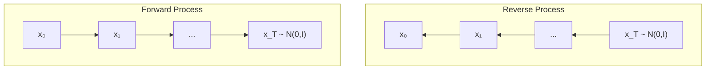

# Diffusion Models

## Review of VAE

In the previous article, we explained VAE (Variational Autoencoder). In VAE, similar to the EM algorithm, we modeled the relationship between observed data $$\boldsymbol{x}$$ and latent variables $$\boldsymbol{z}$$. However, since the posterior distribution $$p(\boldsymbol{z}\mid\boldsymbol{x})$$ cannot be computed for continuous $$\boldsymbol{z}$$, we designed the loss function using ELBO with an encoder $$q_{\boldsymbol{\phi}}(\boldsymbol{z}\mid\boldsymbol{x})$$.

$$ \mathcal{L}(\boldsymbol{\theta}, \boldsymbol{\phi}; \boldsymbol{x}) = \mathbb{E}_{q_{\boldsymbol{\phi}}(\boldsymbol{z}\mid\boldsymbol{x})} \left[ \log p_{\boldsymbol{\theta}}(\boldsymbol{x}\mid\boldsymbol{z}) \right] - D_{\text{KL}}(q_{\boldsymbol{\phi}}(\boldsymbol{z}\mid\boldsymbol{x}) || p(\boldsymbol{z})) $$

- $$q_{\boldsymbol{\phi}}(\boldsymbol{z}\mid\boldsymbol{x})$$: Encoder (variational distribution)
- $$p_{\boldsymbol{\theta}}(\boldsymbol{x}\mid\boldsymbol{z})$$: Decoder (generative model)
- $$p(\boldsymbol{z})$$: Prior distribution (standard normal distribution)

## Hierarchical VAE

Methods that extend single-stage VAE by introducing multiple latent variables hierarchically have been reported[^1].

For example, in a two-stage VAE, we introduce latent variables $$\boldsymbol{z}_1$$ and $$\boldsymbol{z}_2$$ and consider the following structure:

$$ \boldsymbol{x} \rightarrow \boldsymbol{z}_1 \rightarrow \boldsymbol{z}_2 $$

The generation process proceeds in the reverse direction:

$$ \boldsymbol{z}_2 \rightarrow \boldsymbol{z}_1 \rightarrow \boldsymbol{x} $$

This hierarchical structure allows for representing more complex data distributions. When generalized to $$T$$ stages, we introduce a sequence of latent variables $$\boldsymbol{z}_1, \boldsymbol{z}_2, \ldots, \boldsymbol{z}_T$$, transforming from observed data to progressively more abstract representations. This is not explained in detail in the book, and I'm not very familiar with it either, so this is where I'll stop.

The important point is that by imposing the following constraints on this hierarchical VAE, we can extend it to diffusion models:
- Match the dimensionality of data points and latent variables
- Do not parameterize the encoder; only add fixed Gaussian noise

## Principles of Diffusion Models

Diffusion models consist of two stochastic processes.

### Forward Process (Diffusion Process)

The forward process gradually adds noise to observed data $$\boldsymbol{x}_0$$, eventually transforming it into pure Gaussian noise $$\boldsymbol{x}_T$$. The book explains that if $$T$$ is sufficiently large, $$\boldsymbol{x}_T$$ approaches a Gaussian distribution. The diffusion process only adds noise, so there are no parameters.

$$ \boldsymbol{x}_0 \xrightarrow{\text{add noise}} \boldsymbol{x}_1 \xrightarrow{\text{add noise}} \cdots \xrightarrow{\text{add noise}} \boldsymbol{x}_T \sim \mathcal{N}(\boldsymbol{0}, \boldsymbol{I}) $$

### Reverse Process (Denoising Process)

The reverse process gradually removes noise from $$\boldsymbol{x}_T$$, generating samples $$\boldsymbol{x}_0$$ that follow the original data distribution. This process is modeled with a neural network and learned.

$$ \boldsymbol{x}_T \xrightarrow{\text{denoise}} \boldsymbol{x}_{T-1} \xrightarrow{\text{denoise}} \cdots \xrightarrow{\text{denoise}} \boldsymbol{x}_0 $$

## Formulation of the Forward Process

In the forward process, a small amount of Gaussian noise is added at each step. The transition from time $$t-1$$ to time $$t$$ is defined by the following conditional distribution:

$$ q(\boldsymbol{x}_t \mid \boldsymbol{x}_{t-1}) = \mathcal{N}(\boldsymbol{x}_t; \sqrt{1 - \beta_t} \boldsymbol{x}_{t-1}, \beta_t \boldsymbol{I}) $$

Here, $$\beta_t \in (0, 1)$$ is a hyperparameter called the noise schedule that controls the amount of noise added at each step. For example, setting $$\beta_t = 0.01$$ adds a small amount of noise to the mean and variance.

- Mean: $$\sqrt{1 - \beta_t} \boldsymbol{x}_{t-1}$$ (slightly scales down the previous step's value)
- Variance: $$\beta_t \boldsymbol{I}$$ (adds a small amount of noise)

Sampling is performed as follows:

$$ \boldsymbol{x}_t = \sqrt{1 - \beta_t} \boldsymbol{x}_{t-1} + \sqrt{\beta_t} \boldsymbol{\epsilon}_t, \quad \boldsymbol{\epsilon}_t \sim \mathcal{N}(\boldsymbol{0}, \boldsymbol{I}) $$

### Sampling at Arbitrary Time Steps

When adding noise as described above, we can directly compute $$\boldsymbol{x}_t$$ at any time step $$t$$ from $$\boldsymbol{x}_0$$ (intermediate steps are shown in the book). Defining $$\alpha_t = 1 - \beta_t$$ and $$\bar{\alpha}_t = \prod_{s=1}^{t} \alpha_s$$,

$$ q(\boldsymbol{x}_t \mid \boldsymbol{x}_0) = \mathcal{N}(\boldsymbol{x}_t; \sqrt{\bar{\alpha}_t} \boldsymbol{x}_0, (1 - \bar{\alpha}_t) \boldsymbol{I}) $$

This allows efficient generation of samples at any time step during training without going through intermediate steps. Using the Reparameterization Trick explained in the VAE chapter, we can write:

$$ \boldsymbol{x}_t = \sqrt{\bar{\alpha}_t} \boldsymbol{x}_0 + \sqrt{1 - \bar{\alpha}_t} \boldsymbol{\epsilon}, \quad \boldsymbol{\epsilon} \sim \mathcal{N}(\boldsymbol{0}, \boldsymbol{I}) $$

## Derivation of the Loss Function: Extension from VAE to Diffusion

### Computing the ELBO

Computing the marginal likelihood requires integration over all latent variables $$\boldsymbol{x}_{1:T} = (\boldsymbol{x}_1, \boldsymbol{x}_2, \ldots, \boldsymbol{x}_T)$$:

$$ p_{\boldsymbol{\theta}}(\boldsymbol{x}_0) = \int p_{\boldsymbol{\theta}}(\boldsymbol{x}_{0:T}) d\boldsymbol{x}_{1:T} $$

Since this integral cannot be computed analytically, we consider maximizing the ELBO as in VAE.

---

In the VAE chapter, we showed that the log-likelihood can be transformed as follows:

$$ \log p_{\boldsymbol{\theta}}(\boldsymbol{x}) = \mathcal{L}(\boldsymbol{\theta}, \boldsymbol{\phi}; \boldsymbol{x}) + D_{\text{KL}}(q_{\boldsymbol{\phi}}(\boldsymbol{z}\mid\boldsymbol{x}) | p_{\boldsymbol{\theta}}(\boldsymbol{z}\mid\boldsymbol{x})) $$

Here, the ELBO is:

$$ \mathcal{L}(\boldsymbol{\theta}, \boldsymbol{\phi}; \boldsymbol{x}) = \mathbb{E}_{q_{\boldsymbol{\phi}}(\boldsymbol{z}\mid\boldsymbol{x})} \left[ \log \frac{p_{\boldsymbol{\theta}}(\boldsymbol{x}, \boldsymbol{z})}{q_{\boldsymbol{\phi}}(\boldsymbol{z}\mid\boldsymbol{x})} \right] $$

In diffusion models, we make the following substitutions:

- Observed data: $$\boldsymbol{x} \rightarrow \boldsymbol{x}_0$$
- Latent variables: $$\boldsymbol{z} \rightarrow \boldsymbol{x}_{1:T} = (\boldsymbol{x}_1, \boldsymbol{x}_2, \ldots, \boldsymbol{x}_T)$$
- Variational distribution: $$q_{\boldsymbol{\phi}}(\boldsymbol{z}\mid\boldsymbol{x}) \rightarrow q(\boldsymbol{x}_{1:T}\mid\boldsymbol{x}_0)$$ (no parameters since it only adds noise)
- Generative model: $$p_{\boldsymbol{\theta}}(\boldsymbol{x}, \boldsymbol{z}) \rightarrow p_{\boldsymbol{\theta}}(\boldsymbol{x}_{0:T})$$ (learns denoising from $$t=T$$ to $$t=0$$)

Applying this transformation, the relationship between log-likelihood and ELBO becomes:

$$ \log p_{\boldsymbol{\theta}}(\boldsymbol{x}_0) = \mathcal{L}(\boldsymbol{\theta}; \boldsymbol{x}_0) + D_{\text{KL}}(q(\boldsymbol{x}_{1:T}\mid\boldsymbol{x}_0) | p_{\boldsymbol{\theta}}(\boldsymbol{x}_{1:T}\mid\boldsymbol{x}_0)) $$

Since KL divergence is non-negative:

$$
D_{\text{KL}}(q(\boldsymbol{x}_{1:T}\mid\boldsymbol{x}_0) | p_{\boldsymbol{\theta}}(\boldsymbol{x}_{1:T}\mid\boldsymbol{x}_0)) = \log p_{\boldsymbol{\theta}}(\boldsymbol{x}_0) - \mathcal{L}(\boldsymbol{\theta}; \boldsymbol{x}_0) \geq 0
$$

$$ \log p_{\boldsymbol{\theta}}(\boldsymbol{x}_0) \geq \mathcal{L}(\boldsymbol{\theta}; \boldsymbol{x}_0) $$

The ELBO for diffusion models is expressed as:

$$ \mathcal{L}(\boldsymbol{\theta}; \boldsymbol{x}_0) = \mathbb{E}_{q(\boldsymbol{x}_{1:T}\mid\boldsymbol{x}_0)} \left[ \log \frac{p_{\boldsymbol{\theta}}(\boldsymbol{x}_{0:T})}{q(\boldsymbol{x}_{1:T}\mid\boldsymbol{x}_0)} \right] $$

### Expanding the ELBO

Let's expand the ELBO.

Forward process (Markov chain):
$$ q(\boldsymbol{x}_{1:T}\mid\boldsymbol{x}_0) = \prod_{t=1}^{T} q(\boldsymbol{x}_t \mid \boldsymbol{x}_{t-1}) $$

Reverse process (generative model):
$$ p_{\boldsymbol{\theta}}(\boldsymbol{x}_{0:T}) = p(\boldsymbol{x}_T) \prod_{t=1}^{T} p_{\boldsymbol{\theta}}(\boldsymbol{x}_{t-1} \mid \boldsymbol{x}_t) $$

Here, $$p(\boldsymbol{x}_T)$$ is the prior distribution. If $$T$$ is sufficiently large, the endpoint of the forward process $$q(\boldsymbol{x}_T \mid \boldsymbol{x}_0)$$ approaches a standard normal distribution, so we use the standard normal distribution as the prior.

$$p(\boldsymbol{x}_T) = \mathcal{N}(\boldsymbol{x}_T; \boldsymbol{0}, \boldsymbol{I})$$

Expanding the ELBO with these:

$$ \mathcal{L}(\boldsymbol{\theta}; \boldsymbol{x}_0) = \mathbb{E}_{q(\boldsymbol{x}_{1:T}\mid\boldsymbol{x}_0)} \left[ \log \frac{p_{\boldsymbol{\theta}}(\boldsymbol{x}_{0:T})}{q(\boldsymbol{x}_{1:T}\mid\boldsymbol{x}_0)} \right] $$

$$ = \mathbb{E}_q \left[ \log \frac{p(\boldsymbol{x}_T) \prod_{t=1}^{T} p_{\boldsymbol{\theta}}(\boldsymbol{x}_{t-1} \mid \boldsymbol{x}_t)}{\prod_{t=1}^{T} q(\boldsymbol{x}_t \mid \boldsymbol{x}_{t-1})} \right] $$

Decomposing the logarithm:

$$ = \mathbb{E}_{q(\boldsymbol{x}_{1:T}\mid\boldsymbol{x}_0)} \left[ \log p(\boldsymbol{x}_T) + \sum_{t=1}^{T} \log p_{\boldsymbol{\theta}}(\boldsymbol{x}_{t-1} \mid \boldsymbol{x}_t) - \sum_{t=1}^{T} \log q(\boldsymbol{x}_t \mid \boldsymbol{x}_{t-1}) \right] $$

Here, we organize terms that depend on $$\boldsymbol{\theta}$$ and those that don't. Also, while the expectation is over all $$\boldsymbol{x}_{1:T}$$, only $$\boldsymbol{x}_t, \boldsymbol{x}_{t-1}$$ are actually relevant, so we simplify:

$$ \mathcal{L}(\boldsymbol{\theta}; \boldsymbol{x}_0) = \mathbb{E}_{q(\boldsymbol{x}_{t}, \boldsymbol{x}_{t-1} \mid \boldsymbol{x}_0)} \left[ \sum_{t=1}^{T} \log p_{\boldsymbol{\theta}}(\boldsymbol{x}_{t-1} \mid \boldsymbol{x}_t) \right] + \text{Const} $$

In maximizing the ELBO, terms that don't depend on $$\boldsymbol{\theta}$$ can be ignored, so the optimization target is only the reverse process $$p_{\boldsymbol{\theta}}(\boldsymbol{x}_{t-1} \mid \boldsymbol{x}_t)$$.

## Modeling the Reverse Process

We model the reverse process $$p_{\boldsymbol{\theta}}(\boldsymbol{x}_{t-1} \mid \boldsymbol{x}_t)$$ with a neural network. Similar to VAE, we define it as a Gaussian distribution with the neural network output as the mean.

The neural network takes $$\boldsymbol{x}_t$$ and time $$t$$ as input and outputs the denoised estimate $$\hat{\boldsymbol{x}}_{t-1}$$. Here, since the amount of noise added differs at each step of the forward process, the network needs information about which time step's noise to remove, so $$t$$ is given as input to the network.

$$ \hat{\boldsymbol{x}}_{t-1} = \text{NeuralNet}(\boldsymbol{x}_t, t; \boldsymbol{\theta}) $$

We define the reverse process as a Gaussian distribution with this output as the mean and the identity matrix as the variance.

$$ p_{\boldsymbol{\theta}}(\boldsymbol{x}_{t-1} \mid \boldsymbol{x}_t) = \mathcal{N}(\boldsymbol{x}_{t-1}; \hat{\boldsymbol{x}}_{t-1}, \boldsymbol{I}) $$

## Derivation of the Objective Function

### Computing the Log-Likelihood

Since we modeled the reverse process as a Gaussian distribution, we can concretely compute the log-likelihood.

The log probability density of a $$D$$-dimensional Gaussian distribution is:

$$
\mathcal{N}(\boldsymbol{x};\boldsymbol{\mu},\boldsymbol{\Sigma})
=
\frac{1}{(2\pi)^{D/2}|\boldsymbol{\Sigma}|^{1/2}}
\exp \left(
-\frac{1}{2}(\boldsymbol{x}-\boldsymbol{\mu})^\top \boldsymbol{\Sigma}^{-1}(\boldsymbol{x}-\boldsymbol{\mu})
\right)
$$

Taking the logarithm with the identity matrix as variance:

$$ \log \mathcal{N}(\boldsymbol{x}; \boldsymbol{\mu}, \boldsymbol{I}) = -\frac{1}{2} \|\boldsymbol{x} - \boldsymbol{\mu}\|^2 - \frac{D}{2} \log(2\pi) $$

Here, we modeled the reverse process from $$x_t$$ to $$x_{t-1}$$ as the Gaussian distribution

$$ p_{\boldsymbol{\theta}}(\boldsymbol{x}_{t-1} \mid \boldsymbol{x}_t) = \mathcal{N}(\boldsymbol{x}_{t-1}; \hat{\boldsymbol{x}}_{t-1}, \boldsymbol{I}) $$

so substituting $$\boldsymbol{x}\leftarrow \boldsymbol{x}_{t-1}$$, $$\boldsymbol{\mu}\leftarrow \hat{\boldsymbol{x}}_{t-1}$$ and applying to
$$p_{\boldsymbol{\theta}}(\boldsymbol{x}_{t-1} \mid \boldsymbol{x}_t)$$:

$$ \log p_{\boldsymbol{\theta}}(\boldsymbol{x}_{t-1} \mid \boldsymbol{x}_t) = -\frac{1}{2} \|\boldsymbol{x}_{t-1} - \hat{\boldsymbol{x}}_{t-1}\|^2 + \text{Const} $$

Substituting this result into the ELBO:

$$ \mathcal{L}(\boldsymbol{\theta}; \boldsymbol{x}_0) = \mathbb{E}_q \left[ \sum_{t=1}^{T} \log p_{\boldsymbol{\theta}}(\boldsymbol{x}_{t-1} \mid \boldsymbol{x}_t) \right] + \text{Const} $$

$$ = \mathbb{E}_q \left[ \sum_{t=1}^{T} \left( -\frac{1}{2} \|\boldsymbol{x}_{t-1} - \hat{\boldsymbol{x}}_{t-1}\|^2 \right) \right] + \text{Const} $$

$$ = -\frac{1}{2} \sum_{t=1}^{T} \mathbb{E}_q \left[ \|\boldsymbol{x}_{t-1} - \hat{\boldsymbol{x}}_{t-1}\|^2 \right] + \text{Const} $$

Here $$\hat{\boldsymbol{x}}_{t-1} = \text{NeuralNet}(\boldsymbol{x}_t, t; \boldsymbol{\theta})$$.

This formula contains a sum over time step $$t$$. When approximating the expectation using Monte Carlo methods, we can randomly sample $$t$$ at each training step and compute the loss for a single $$t$$.

Let $$t$$ be a random variable sampled from a uniform distribution over $$\{1,\dots,T\}$$:
$$
t \sim \mathrm{Unif}\{1,\dots,T\}
$$
In general, the following holds:
$$
\sum_{t=1}^{T} a_t \;=\; T\,\mathbb{E}_{t \sim \mathrm{Unif}\{1,\dots,T\}}\!\left[a_t\right]
$$
So the ELBO can be rewritten in expectation form:

$$
\mathcal{L}(\boldsymbol{\theta}; \boldsymbol{x}_0) =
-\frac{T}{2}\,\mathbb{E}_{t \sim \mathrm{Unif}\{1,\dots,T\},\, q}
\left[
\left\|\boldsymbol{x}_{t-1}-\hat{\boldsymbol{x}}_{t-1}\right\|^2
\right]
+\text{Const}
$$

From the above, we have reduced the problem to minimizing the squared error (L2 norm) between the neural network output $$\hat{\boldsymbol{x}}_{t-1}$$ and the actual $$\boldsymbol{x}_{t-1}$$.

## Training with Two Samples

To compute the above loss function, we need to approximate the expectation $$\mathbb{E}_{q(\boldsymbol{x}_{t-1}, \boldsymbol{x}_t \mid \boldsymbol{x}_0)}$$ using Monte Carlo methods. A naive approach is to separately sample $$\boldsymbol{x}_{t-1}$$ and $$\boldsymbol{x}_t$$ from the forward process and compute $$ p_{\boldsymbol{\theta}}(\boldsymbol{x}_{t-1} \mid \boldsymbol{x}_t) $$.

As explained at the beginning, in the forward process we can directly generate samples at any time from $$\boldsymbol{x}_0$$.

$$ \boldsymbol{x}_{t-1} = \sqrt{\bar{\alpha}_{t-1}} \boldsymbol{x}_0 + \sqrt{1 - \bar{\alpha}_{t-1}} \boldsymbol{\epsilon}_{t-1}, \quad \boldsymbol{\epsilon}_{t-1} \sim \mathcal{N}(\boldsymbol{0}, \boldsymbol{I}) $$

$$ \boldsymbol{x}_t = \sqrt{\bar{\alpha}_t} \boldsymbol{x}_0 + \sqrt{1 - \bar{\alpha}_t} \boldsymbol{\epsilon}_t, \quad \boldsymbol{\epsilon}_t \sim \mathcal{N}(\boldsymbol{0}, \boldsymbol{I}) $$

In this method, two independent noise samples $$\boldsymbol{\epsilon}_{t-1}$$ and $$\boldsymbol{\epsilon}_t$$ are drawn. The training procedure is as follows:

1. Sample $$\boldsymbol{x}_0$$ from the dataset
2. Sample time $$t$$ uniformly from $$\{1, 2, \ldots, T\}$$
3. Sample $$\boldsymbol{\epsilon}_{t-1}, \boldsymbol{\epsilon}_t \sim \mathcal{N}(\boldsymbol{0}, \boldsymbol{I})$$
4. Compute $$\boldsymbol{x}_{t-1}$$ and $$\boldsymbol{x}_t$$ using the above formulas
5. Compute the loss $$\|\boldsymbol{x}_{t-1} - \text{NeuralNet}(\boldsymbol{x}_t, t; \boldsymbol{\theta})\|^2$$
6. Update parameters $$\boldsymbol{\theta}$$ using gradient descent

Originally, there should be strong correlation between $$\boldsymbol{x}_{t-1}$$ and $$\boldsymbol{x}_t$$, but in this method each is sampled independently, so the correlation between them is ignored.

## Method with Single Sampling

By utilizing the fact that the posterior distribution of the forward process $$q(\boldsymbol{x}_{t-1} \mid \boldsymbol{x}_t, \boldsymbol{x}_0)$$ can be computed analytically, we can reduce the number of samples to one.
Using Bayes' theorem, we compute $$q(\boldsymbol{x}_{t-1} \mid \boldsymbol{x}_t, \boldsymbol{x}_0)$$.

$$ q(\boldsymbol{x}_{t-1} \mid \boldsymbol{x}_t, \boldsymbol{x}_0) = \frac{q(\boldsymbol{x}_t \mid \boldsymbol{x}_{t-1}, \boldsymbol{x}_0) \cdot q(\boldsymbol{x}_{t-1} \mid \boldsymbol{x}_0)}{q(\boldsymbol{x}_t \mid \boldsymbol{x}_0)} $$

Since the forward process is a Markov chain, $$q(\boldsymbol{x}_t \mid \boldsymbol{x}_{t-1}, \boldsymbol{x}_0) = q(\boldsymbol{x}_t \mid \boldsymbol{x}_{t-1})$$ holds.

These are all Gaussian distributions, and with $$\alpha_t = 1-\beta_t$$, they are expressed as:

$$q(\boldsymbol{x}_t \mid \boldsymbol{x}_{t-1}) = \mathcal{N}(\boldsymbol{x}_t; \sqrt{\alpha_t} \boldsymbol{x}_{t-1}, (1-\alpha_t) \boldsymbol{I})$$

$$q(\boldsymbol{x}_{t-1} \mid \boldsymbol{x}_0) = \mathcal{N}(\boldsymbol{x}_{t-1}; \sqrt{\bar{\alpha}_{t-1}} \boldsymbol{x}_0, (1-\bar{\alpha}_{t-1}) \boldsymbol{I})$$

$$q(\boldsymbol{x}_t \mid \boldsymbol{x}_0) = \mathcal{N}(\boldsymbol{x}_t; \sqrt{\bar{\alpha}_t} \boldsymbol{x}_0, (1-\bar{\alpha}_t) \boldsymbol{I})$$

Since products and quotients of Gaussian distributions are Gaussian, $$q(\boldsymbol{x}_{t-1} \mid \boldsymbol{x}_t, \boldsymbol{x}_0)$$ is also Gaussian. Proceeding with the calculation (intermediate steps omitted),

$$ q(\boldsymbol{x}_{t-1} \mid \boldsymbol{x}_t, \boldsymbol{x}_0) = \mathcal{N}(\boldsymbol{x}_{t-1}; \tilde{\boldsymbol{\mu}}_t(\boldsymbol{x}_t, \boldsymbol{x}_0), \tilde{\sigma}_{t}^2 \boldsymbol{I}) $$

Here, the mean and variance are given as follows:

$$ \tilde{\boldsymbol{\mu}}_t(\boldsymbol{x}_t, \boldsymbol{x}_0) = \frac{\sqrt{\bar{\alpha}_{t-1}}(1-\alpha_t)}{1-\bar{\alpha}_t} \boldsymbol{x}_0 + \frac{\sqrt{\alpha_t}(1-\bar{\alpha}_{t-1})}{1-\bar{\alpha}_t} \boldsymbol{x}_t $$

$$ \tilde{\sigma}_{t}^2 = \frac{(1-\bar{\alpha}_{t-1})(1-\alpha_t)}{1-\bar{\alpha}_t} $$

### Loss Function with Single Sampling

Using the analytical posterior distribution $$q(\boldsymbol{x}_{t-1} \mid \boldsymbol{x}_t, \boldsymbol{x}_0)$$ obtained above, given $$\boldsymbol{x}_0$$ and $$t$$, if we sample $$\boldsymbol{x}_t$$, we can analytically compute the conditional expectation of $$\boldsymbol{x}_{t-1}$$, which is $$\tilde{\boldsymbol{\mu}}_t(\boldsymbol{x}_t, \boldsymbol{x}_0)$$.

We explained that the ELBO can be written as follows, omitting constant terms:

$$ \mathcal{L}(\boldsymbol{\theta}; \boldsymbol{x}_0) = \mathbb{E}_{q(\boldsymbol{x}_{t}, \boldsymbol{x}_{t-1} \mid \boldsymbol{x}_0)} \left[ \sum_{t=1}^{T} \log p_{\boldsymbol{\theta}}(\boldsymbol{x}_{t-1} \mid \boldsymbol{x}_t) \right] $$

Rewriting this with $$t$$ as a random variable sampled from a uniform distribution over $$\{1,\ldots,T\}$$:

$$ \mathcal{L}(\boldsymbol{\theta}; \boldsymbol{x}_0) = T \cdot \mathbb{E}_{t \sim \text{Unif}\{1,\ldots,T\}} \left[ \mathbb{E}_{q(\boldsymbol{x}_{t}, \boldsymbol{x}_{t-1} \mid \boldsymbol{x}_0)} \left[ \log p_{\boldsymbol{\theta}}(\boldsymbol{x}_{t-1} \mid \boldsymbol{x}_t) \right] \right] $$

Next, we expand $$\log p_{\boldsymbol{\theta}}(\boldsymbol{x}_{t-1} \mid \boldsymbol{x}_t)$$. Introducing the posterior distribution of the forward process $$q(\boldsymbol{x}_{t-1} \mid \boldsymbol{x}_t, \boldsymbol{x}_0)$$, we transform as follows:

$$ \log p_{\boldsymbol{\theta}}(\boldsymbol{x}_{t-1} \mid \boldsymbol{x}_t) = \log \frac{p_{\boldsymbol{\theta}}(\boldsymbol{x}_{t-1} \mid \boldsymbol{x}_t)}{q(\boldsymbol{x}_{t-1} \mid \boldsymbol{x}_t, \boldsymbol{x}_0)} + \log q(\boldsymbol{x}_{t-1} \mid \boldsymbol{x}_t, \boldsymbol{x}_0) $$

Putting this inside the expectation with respect to $$q(\boldsymbol{x}_{t-1} \mid \boldsymbol{x}_t, \boldsymbol{x}_0)$$:

$$ \mathbb{E}_{q(\boldsymbol{x}_{t}, \boldsymbol{x}_{t-1} \mid \boldsymbol{x}_0)} \left[ \log p_{\boldsymbol{\theta}}(\boldsymbol{x}_{t-1} \mid \boldsymbol{x}_t) \right] $$

$$ = \mathbb{E}_{q(\boldsymbol{x}_{t}, \boldsymbol{x}_{t-1} \mid \boldsymbol{x}_0)} \left[ \log \frac{p_{\boldsymbol{\theta}}(\boldsymbol{x}_{t-1} \mid \boldsymbol{x}_t)}{q(\boldsymbol{x}_{t}, \boldsymbol{x}_{t-1} \mid \boldsymbol{x}_0)} \right] + \mathbb{E}_{q(\boldsymbol{x}_{t}, \boldsymbol{x}_{t-1} \mid \boldsymbol{x}_0)} \left[ \log q(\boldsymbol{x}_{t-1} \mid \boldsymbol{x}_t, \boldsymbol{x}_0) \right] $$

The first term can be transformed into the following KL divergence. The second term is a constant that doesn't depend on the parameters.

$$ = -\mathbb{E}_{q(\boldsymbol{x}_t \mid \boldsymbol{x}_0)} \left[ D_{\text{KL}}(q(\boldsymbol{x}_{t-1} \mid \boldsymbol{x}_t, \boldsymbol{x}_0) \| p_{\boldsymbol{\theta}}(\boldsymbol{x}_{t-1} \mid \boldsymbol{x}_t)) \right] + \text{Const}. $$

Both the reverse process model $$p_{\boldsymbol{\theta}}(\boldsymbol{x}_{t-1} \mid \boldsymbol{x}_t)$$ and the posterior distribution $$q(\boldsymbol{x}_{t-1} \mid \boldsymbol{x}_t, \boldsymbol{x}_0)$$ are Gaussian distributions. The mean and variance of the posterior distribution are as described above. Here, we model $$ p_{\boldsymbol{\theta}}(\boldsymbol{x}_{t-1} \mid \boldsymbol{x}_t) $$ by representing the model mean with the neural network output $$\hat{\boldsymbol{\mu}}_{\boldsymbol{\theta}}(\boldsymbol{x}_t, t)$$ and setting the variance to the same value as the posterior distribution.

- Posterior distribution: $$q(\boldsymbol{x}_{t-1} \mid \boldsymbol{x}_t, \boldsymbol{x}_0) = \mathcal{N}(\boldsymbol{x}_{t-1}; \tilde{\boldsymbol{\mu}}_t, \tilde{\sigma}_{t}^2 \boldsymbol{I})$$
- Model: $$p_{\boldsymbol{\theta}}(\boldsymbol{x}_{t-1} \mid \boldsymbol{x}_t) = \mathcal{N}(\boldsymbol{x}_{t-1}; \hat{\boldsymbol{\mu}}_{\boldsymbol{\theta}}, \tilde{\sigma}_{t}^2 \boldsymbol{I}) $$

This allows the KL divergence between the two Gaussian distributions to be expressed only in terms of the difference in means (calculation omitted).

$$ D_{\text{KL}}(\mathcal{N}(\boldsymbol{\mu}_1, \tilde{\sigma}_{t}^2 \boldsymbol{I}) \| \mathcal{N}(\boldsymbol{\mu}_2, \tilde{\sigma}_{t}^2 \boldsymbol{I})) = \frac{1}{2\tilde{\sigma}_{t}^2} \|\boldsymbol{\mu}_1 - \boldsymbol{\mu}_2\|^2 $$

Therefore,

$$ D_{\text{KL}}(q(\boldsymbol{x}_{t-1} \mid \boldsymbol{x}_t, \boldsymbol{x}_0) \| p_{\boldsymbol{\theta}}(\boldsymbol{x}_{t-1} \mid \boldsymbol{x}_t)) = \frac{1}{2\tilde{\sigma}_{t}^2} \|\tilde{\boldsymbol{\mu}}_t(\boldsymbol{x}_t, \boldsymbol{x}_0) - \hat{\boldsymbol{\mu}}_{\boldsymbol{\theta}}(\boldsymbol{x}_t, t)\|^2 $$

### Final Loss Function

Substituting the above results into the ELBO:

$$ \mathcal{L}(\boldsymbol{\theta}; \boldsymbol{x}_0) = T \cdot \mathbb{E}_{t \sim \text{Unif}\{1,\ldots,T\}} \left[ \mathbb{E}_{q(\boldsymbol{x}_t \mid \boldsymbol{x}_0)} \left[ -D_{\text{KL}}(q(\boldsymbol{x}_{t-1} \mid \boldsymbol{x}_t, \boldsymbol{x}_0) \| p_{\boldsymbol{\theta}}(\boldsymbol{x}_{t-1} \mid \boldsymbol{x}_t)) \right] \right] $$

$$ = -T \cdot \mathbb{E}_{t \sim \text{Unif}\{1,\ldots,T\}} \left[ \mathbb{E}_{q(\boldsymbol{x}_t \mid \boldsymbol{x}_0)} \left[ \frac{1}{2\tilde{\sigma}_{t}^2} \|\tilde{\boldsymbol{\mu}}_t(\boldsymbol{x}_t, \boldsymbol{x}_0) - \hat{\boldsymbol{\mu}}_{\boldsymbol{\theta}}(\boldsymbol{x}_t, t)\|^2 \right] \right] $$

Now we can compute the objective function with a single sample. The loss function is the negative ELBO and is expressed as:

$$ \mathcal{L}(\boldsymbol{\theta}; \boldsymbol{x}_0) = -\frac{T}{2} \cdot \mathbb{E}_{t \sim \text{Unif}\{1,\ldots,T\}} \left[ \mathbb{E}_{q(\boldsymbol{x}_t \mid \boldsymbol{x}_0)} \left[ \frac{1}{\tilde{\sigma}_{t}^2} \|\tilde{\boldsymbol{\mu}}_t(\boldsymbol{x}_t, \boldsymbol{x}_0) - \hat{\boldsymbol{\mu}}_{\boldsymbol{\theta}}(\boldsymbol{x}_t, t)\|^2 \right] \right] $$

{: .prompt-tip }
> **Summary of Loss Function with Single Sampling**
> - Mean prediction: The neural network learns to predict the posterior distribution mean $$\tilde{\boldsymbol{\mu}}_t$$
> - Computable with single sampling: By sampling only $$\boldsymbol{x}_t$$, $$\tilde{\boldsymbol{\mu}}_t(\boldsymbol{x}_t, \boldsymbol{x}_0)$$ can be analytically computed from $$\boldsymbol{x}_0$$, $$\boldsymbol{x}_t$$, and known schedule parameters, allowing evaluation of the loss function using the KL divergence between $$q(\boldsymbol{x}_{t-1} \mid \boldsymbol{x}_t, \boldsymbol{x}_0)$$ and $$p_{\boldsymbol{\theta}}(\boldsymbol{x}_{t-1} \mid \boldsymbol{x}_t)$$
> - Time-dependent weighting: A weight of $$\frac{1}{\tilde{\sigma}_{t}^2}$$ determined by the noise schedule is applied to each time step's loss, enabling different weighting by time step

## Training Procedure

1. Sample $$\boldsymbol{x}_0$$ from the dataset
2. Sample time $$t$$ from uniform distribution over $$\{1, 2, \ldots, T\}$$
3. Sample $$\boldsymbol{\epsilon} \sim \mathcal{N}(\boldsymbol{0}, \boldsymbol{I})$$ once
4. Compute $$ \boldsymbol{x}_t $$ using $$ q(\boldsymbol{x}_t \mid \boldsymbol{x}_0) $$ and $$\boldsymbol{\epsilon}$$
$$ \boldsymbol{x}_t = \sqrt{\bar{\alpha}_t} \boldsymbol{x}_0 + \sqrt{1 - \bar{\alpha}_t} \boldsymbol{\epsilon} $$
5. Analytically compute the posterior distribution mean $$\tilde{\boldsymbol{\mu}}_t(\boldsymbol{x}_t, \boldsymbol{x}_0)$$
6. Compute the loss $$\frac{1}{2\sigma_t^2} \|\tilde{\boldsymbol{\mu}}_t - \hat{\boldsymbol{\mu}}_{\boldsymbol{\theta}}(\boldsymbol{x}_t, t)\|^2$$
7. Update parameters $$\boldsymbol{\theta}$$

This eliminates the need to explicitly sample $$\boldsymbol{x}_{t-1}$$ and allows computing a loss function that considers the correlation between $$\boldsymbol{x}_{t-1}$$ and $$\boldsymbol{x}_t$$.

## Reference
[^1]: Diederik P. Kingma, Tim Salimans, Rafal Jozefowicz, Xi Chen, Ilya Sutskever, Max Welling. "Improved Variational Inference with Inverse Autoregressive Flow." _Advances in Neural Information Processing Systems_ 29 (2016).

