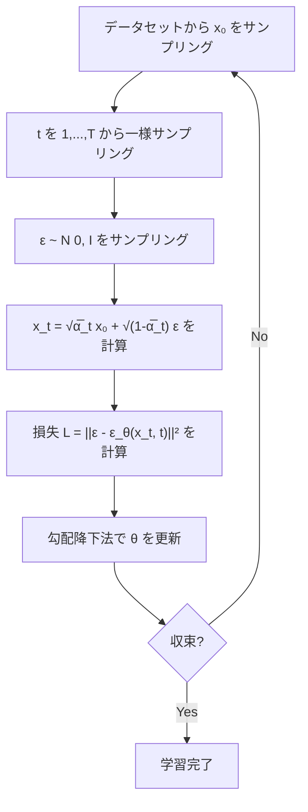
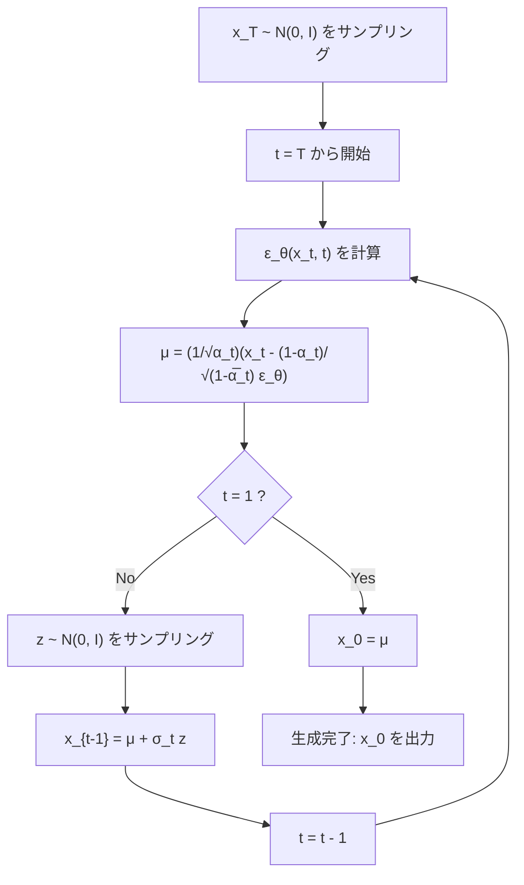

## データ点予測とノイズ予測

前回のポストでは、拡散モデルの概要と、逆拡散過程におけるニューラルネットワークの学習方法をまとめました。$$\boldsymbol{x}_T$$ から $$\boldsymbol{x}_0$$ までの全てのサンプルがある状況や、$$\boldsymbol{x}_t$$ と $$\boldsymbol{x}_{t-1}$$ をサンプリングする方法、$$\boldsymbol{x}_t$$ だけをサンプリングして $$ q(\boldsymbol{x}_{t-1} \mid \boldsymbol{x}_t, \boldsymbol{x}_0) $$ を使ってELBOを計算する手法などを説明しました。以降は、サンプルサイズが1のときについて考えます。


ニューラルネットワークは、$$q$$ でサンプリングした $$\boldsymbol{x}_t$$ を利用し、事後分布の平均 $$\tilde{\boldsymbol{\mu}}_t(\boldsymbol{x}_t, \boldsymbol{x}_0)$$ を予測するように学習するのでした。
具体的には、事後分布 $$q(\boldsymbol{x}_{t-1} \mid \boldsymbol{x}_t, \boldsymbol{x}_0)$$ の平均 $$\tilde{\boldsymbol{\mu}}_t(\boldsymbol{x}_t, \boldsymbol{x}_0)$$ をニューラルネットワーク $$\hat{\boldsymbol{\mu}}_{\boldsymbol{\theta}}(\boldsymbol{x}_t, t)$$ で近似するモデルを考えました。


今回は、その他諸々勉強したことについてとりとめなく書きます。全く整理できていないので、気が向いたら修正します。


## 1. 種々のパラメータ化

前回、ニューラルネットワークが事後分布の平均 $$\tilde{\boldsymbol{\mu}}_t(\boldsymbol{x}_t, \boldsymbol{x}_0)$$ を予測するモデルを導出しました。事後分布の平均は以下のように定義されていました。


$$
\tilde{\boldsymbol{\mu}}_t(\boldsymbol{x}_t, \boldsymbol{x}_0) = \frac{\sqrt{\bar{\alpha}_{t-1}}(1-\alpha_t)}{1-\bar{\alpha}_t} \boldsymbol{x}_0 + \frac{\sqrt{\alpha_t}(1-\bar{\alpha}_{t-1})}{1-\bar{\alpha}_t} \boldsymbol{x}_t
\tag{1}
$$

この式は $$\boldsymbol{x}_0$$ と $$\boldsymbol{x}_t$$ の両方に依存しています。しかし、ニューラルネットワークが $$\tilde{\boldsymbol{\mu}}_t$$ を直接予測するように学習させることも、$$\boldsymbol{x}_0$$ を予測するように学習させることも、あるいは後述するノイズ $$\boldsymbol{\epsilon}$$ を予測するように学習させることもできます。

例えば、ニューラルネットワークで予測する部分を $$\boldsymbol{x}_0$$ にして、他の部分は $$ \tilde{\boldsymbol{\mu}}_t(\boldsymbol{x}_t, \boldsymbol{x}_0) $$ と同じになるように設定することで、$$ \hat{\boldsymbol{\mu}}_{\boldsymbol{\theta}}(\boldsymbol{x}_t, t) $$ は以下のように表せます。

$$
\hat{\boldsymbol{\mu}}_{\boldsymbol{\theta}}(\boldsymbol{x}_t, t)
=
\frac{\sqrt{\bar{\alpha}_{t-1}}(1-\alpha_t)}{1-\bar{\alpha}_t} \hat{\boldsymbol{x}}_{\theta}(\boldsymbol{x}_t, t) + \frac{\sqrt{\alpha_t}(1-\bar{\alpha}_{t-1})}{1-\bar{\alpha}_t} \boldsymbol{x}_t
$$

ここで、$$\hat{\boldsymbol{x}}_{\theta}(\boldsymbol{x}_t, t)$$ はニューラルネットワークの出力であり、$$\boldsymbol{x}_0$$ の推定値を表しています。単に、ニューラルネットワークで予測するものを平均からデータ点に変えただけです。理論上は、これによってノイズが付加されたデータ点 $$\boldsymbol{x}_t$$ から元のデータ点 $$\boldsymbol{x}_0$$ を復元することが可能です。

### 平均の式変形

事後分布の平均 $$\tilde{\boldsymbol{\mu}}_t$$ を別の形で表現することを考えます。

拡散過程において、$$\boldsymbol{x}_t$$ は以下のように表されました。

$$ \boldsymbol{x}_t = \sqrt{\bar{\alpha}_t} \boldsymbol{x}_0 + \sqrt{1 - \bar{\alpha}_t} \boldsymbol{\epsilon}, \quad \boldsymbol{\epsilon} \sim \mathcal{N}(\boldsymbol{0}, \boldsymbol{I}) $$

この式を $$\boldsymbol{x}_0$$ について解くと、

$$ \boldsymbol{x}_0 = \frac{1}{\sqrt{\bar{\alpha}_t}}\left(\boldsymbol{x}_t - \sqrt{1 - \bar{\alpha}_t} \boldsymbol{\epsilon}\right) $$

この関係を $$\tilde{\boldsymbol{\mu}}_t$$ の式 (1) に代入して整理すると、$$ \boldsymbol{x}_t $$ と $$ \epsilon $$ で表現できます。この式を使えば、ノイズをパラメータ化して予測することも可能です。

$$
\tilde{\boldsymbol{\mu}}_t = \frac{1}{\sqrt{\alpha_t}} \left( \boldsymbol{x}_t - \frac{1-\alpha_t}{\sqrt{1-\bar{\alpha}_t}} \boldsymbol{\epsilon} \right)
\tag{2}
$$


### 3つのパラメータ化

逆拡散過程のモデル $$p_{\boldsymbol{\theta}}(\boldsymbol{x}_{t-1} \mid \boldsymbol{x}_t)$$ の平均をニューラルネットワークで表現する方法として、以下の3つが考えられます。

1. **平均予測**: $$\hat{\boldsymbol{\mu}}_{\boldsymbol{\theta}}(\boldsymbol{x}_t, t)$$ を直接予測
2. **データ点予測**: $$\hat{\boldsymbol{x}}_0$$ を予測し、$$\tilde{\boldsymbol{\mu}}_t$$ の式に代入
3. **ノイズ予測**: $$\boldsymbol{\epsilon}_{\boldsymbol{\theta}}(\boldsymbol{x}_t, t)$$ を予測し、上記の変換式を使用

ノイズ予測を採用する場合、式 (2) のノイズをニューラルネットワークでモデル化することで、以下のように平均を表現できます。

$$ \hat{\boldsymbol{\mu}}_{\boldsymbol{\theta}}(\boldsymbol{x}_t, t) = \frac{1}{\sqrt{\alpha_t}} \left( \boldsymbol{x}_t - \frac{1-\alpha_t}{\sqrt{1-\bar{\alpha}_t}} \boldsymbol{\epsilon}_{\boldsymbol{\theta}}(\boldsymbol{x}_t, t) \right) $$

これらのパラメータ化について、どれを選んでも同じ分布族を表現できます。しかし、Ho らによって報告された画像生成の実験では、ノイズ予測と簡略化された損失関数の組み合わせが最も良いサンプル品質を達成することが示されました [^1]。


### 実験的な比較

Ho et al. らによる報告 [^1] では、 CIFAR10 で学習した拡散モデルを使って生成した画像を評価する実験で、種々のパラメータ化と損失関数の組み合わせが比較されています。評価指標は Inception Score と FID (Fréchet Inception Distance) です。

#### 評価指標

##### Inception Score (IS)
生成した画像の「品質」と「多様性」を測る指標で、高いほど良いスコアです。
Inception モジュールと呼ばれるアーキテクチャを持つ画像分類モデル (Inception Network) に生成した画像を入力し、その出力分布を利用してスコアを計算します。実際のデータ分布との類似性を直接測らないため注意が必要ですが、以下の2つの観点で評価します。

- 品質: 生成した画像を画像分類器（Inception Network）に入力したとき、特定のクラスに自信を持って分類されるほど高品質とみなします。シャープな分布ほど良く評価されます。
- 多様性: 生成した画像全体で、様々なクラスに分類されるほど多様性が高いとみなします。


##### Fréchet Inception Distance (FID)

生成した画像と実在する画像の分布の近さを測る指標です。

1. 生成した画像と実在する画像をそれぞれ Inception Network の中間層に通し、特徴ベクトルを取得
2. それぞれの特徴ベクトル集合を多変量正規分布で近似
3. 2つの正規分布間の Fréchet 距離（Wasserstein 距離）を計算

生成した画像の分布と、現実の画像の分布の近さを測っているため、低いほど良いスコアです。個人的には Fréchet ChemNet Distance で馴染みがある手法です。

#### 損失関数
損失関数は、後述する理論的に導出された variational bound に基づく損失関数 $$L$$ と、簡略化された損失関数 $$L_{\text{simple}}$$ の2種類が比較されています。

##### 理論的な損失関数

後に導出する損失関数には、時刻依存の重み係数がかかります。

$$ L = \mathbb{E}\left[ \frac{\beta_t^2}{2\sigma_t^2 \alpha_t (1-\bar{\alpha}_t)} \|\boldsymbol{\epsilon} - \boldsymbol{\epsilon}_{\boldsymbol{\theta}}(\boldsymbol{x}_t, t)\|^2 \right] $$

- $$ \alpha_t = 1 - \beta_t $$
- $$ \bar{\alpha}_t = \prod_{s=1}^t \alpha_s $$
- $$ \sigma_t^2 $$: 逆拡散過程 $$ q(\boldsymbol{x}_{t-1} \mid \boldsymbol{x}_t) = \mathcal{N}(\tilde{\boldsymbol{\mu}}_t, \sigma_t^2 \boldsymbol{I}) $$ の分散

$$\beta_t$$ はスケジュールによって決定される分散であり、論文では $$ \beta_1 = 10^{-4}, \beta_T = 0.02 $$ と設定されている小さな値です。

$$L_{\text{simple}}$$ はこの重み係数を単純に 1 として扱います。

$$
L_{\text{simple}} = \mathbb{E}_{t, \boldsymbol{x}_0, \boldsymbol{\epsilon}} \left[ \|\boldsymbol{\epsilon} - \boldsymbol{\epsilon}_{\boldsymbol{\theta}}(\boldsymbol{x}_t, t)\|^2 \right]
\tag{3}
$$


$$ t $$ によって重み係数がどう変わるかが式を見ただけでは分かりにくいですが、論文では以下のように説明されています。

{: .prompt-tip }

> "In particular, our diffusion process setup causes the simplified objective to down-weight loss terms corresponding to small $$t$$. These terms train the network to denoise data with very small amounts of noise, so it is beneficial to down-weight them so that the network can focus on more difficult denoising tasks at larger $$t$$ terms."

つまり $$L_{\text{simple}}$$ は、 $$t$$ が小さい = 実データに近くノイズが少ない場合の寄与を相対的に下げて、$$t$$ が大きい = ノイズが多く難しいタスクの学習にフォーカスできるようにしているということです。

#### 実験結果

論文[^1]に示されている実験の結果は以下の通りです。

| パラメータ化 | 損失関数 | Inception Score | FID |
|-------------|---------|-----------------|-----|
| $$\tilde{\mu}$$ 予測 | $$L$$（variational bound） | 8.06 | 13.22 |
| $$\epsilon$$ 予測 | $$L$$（variational bound） | 7.67 | 13.51 |
| $$\epsilon$$ 予測 | $$L_{\text{simple}}$$ | 9.46 | 3.17 |

$$\boldsymbol{x}_0$$ を直接予測する方法は、サンプル品質が悪かったため採用されなかったそうです。
これらの結果から、以下のことが分かります。

- 理論的に導出された損失関数（variational bound）を使う場合、$$\tilde{\mu}$$ 予測と $$\epsilon$$ 予測はほぼ同等の性能
- $$\epsilon$$ 予測と $$L_{\text{simple}}$$（簡略化された損失関数）の組み合わせが良い


## 2. スコアマッチング

DDPMでノイズ予測が可能である理由の一つとして、スコアマッチングとの数学的な等価性が挙げられます。これを理解するために、エネルギーベースモデル (EBM) とスコアマッチングについて説明します。ただし、ノイズ予測がなぜ平均予測よりも良いのかについては、Ho らの論文では説明されていません。知っている方がいれば教えてください。（直感的な説明としては、複雑なデータ空間上の点を予測するよりも、time step に依らず平均と分散が一定なノイズを学習する方が簡単なタスクだから良いといったものがありました。）


### 2.1 生成モデルと正規化定数の問題

#### 問題設定

生成モデルの目標は、訓練データ $$\{\mathbf{x}_1, \mathbf{x}_2, \cdots, \mathbf{x}_N\}$$ から、その背後にある確率分布 $$p(\mathbf{x})$$ を学習することです。この確率分布を表現するために、データのもっともらしさをエネルギー関数 $$E_\theta(\mathbf{x})$$ でモデル化したものをエネルギーベースモデル (EBM) と呼びます。エネルギーが高い部分は確率密度が低くなるような以下の関数で $$p(\mathbf{x})$$ をモデル化します。


$$
p_\theta(\mathbf{x}) = \frac{\exp(-E_\theta(\mathbf{x}))}{Z_\theta}
$$


- $$E_\theta(\mathbf{x})$$：エネルギー関数（ニューラルネットワークで定義可能）
- $$Z_\theta = \int \exp(-E_\theta(\mathbf{x})) d\mathbf{x}$$：正規化定数（分配関数）


この $$Z_\theta$$ の計算は非常に困難です。高次元空間での積分は一般に計算不可能で、これが確率モデリングのボトルネックになっています。

---

### 2.2 スコア関数：正規化定数の計算を回避する手法

#### スコア関数の定義

スコア関数（score function）は、確率分布の対数確率密度のデータに関する勾配として定義されます。


$$\mathbf{s}(\mathbf{x}) := \nabla_{\mathbf{x}} \log p(\mathbf{x})$$


スコア関数は、各データ点 $$\mathbf{x}$$ において、確率密度が最も急峻に増加する方向とその大きさを示すベクトル場です。

つまり、スコア関数はデータ空間内での確率分布の地形のようなものを描き出し、より尤もらしいデータ点への勾配を表しています。


#### スコア関数の利点

スコア関数は、データ空間上の変数 $$\mathbf{x}$$ に関する微分であるため、正規化定数 $$Z_\theta$$ に依存しないという重要な性質があります。

$$\mathbf{s}_\theta(\mathbf{x}) = \nabla_{\mathbf{x}} \log p_\theta(\mathbf{x}) = \nabla_{\mathbf{x}} \left[ -E_\theta(\mathbf{x}) - \log Z_\theta \right]$$

$$\log Z_\theta$$ は $$\mathbf{x}$$ に依存しないため：

$$\mathbf{s}_\theta(\mathbf{x}) = -\nabla_{\mathbf{x}} E_\theta(\mathbf{x}) - \underbrace{\nabla_{\mathbf{x}} \log Z_\theta}_{=\mathbf{0}} = -\nabla_{\mathbf{x}} E_\theta(\mathbf{x})$$

これにより、スコア関数さえ学習できれば、正規化定数を計算することなく確率分布を間接的に表現できます。


### 2.3 スコアマッチング：未知のスコア関数の学習

スコア関数を利用することで、正規化定数を計算せずに確率分布のモデル化ができることが分かりました。しかし、真のデータ分布 $$p_{data}(\mathbf{x})$$ は未知であるため、そのスコア関数 $$\nabla_\mathbf{x} \log p_{data}(\mathbf{x})$$ も直接は計算できません。
そこで登場するのがスコアマッチングです。この章は元論文を自分で読むところまでできていないので、本と他のテックブログを読んだ内容を書きます。

#### 明示的スコアマッチング （Explicit Score Matching, ESM）

最も直接的なアプローチはモデルのスコア $$\mathbf{s}_\theta(\mathbf{x})$$ と真のスコア $$\nabla_\mathbf{x} \log p_{data}(\mathbf{x})$$ の間の二乗誤差の期待値を最小化することですが、未知の $$\nabla_\mathbf{x} \log p_{data}(\mathbf{x})$$ が含まれているため、このままでは計算できません。

$$J_{ESM}(\theta) = \frac{1}{2} \mathbb{E}_{\mathbf{x} \sim p_{data}(\mathbf{x})} \left[\| \mathbf{s}_\theta(\mathbf{x}) - \nabla_\mathbf{x} \log p_{data}(\mathbf{x}) \|^2\right]$$


#### 暗黙的スコアマッチング （Implicit Score Matching, ISM）

Hyvärinen らは、真のスコアを直接使わずにスコアマッチングを実現する損失関数を導出しました [^2]。部分積分を用いることで、ESMの損失関数は以下と等価になります。

$$J_{ISM}(\theta) = \mathbb{E}_{\mathbf{x} \sim p_{data}(\mathbf{x})} \left[ \text{tr}(\nabla_\mathbf{x} \mathbf{s}_\theta(\mathbf{x})) + \frac{1}{2} \|\mathbf{s}_\theta(\mathbf{x})\|^2 \right]$$

- $$\text{tr}(\nabla_\mathbf{x} \mathbf{s}_\theta(\mathbf{x}))$$ : スコア関数のヤコビ行列のトレース

ISMでは真のスコア $$\nabla_\mathbf{x} \log p_{data}(\mathbf{x})$$ を必要としないという利点があります。一方で、以下の課題がありました。

##### 1. データがほとんど存在しない低密度領域ではスコアの推定が不正確になる

ISMの損失関数では、$$p_{data}(\mathbf{x})$$ に従う $$\mathbf{x}$$ について考えています。損失関数の期待値を積分形式にして書き直してみます。


$$J_{ISM}(\theta) = \int \underbrace{p_{data}(\mathbf{x})}_{\text{重み}} \left[ \text{tr}(\nabla_\mathbf{x} \mathbf{s}_\theta(\mathbf{x})) + \frac{1}{2} \|\mathbf{s}_\theta(\mathbf{x})\|^2 \right] d\mathbf{x}$$


積分の重みが $$p_{data}(\mathbf{x})$$ なので：

| 領域 | $$p_{data}(\mathbf{x})$$ の値 | 損失への寄与 |
|------|---------------------------|-------------|
| 高密度領域（データが多い） | 大きい | **大きい** |
| 低密度領域（データが少ない） | ≈ 0 | **ほぼゼロ** |

つまり、低密度領域でスコアがどれだけ間違っていても、損失にほとんど影響しないという事になります。


実際の訓練では、期待値をモンテカルロ近似します。

$$J_{ISM}(\theta) \approx \frac{1}{N} \sum_{i=1}^{N} \left[ \text{tr}(\nabla_\mathbf{x} \mathbf{s}_\theta(\mathbf{x}^{(i)})) + \frac{1}{2} \|\mathbf{s}_\theta(\mathbf{x}^{(i)})\|^2 \right]$$

ここで $$\mathbf{x}^{(i)} \sim p_{data}$$ であり、訓練データからサンプリングして取得したデータです。低密度領域については訓練データの中にサンプルがほとんど無いため、その領域でについてモデルが訓練することができません。推論時はガウスノイズからスタートすることになりますが、通常そのようなノイズはデータ空間上では低密度領域になります。ISMでは低密度領域で十分にモデルを訓練することが難しいため、高密度領域に導くことが困難になります。

```
確率密度 p(x)
    ▲
    │      ╱╲      ╱╲
    │     ╱  ╲    ╱  ╲
    │    ╱    ╲  ╱    ╲
    ├───╱──────╲╱──────╲───→ x
               ↑
         初期点（低密度領域）
         
ここでスコアが不正確 → 間違った方向に進む → サンプリング失敗
```


##### 2. ヤコビ行列のトレースの計算量が大きい
また、ヤコビ行列 $$\nabla_\mathbf{x} \mathbf{s}_\theta(\mathbf{x})$$ のトレースについて、$$d$$ 回の backpropagation が必要になる場合があり、計算コストが高いことも課題です。

ヤコビ行列のトレースは以下で表されます。

$$\nabla_\mathbf{x} \mathbf{s}_\theta(\mathbf{x}) = \begin{pmatrix}
\frac{\partial s_1}{\partial x_1} & \frac{\partial s_1}{\partial x_2} & \cdots & \frac{\partial s_1}{\partial x_d} \\
\frac{\partial s_2}{\partial x_1} & \frac{\partial s_2}{\partial x_2} & \cdots & \frac{\partial s_2}{\partial x_d} \\
\vdots & \vdots & \ddots & \vdots \\
\frac{\partial s_d}{\partial x_1} & \frac{\partial s_d}{\partial x_2} & \cdots & \frac{\partial s_d}{\partial x_d}
\end{pmatrix}$$


$$\text{tr}(\nabla_\mathbf{x} \mathbf{s}_\theta(\mathbf{x})) = \frac{\partial s_1}{\partial x_1} + \frac{\partial s_2}{\partial x_2} + \cdots + \frac{\partial s_d}{\partial x_d}$$


通常の backpropagation では、スカラー出力に対して全入力の勾配を一度に計算しますが、$$\frac{\partial s_i}{\partial x_i}$$ を計算するには、以下のように出力の各成分 $$s_i$$ に対して個別に逆伝播する必要があることが課題です。

- $$s_1$$ に対して逆伝播 → $$\frac{\partial s_1}{\partial x_1}$$ を取得
- $$s_2$$ に対して逆伝播 → $$\frac{\partial s_2}{\partial x_2}$$ を取得
- ...
- $$s_d$$ に対して逆伝播 → $$\frac{\partial s_d}{\partial x_d}$$ を取得


---

### 2.4 Denoising Score Matching （DSM）

ISMにおける課題であった、データ空間上の低密度領域での訓練、及び計算コストの問題を解決するために提案されたのが、Denoising Score Matching (DSM) [^3] です。


ISMの損失関数は $$p_{data}(\mathbf{x})$$ で重み付けされているため、データが存在しない低密度領域ではスコアの誤差があっても損失にほとんど寄与しないという問題がありました。そこで、DSMではノイズを加えて低密度領域を埋めるというのが基本的なアイデアです。


まず、元のデータ $$\mathbf{x}$$ にガウスノイズを加えてノイズ入りデータ $$\tilde{\mathbf{x}}$$ を作ります。


$$\tilde{\mathbf{x}} = \mathbf{x} + \sigma \boldsymbol{\epsilon}, \quad \boldsymbol{\epsilon} \sim \mathcal{N}(\mathbf{0}, \mathbf{I})$$

これによって変換されたデータ $$\tilde{\mathbf{x}}$$ の分布を $$q_\sigma(\tilde{\mathbf{x}})$$ とします。ここで $$\sigma$$ はノイズの標準偏差です。


これにより、$$\mathbf{x}$$ を使う場合と比較して以下のような違いが生まれます。
- 低密度領域にもデータ点が広がる
- 広がった分布 $$q_\sigma(\tilde{\mathbf{x}})$$ のスコアを学習する


Claudeが作成してくれた図：

```
ノイズを加えることで低密度領域が埋まる

元の分布 p(x)           ノイズ入り分布 q_σ(x̃)
    ▲                       ▲
    │   ╱╲    ╱╲            │  ╱~~~~╲
    │  ╱  ╲  ╱  ╲           │ ╱      ╲
    │ ╱    ╲╱    ╲          │╱        ╲
    ├╱──────╲╲────╲→        ├──────────────→
       隙間あり               隙間が埋まる！
```

隙間がある部分が低密度領域で、ここを出発にするとスコア関数がうまく働きません。そこで、ノイズ入りの分布を考えることで、低密度領域を埋めてしまうという事です。


#### 条件付き分布と周辺分布

ここで2つの分布を導入します。

1. 条件付き分布
$$q(\tilde{\mathbf{x}}|\mathbf{x})$$：元データ $$\mathbf{x}$$ が与えられたときの $$\tilde{\mathbf{x}}$$ の分布
$$q(\tilde{\mathbf{x}}|\mathbf{x}) = \mathcal{N}(\tilde{\mathbf{x}}; \mathbf{x}, \sigma^2\mathbf{I})$$

2. 周辺分布 $$q_\sigma(\tilde{\mathbf{x}})$$：$$\mathbf{x}$$ を積分して消した $$\tilde{\mathbf{x}}$$ の分布
$$q_\sigma(\tilde{\mathbf{x}}) = \int q(\tilde{\mathbf{x}}|\mathbf{x}) p_{data}(\mathbf{x}) d\mathbf{x}$$

サンプリングに必要なのは周辺分布のスコア $$\nabla_{\tilde{\mathbf{x}}} \log q_\sigma(\tilde{\mathbf{x}})$$ ですが、$$p_{data}(\mathbf{x})$$ に依存するため直接計算できません。一方で、条件付き分布のスコアは解析的に計算可能です。DSMではこの条件付きスコアを学習することを目標とします。

#### 条件付きスコアの解析的計算

ガウス分布の確率密度関数は、


$$q(\tilde{\mathbf{x}}|\mathbf{x}) = \frac{1}{(2\pi\sigma^2)^{d/2}} \exp\left(-\frac{\|\tilde{\mathbf{x}} - \mathbf{x}\|^2}{2\sigma^2}\right)$$

対数を取ると、


$$\log q(\tilde{\mathbf{x}}|\mathbf{x}) = -\frac{d}{2}\log(2\pi\sigma^2) - \frac{\|\tilde{\mathbf{x}} - \mathbf{x}\|^2}{2\sigma^2}$$

$$\tilde{\mathbf{x}}$$ で微分すると、第1項は $$\tilde{\mathbf{x}}$$ に依存しないので消去でき、


$$\nabla_{\tilde{\mathbf{x}}} \log q(\tilde{\mathbf{x}}|\mathbf{x}) = -\frac{\tilde{\mathbf{x}} - \mathbf{x}}{\sigma^2}$$

ここで $$\tilde{\mathbf{x}} = \mathbf{x} + \sigma\boldsymbol{\epsilon}$$ より $$\tilde{\mathbf{x}} - \mathbf{x} = \sigma\boldsymbol{\epsilon}$$ なので、最終的に以下のようになります。

$$\nabla_{\tilde{\mathbf{x}}} \log q(\tilde{\mathbf{x}}|\mathbf{x}) = -\frac{\sigma\boldsymbol{\epsilon}}{\sigma^2} = -\frac{\boldsymbol{\epsilon}}{\sigma}$$


結果的に、加えられたノイズ $$\boldsymbol{\epsilon}$$ を $$-\frac{1}{\sigma}$$ 倍しただけのシンプルな形になります。


ここで、$$ q(\tilde{\mathbf{x}}\mid\mathbf{x})$$ は、与えられたデータ点 $$\mathbf{x}$$ を中心としたガウス分布であり、中心 $$\mathbf{x}$$ で最大になります。従って、条件付きスコア $$\nabla_{\tilde{\mathbf{x}}} \log q(\tilde{\mathbf{x}}\mid\mathbf{x})$$ を最大化するという事は、ノイズ入りデータ $$\tilde{\mathbf{x}}$$ から元データ $$\mathbf{x}$$ へ向かう方向を指し示すことになります。つまりこの式は、ノイズを除去する方向を示しています。


#### DSMの損失関数

DSMでは、モデルが予測するスコア $$ \mathbf{s}_\theta(\tilde{\mathbf{x}}, \sigma) $$ と条件付きスコア $$\nabla_{\tilde{\mathbf{x}}} \log q(\tilde{\mathbf{x}}\mid\mathbf{x})$$ との二乗誤差を最小化します。


$$
J_{DSM}(\theta) = \frac{1}{2} \mathbb{E}_{\mathbf{x} \sim p_{data}} \mathbb{E}_{\tilde{\mathbf{x}} \sim q(\tilde{\mathbf{x}}\mid\mathbf{x})} \left[ \left\\mid \mathbf{s}_\theta(\tilde{\mathbf{x}}, \sigma) - \nabla_{\tilde{\mathbf{x}}} \log q(\tilde{\mathbf{x}}\mid\mathbf{x}) \right\\mid^2 \right]
\tag{4}
$$


先ほど求めた条件付きスコアの式を代入し、さらに $$\tilde{\mathbf{x}} = \mathbf{x} + \sigma\boldsymbol{\epsilon}$$ として、ガウスノイズ $$\boldsymbol{\epsilon}$$ を用いて書き直すと、


$$J_{DSM}(\theta) = \frac{1}{2} \mathbb{E}_{\mathbf{x} \sim p_{data}} \mathbb{E}_{\boldsymbol{\epsilon} \sim \mathcal{N}(\mathbf{0}, \mathbf{I})} \left[ \left\| \mathbf{s}_\theta(\mathbf{x}+\sigma\boldsymbol{\epsilon}, \sigma) + \frac{\boldsymbol{\epsilon}}{\sigma} \right\|^2 \right]$$


この式は、ノイズ入りデータ $$\tilde{\mathbf{x}} = \mathbf{x} + \sigma\boldsymbol{\epsilon}$$ に対して、モデルが予測するスコア $$\mathbf{s}_\theta(\tilde{\mathbf{x}}, \sigma)$$ が、ノイズを除去する方向 $$-\frac{\boldsymbol{\epsilon}}{\sigma}$$ に近づくように学習することを意味します。


以上から、DSMの損失関数にすることで以下の利点があることが分かります。
- ヤコビ行列のトレース計算が不要
- 訓練データ $$\mathbf{x}$$、サンプリングしたノイズ $$\boldsymbol{\epsilon}$$、モデルのスコア $$\mathbf{s}_\theta$$ だけで計算可能
- 高次元データでも効率的に学習できる


### 2.5 スコア関数からのサンプリング

#### なぜサンプリング方法が必要か

ここまでで、スコア関数 $$\nabla_\mathbf{x} \log p(\mathbf{x})$$ を学習する方法（DSM）について説明しました。しかし、スコア関数は確率が高くなる方向を教えてくれるだけで、それ自体は確率分布ではありません。そこで、学習したスコア関数を使って、実際に新しいデータを生成する方法が必要になります。
    

最も簡単な方法は、ランダムな点から始めてスコアの方向に繰り返し移動することです。これにより、確率が高い領域に向かって徐々に移動していきます。

$$\mathbf{x}_{i+1} = \mathbf{x}_i + \tau \nabla_\mathbf{x} \log p(\mathbf{x}_i)$$

- $$\tau > 0$$ : ステップサイズ（1回の更新でどれだけ移動するかを制御するパラメータ）

これは単純な勾配上昇法ですが、更新後の値はdeterministicに決まります。したがって、初期値に対して到達点が一意に決まってしまい、多様なサンプルを得ることができません。


#### Langevin dynamics

この問題を解決するのが Langevin dynamics です。勾配上昇法の更新式にランダムノイズを加えることで、確率分布全体を探索できるようにします。


$$\mathbf{x}_{i+1} = \mathbf{x}_i + \tau \nabla_\mathbf{x} \log p(\mathbf{x}_i) + \sqrt{2\tau} \mathbf{z}_i, \quad \mathbf{z}_i \sim \mathcal{N}(\mathbf{0}, \mathbf{I})$$

ここで $$\mathbf{z}_i$$ は毎ステップ新たにサンプリングされる標準正規分布からのノイズです。


Langevin dynamicsの特徴は以下の通りです。
- ノイズ項により、更新が確率的になる
- スコア項が確率の高い領域へ引っ張り（第2項）、ノイズ項がその周辺を探索させる（第3項）
- 確率が高い場所ほど長く滞在し、低い場所からは早く離れる


## 3. DDPMとスコアマッチングの関係

DDPMの逆過程（ノイズからデータを復元する過程）は、このLangevin dynamicsの考え方を基にしています。


DDPMでは、以下の2つの操作を各時刻 $$t$$ で繰り返します。

1. 各時刻 $$t$$ でスコア（≒ノイズ予測）を使って確率が高い方向に移動
2. 同時にノイズを加えることで多様なサンプルを生成


---

### 3.1 DDPMとスコアマッチングの等価性

#### DDPMの損失関数

DDPMでノイズ予測を行う場合の損失関数は、式（3）で示しました。

$$\mathcal{L}_{DDPM} = \mathbb{E}_{t, \mathbf{x}_0, \boldsymbol{\epsilon}}\left[\|\boldsymbol{\epsilon} - \boldsymbol{\epsilon}_\theta(\mathbf{x}_t, t)\|^2\right]$$

- $$\mathbf{x}_t = \sqrt{\bar{\alpha}_t}\mathbf{x}_0 + \sqrt{1-\bar{\alpha}_t}\boldsymbol{\epsilon}$$
- $$\boldsymbol{\epsilon} \sim \mathcal{N}(\mathbf{0}, \mathbf{I})$$


一方、DSMの損失関数は式（4）で示しました。

$$\mathcal{L}_{DSM} = \mathbb{E}\left[\|\mathbf{s}_\theta(\tilde{\mathbf{x}}) - \nabla_{\tilde{\mathbf{x}}} \log q(\tilde{\mathbf{x}}|\mathbf{x})\|^2\right]$$

一見すると、DDPMはノイズ $$\boldsymbol{\epsilon}$$ を予測し、DSMはスコア $$\nabla \log q$$ を予測しており、異なるものを学習しているように見えます。しかし、実はこれらは本質的に同じものを学習していることを示します。


#### スコアとノイズの関係を導出

ノイズ入りデータの条件付き分布は以下でした。

$$q(\mathbf{x}_t | \mathbf{x}_0) = \mathcal{N}(\mathbf{x}_t; \sqrt{\bar{\alpha}_t}\mathbf{x}_0, (1-\bar{\alpha}_t)\mathbf{I})$$

この分布のスコアを計算します。ガウス分布 $$\mathcal{N}(\boldsymbol{\mu}, \sigma^2\mathbf{I})$$ のスコアは $$-\frac{\mathbf{x}-\boldsymbol{\mu}}{\sigma^2}$$ なので、$$\mu = \sqrt{\bar{\alpha}_t}\mathbf{x}_0$$、$$\sigma^2 = 1-\bar{\alpha}_t$$ として、


$$\nabla_{\mathbf{x}_t} \log q(\mathbf{x}_t | \mathbf{x}_0) = -\frac{\mathbf{x}_t - \sqrt{\bar{\alpha}_t}\mathbf{x}_0}{1-\bar{\alpha}_t}$$

ここで、DDPMで導入した $$t$$ ステップ目のノイズ入りデータの定義 $$\mathbf{x}_t = \sqrt{\bar{\alpha}_t}\mathbf{x}_0 + \sqrt{1-\bar{\alpha}_t}\boldsymbol{\epsilon}$$ より、


$$\mathbf{x}_t - \sqrt{\bar{\alpha}_t}\mathbf{x}_0 = \sqrt{1-\bar{\alpha}_t}\boldsymbol{\epsilon}$$

したがって、


$$\nabla_{\mathbf{x}_t} \log q(\mathbf{x}_t | \mathbf{x}_0) = -\frac{\sqrt{1-\bar{\alpha}_t}\boldsymbol{\epsilon}}{1-\bar{\alpha}_t} = -\frac{\boldsymbol{\epsilon}}{\sqrt{1-\bar{\alpha}_t}}$$

この式を $$\boldsymbol{\epsilon}$$ について解くと、


$$
\boldsymbol{\epsilon} = -\sqrt{1-\bar{\alpha}_t} \cdot \nabla_{\mathbf{x}_t} \log q(\mathbf{x}_t | \mathbf{x}_0)
\tag{5}
$$

つまり、真のノイズ $$\boldsymbol{\epsilon}$$ は、条件付きスコアを定数倍したものと一致することが分かります。真のノイズ $$\boldsymbol{\epsilon}$$ をDDPMで予測する $$\boldsymbol{\epsilon}_\theta(\mathbf{x}_t, t)$$ 、条件付きスコア $$\nabla_{\mathbf{x}_t} \log q(\mathbf{x}_t \| \mathbf{x}_0)$$ を $$\mathbf{s}_\theta(\mathbf{x}_t, t)$$ で書き換えると、式（5）は以下のようになります。


$$\boxed{\mathbf{s}_\theta(\mathbf{x}_t, t) = -\frac{\boldsymbol{\epsilon}_\theta(\mathbf{x}_t, t)}{\sqrt{1-\bar{\alpha}_t}}}$$


この式から、DDPMでノイズ $$\boldsymbol{\epsilon}$$ を予測することはDSMでスコア $$\nabla_{\mathbf{x}_t} \log q(\mathbf{x}_t \| \mathbf{x}_0)$$ を予測することと本質的に同じであることが分かります。


#### DSMとDDPMの対応関係

DSMとDDPMの記法を対応させると、DDPMはDSMを複数のノイズレベル（各時刻 $$t$$）に拡張したものと見なせます。

| DSM | DDPM |
|-----|------|
| $$\tilde{\mathbf{x}} = \mathbf{x} + \sigma\boldsymbol{\epsilon}$$ | $$\mathbf{x}_t = \sqrt{\bar{\alpha}_t}\mathbf{x}_0 + \sqrt{1-\bar{\alpha}_t}\boldsymbol{\epsilon}$$ |
| ノイズの標準偏差: $$\sigma$$ | ノイズの標準偏差: $$\sqrt{1-\bar{\alpha}_t}$$ |
| 条件付きスコア: $$-\frac{\boldsymbol{\epsilon}}{\sigma}$$ | 条件付きスコア: $$-\frac{\boldsymbol{\epsilon}}{\sqrt{1-\bar{\alpha}_t}}$$ |


#### スコアマッチングの発展の流れ

ここまでの流れをまとめると、以下のようになります。

```
EBM（正規化定数が計算困難）
    ↓
スコア関数を導入（正規化定数に依存しない）
    ↓
ESM（真のスコアが必要 → 計算不可能）
    ↓
ISM（真のスコア不要、だが計算コスト高 & 低密度領域問題）
    ↓
DSM（ノイズを加えて条件付きスコアを学習）
    ↓
DDPM（DSMを複数ノイズレベルに拡張）
```

## 4. ノイズ予測の損失関数の導出

### KLダイバージェンスからの導出

前節で導出した損失関数を再掲します。

$$ \mathcal{L}(\boldsymbol{\theta}; \boldsymbol{x}_0) \propto \mathbb{E}_{t, q(\boldsymbol{x}_t \mid \boldsymbol{x}_0)} \left[ \frac{1}{\tilde{\sigma}_{t}^2} \|\tilde{\boldsymbol{\mu}}_t(\boldsymbol{x}_t, \boldsymbol{x}_0) - \hat{\boldsymbol{\mu}}_{\boldsymbol{\theta}}(\boldsymbol{x}_t, t)\|^2 \right] $$

ここで、$$\tilde{\boldsymbol{\mu}}_t$$ と $$\hat{\boldsymbol{\mu}}_{\boldsymbol{\theta}}$$ をノイズの関数として書き直します。

真の事後分布の平均（$$\boldsymbol{\epsilon}$$ を用いた表現）:
$$ \tilde{\boldsymbol{\mu}}_t = \frac{1}{\sqrt{\alpha_t}} \left( \boldsymbol{x}_t - \frac{1-\alpha_t}{\sqrt{1-\bar{\alpha}_t}} \boldsymbol{\epsilon} \right) $$

モデルの平均（$$\boldsymbol{\epsilon}_{\boldsymbol{\theta}}$$ を用いた表現）:
$$ \hat{\boldsymbol{\mu}}_{\boldsymbol{\theta}} = \frac{1}{\sqrt{\alpha_t}} \left( \boldsymbol{x}_t - \frac{1-\alpha_t}{\sqrt{1-\bar{\alpha}_t}} \boldsymbol{\epsilon}_{\boldsymbol{\theta}}(\boldsymbol{x}_t, t) \right) $$

これらの差を計算すると、

$$ \tilde{\boldsymbol{\mu}}_t - \hat{\boldsymbol{\mu}}_{\boldsymbol{\theta}} = \frac{1}{\sqrt{\alpha_t}} \cdot \frac{1-\alpha_t}{\sqrt{1-\bar{\alpha}_t}} \left( \boldsymbol{\epsilon}_{\boldsymbol{\theta}}(\boldsymbol{x}_t, t) - \boldsymbol{\epsilon} \right) $$

したがって、

$$ \|\tilde{\boldsymbol{\mu}}_t - \hat{\boldsymbol{\mu}}_{\boldsymbol{\theta}}\|^2 = \frac{(1-\alpha_t)^2}{\alpha_t (1-\bar{\alpha}_t)} \|\boldsymbol{\epsilon} - \boldsymbol{\epsilon}_{\boldsymbol{\theta}}(\boldsymbol{x}_t, t)\|^2 $$

これを損失関数に代入すると、

$$ \mathcal{L}(\boldsymbol{\theta}; \boldsymbol{x}_0) \propto \mathbb{E}_{t, \boldsymbol{\epsilon}} \left[ \frac{(1-\alpha_t)^2}{\tilde{\sigma}_{t}^2 \alpha_t (1-\bar{\alpha}_t)} \|\boldsymbol{\epsilon} - \boldsymbol{\epsilon}_{\boldsymbol{\theta}}(\boldsymbol{x}_t, t)\|^2 \right] $$


$$\beta_t = 1-\alpha_t$$ を代入すると、


$$  \mathcal{L}(\boldsymbol{\theta}; \boldsymbol{x}_0) = \mathbb{E}_{t, \boldsymbol{\epsilon}} \left[ \frac{\beta_t^2}{\tilde{\sigma}_t^2 \alpha_t (1-\bar{\alpha}_t)} \|\boldsymbol{\epsilon} - \boldsymbol{\epsilon}_{\boldsymbol{\theta}}(\boldsymbol{x}_t, t)\|^2 \right] $$

これで、上の方で示した損失関数と一致しました。


## 5. 学習アルゴリズム

前回の記事と今回の記事をまとめて、拡散モデルの学習アルゴリズムを示します。

### 学習

```
入力: データセット、ノイズスケジュール {β_t}、ネットワーク ε_θ
出力: 学習済みパラメータ θ

収束するまで繰り返す:
    1. データセットから x_0 をサンプリング
    2. t を {1, 2, ..., T} から一様にサンプリング
    3. ε ~ N(0, I) をサンプリング
    4. x_t = √(α̅_t) x_0 + √(1 - α̅_t) ε を計算
    5. 損失 L = ||ε - ε_θ(x_t, t)||² を計算
    6. ∇_θ L を計算し、パラメータ θ を更新
```




### サンプリング

```
入力: 学習済みネットワーク ε_θ、ノイズスケジュール {β_t}
出力: 生成サンプル x_0

1. x_T ~ N(0, I) をサンプリング
2. t = T, T-1, ..., 1 について:
    a. z ~ N(0, I) をサンプリング（t = 1 のときは z = 0）
    b. ε_θ(x_t, t) を計算
    c. x_{t-1} = (1/√α_t)(x_t - (1-α_t)/√(1-α̅_t) ε_θ(x_t, t)) + σ_t z
3. x_0 を返す
```




## Reference

[^1]: Jonathan Ho, Ajay Jain, Pieter Abbeel. "Denoising Diffusion Probabilistic Models." _Advances in Neural Information Processing Systems_ 33 (2020).

[^2]: Hyvärinen, Aapo, and Peter Dayan. "Estimation of non-normalized statistical models by score matching." Journal of Machine Learning Research 6.4 (2005).

[^3]: Vincent, Pascal. "A connection between score matching and denoising autoencoders." Neural computation 23.7 (2011): 1661-1674.
