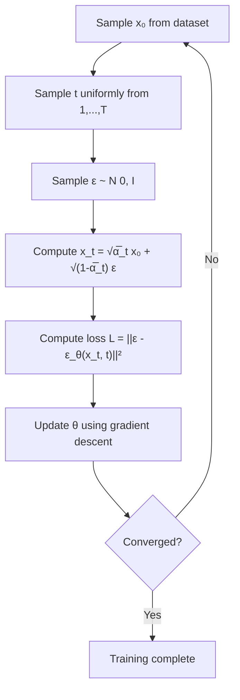
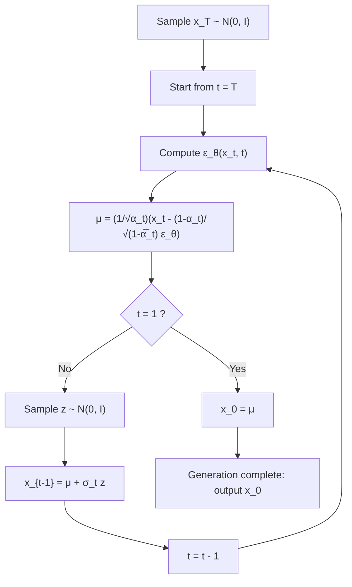

## Data Point Prediction and Noise Prediction

In the previous post, I summarized the overview of diffusion models and the training method for neural networks in the reverse diffusion process. I explained situations where we have all samples from $$\boldsymbol{x}_T$$ to $$\boldsymbol{x}_0$$, methods for sampling $$\boldsymbol{x}_t$$ and $$\boldsymbol{x}_{t-1}$$, and techniques for sampling only $$\boldsymbol{x}_t$$ and computing the ELBO using $$ q(\boldsymbol{x}_{t-1} \mid \boldsymbol{x}_t, \boldsymbol{x}_0) $$. From here on, we consider the case where the sample size is 1.


The neural network learns to predict the posterior mean $$\tilde{\boldsymbol{\mu}}_t(\boldsymbol{x}_t, \boldsymbol{x}_0)$$ using $$\boldsymbol{x}_t$$ sampled from $$q$$.
Specifically, we considered a model that approximates the mean $$\tilde{\boldsymbol{\mu}}_t(\boldsymbol{x}_t, \boldsymbol{x}_0)$$ of the posterior distribution $$q(\boldsymbol{x}_{t-1} \mid \boldsymbol{x}_t, \boldsymbol{x}_0)$$ with a neural network $$\hat{\boldsymbol{\mu}}_{\boldsymbol{\theta}}(\boldsymbol{x}_t, t)$$.


This time, I'll write about various other things I've studied in a somewhat disorganized manner. Since it's not organized at all, I'll revise it when I feel like it.


## 1. Various Parameterizations

In the previous post, I derived a model where the neural network predicts the posterior mean $$\tilde{\boldsymbol{\mu}}_t(\boldsymbol{x}_t, \boldsymbol{x}_0)$$. The posterior mean was defined as follows.


$$
\tilde{\boldsymbol{\mu}}_t(\boldsymbol{x}_t, \boldsymbol{x}_0) = \frac{\sqrt{\bar{\alpha}_{t-1}}(1-\alpha_t)}{1-\bar{\alpha}_t} \boldsymbol{x}_0 + \frac{\sqrt{\alpha_t}(1-\bar{\alpha}_{t-1})}{1-\bar{\alpha}_t} \boldsymbol{x}_t
\tag{1}
$$

This equation depends on both $$\boldsymbol{x}_0$$ and $$\boldsymbol{x}_t$$. However, we can train the neural network to directly predict $$\tilde{\boldsymbol{\mu}}_t$$, to predict $$\boldsymbol{x}_0$$, or to predict the noise $$\boldsymbol{\epsilon}$$ as described later.

For example, by setting the part predicted by the neural network to $$\boldsymbol{x}_0$$ while keeping the other parts the same as $$ \tilde{\boldsymbol{\mu}}_t(\boldsymbol{x}_t, \boldsymbol{x}_0) $$, $$ \hat{\boldsymbol{\mu}}_{\boldsymbol{\theta}}(\boldsymbol{x}_t, t) $$ can be expressed as follows.

$$
\hat{\boldsymbol{\mu}}_{\boldsymbol{\theta}}(\boldsymbol{x}_t, t)
=
\frac{\sqrt{\bar{\alpha}_{t-1}}(1-\alpha_t)}{1-\bar{\alpha}_t} \hat{\boldsymbol{x}}_{\theta}(\boldsymbol{x}_t, t) + \frac{\sqrt{\alpha_t}(1-\bar{\alpha}_{t-1})}{1-\bar{\alpha}_t} \boldsymbol{x}_t
$$

Here, $$\hat{\boldsymbol{x}}_{\theta}(\boldsymbol{x}_t, t)$$ is the output of the neural network, representing an estimate of $$\boldsymbol{x}_0$$. We simply changed what the neural network predicts from the mean to the data point. Theoretically, this makes it possible to recover the original data point $$\boldsymbol{x}_0$$ from the noisy data point $$\boldsymbol{x}_t$$.

### Reformulation of the Mean

Let's consider expressing the posterior mean $$\tilde{\boldsymbol{\mu}}_t$$ in a different form.

In the diffusion process, $$\boldsymbol{x}_t$$ was expressed as follows.

$$ \boldsymbol{x}_t = \sqrt{\bar{\alpha}_t} \boldsymbol{x}_0 + \sqrt{1 - \bar{\alpha}_t} \boldsymbol{\epsilon}, \quad \boldsymbol{\epsilon} \sim \mathcal{N}(\boldsymbol{0}, \boldsymbol{I}) $$

Solving this equation for $$\boldsymbol{x}_0$$,

$$ \boldsymbol{x}_0 = \frac{1}{\sqrt{\bar{\alpha}_t}}\left(\boldsymbol{x}_t - \sqrt{1 - \bar{\alpha}_t} \boldsymbol{\epsilon}\right) $$

Substituting this relationship into the equation (1) for $$\tilde{\boldsymbol{\mu}}_t$$ and simplifying, we can express it in terms of $$ \boldsymbol{x}_t $$ and $$ \epsilon $$. Using this equation, we can also parameterize and predict the noise.

$$
\tilde{\boldsymbol{\mu}}_t = \frac{1}{\sqrt{\alpha_t}} \left( \boldsymbol{x}_t - \frac{1-\alpha_t}{\sqrt{1-\bar{\alpha}_t}} \boldsymbol{\epsilon} \right)
\tag{2}
$$


### Three Parameterizations

There are three possible ways to represent the mean of the reverse diffusion model $$p_{\boldsymbol{\theta}}(\boldsymbol{x}_{t-1} \mid \boldsymbol{x}_t)$$ using a neural network.

1. **Mean prediction**: Directly predict $$\hat{\boldsymbol{\mu}}_{\boldsymbol{\theta}}(\boldsymbol{x}_t, t)$$
2. **Data point prediction**: Predict $$\hat{\boldsymbol{x}}_0$$ and substitute into the equation for $$\tilde{\boldsymbol{\mu}}_t$$
3. **Noise prediction**: Predict $$\boldsymbol{\epsilon}_{\boldsymbol{\theta}}(\boldsymbol{x}_t, t)$$ and use the transformation equation above

When adopting noise prediction, by modeling the noise in equation (2) with a neural network, the mean can be expressed as follows.

$$ \hat{\boldsymbol{\mu}}_{\boldsymbol{\theta}}(\boldsymbol{x}_t, t) = \frac{1}{\sqrt{\alpha_t}} \left( \boldsymbol{x}_t - \frac{1-\alpha_t}{\sqrt{1-\bar{\alpha}_t}} \boldsymbol{\epsilon}_{\boldsymbol{\theta}}(\boldsymbol{x}_t, t) \right) $$

Regardless of which parameterization is chosen, they can express the same family of distributions. However, experiments on image generation reported by Ho et al. showed that the combination of noise prediction and a simplified loss function achieved the best sample quality [^1].


### Experimental Comparison

In the report by Ho et al. [^1], experiments evaluating images generated by diffusion models trained on CIFAR10 compared various combinations of parameterizations and loss functions. The evaluation metrics are Inception Score and FID (Fréchet Inception Distance).

#### Evaluation Metrics

##### Inception Score (IS)
A metric that measures the "quality" and "diversity" of generated images, where higher is better.
Generated images are input to an image classification model with Inception module architecture (Inception Network), and the score is calculated using the output distribution. Note that this does not directly measure similarity to the actual data distribution, but evaluates from the following two perspectives.

- Quality: When a generated image is input to an image classifier (Inception Network), higher quality is assigned when it is confidently classified into a specific class. Sharper distributions are rated better.
- Diversity: Higher diversity is assigned when generated images as a whole are classified into various classes.


##### Fréchet Inception Distance (FID)

A metric that measures the closeness between the distribution of generated images and real images.

1. Pass generated images and real images through an intermediate layer of Inception Network to obtain feature vectors
2. Approximate each set of feature vectors with a multivariate normal distribution
3. Calculate the Fréchet distance (Wasserstein distance) between the two normal distributions

Since it measures the closeness between the distribution of generated images and real images, lower is better. Personally, I'm familiar with this method from Fréchet ChemNet Distance.

#### Loss Functions
Two types of loss functions are compared: the theoretically derived variational bound-based loss function $$L$$ and the simplified loss function $$L_{\text{simple}}$$.

##### Theoretical Loss Function

The loss function derived later has time-dependent weighting coefficients.

$$ L = \mathbb{E}\left[ \frac{\beta_t^2}{2\sigma_t^2 \alpha_t (1-\bar{\alpha}_t)} \|\boldsymbol{\epsilon} - \boldsymbol{\epsilon}_{\boldsymbol{\theta}}(\boldsymbol{x}_t, t)\|^2 \right] $$

- $$ \alpha_t = 1 - \beta_t $$
- $$ \bar{\alpha}_t = \prod_{s=1}^t \alpha_s $$
- $$ \sigma_t^2 $$: Variance of the reverse diffusion process $$ q(\boldsymbol{x}_{t-1} \mid \boldsymbol{x}_t) = \mathcal{N}(\tilde{\boldsymbol{\mu}}_t, \sigma_t^2 \boldsymbol{I}) $$

$$\beta_t$$ is the variance determined by the schedule, which is set to small values $$ \beta_1 = 10^{-4}, \beta_T = 0.02 $$ in the paper.

$$L_{\text{simple}}$$ simply treats this weighting coefficient as 1.

$$
L_{\text{simple}} = \mathbb{E}_{t, \boldsymbol{x}_0, \boldsymbol{\epsilon}} \left[ \|\boldsymbol{\epsilon} - \boldsymbol{\epsilon}_{\boldsymbol{\theta}}(\boldsymbol{x}_t, t)\|^2 \right]
\tag{3}
$$


It's not immediately clear from the equation how the weighting coefficient changes with $$ t $$, but the paper explains as follows.

{: .prompt-tip }

> "In particular, our diffusion process setup causes the simplified objective to down-weight loss terms corresponding to small $$t$$. These terms train the network to denoise data with very small amounts of noise, so it is beneficial to down-weight them so that the network can focus on more difficult denoising tasks at larger $$t$$ terms."

In other words, $$L_{\text{simple}}$$ relatively down-weights the contribution when $$t$$ is small (close to real data with little noise), allowing the network to focus on learning more difficult tasks when $$t$$ is large (with more noise).

#### Experimental Results

The experimental results shown in the paper[^1] are as follows.

| Parameterization | Loss Function | Inception Score | FID |
|-------------|---------|-----------------|-----|
| $$\tilde{\mu}$$ prediction | $$L$$ (variational bound) | 8.06 | 13.22 |
| $$\epsilon$$ prediction | $$L$$ (variational bound) | 7.67 | 13.51 |
| $$\epsilon$$ prediction | $$L_{\text{simple}}$$ | 9.46 | 3.17 |

The method of directly predicting $$\boldsymbol{x}_0$$ was not adopted because the sample quality was poor.
From these results, we can see:

- When using the theoretically derived loss function (variational bound), $$\tilde{\mu}$$ prediction and $$\epsilon$$ prediction have almost equivalent performance
- The combination of $$\epsilon$$ prediction and $$L_{\text{simple}}$$ (simplified loss function) performs well


## 2. Score Matching

One reason why noise prediction is possible in DDPM is its mathematical equivalence to score matching. To understand this, I'll explain energy-based models (EBM) and score matching. However, Ho et al.'s paper does not explain why noise prediction is better than mean prediction. If anyone knows, please let me know. (An intuitive explanation I've heard is that learning noise with constant mean and variance regardless of time step is an easier task than predicting points in a complex data space.)


### 2.1 The Problem of Normalization Constants in Generative Models

#### Problem Setting

The goal of generative models is to learn the underlying probability distribution $$p(\mathbf{x})$$ from training data $$\{\mathbf{x}_1, \mathbf{x}_2, \cdots, \mathbf{x}_N\}$$. A model that represents this probability distribution by modeling data likelihood with an energy function $$E_\theta(\mathbf{x})$$ is called an energy-based model (EBM). We model $$p(\mathbf{x})$$ with the following function where regions with high energy have low probability density.


$$
p_\theta(\mathbf{x}) = \frac{\exp(-E_\theta(\mathbf{x}))}{Z_\theta}
$$


- $$E_\theta(\mathbf{x})$$: Energy function (can be defined by a neural network)
- $$Z_\theta = \int \exp(-E_\theta(\mathbf{x})) d\mathbf{x}$$: Normalization constant (partition function)


Computing $$Z_\theta$$ is very difficult. Integration in high-dimensional spaces is generally computationally intractable, which becomes a bottleneck in probabilistic modeling.

---

### 2.2 Score Function: A Method to Avoid Computing the Normalization Constant

#### Definition of Score Function

The score function is defined as the gradient of the log probability density with respect to the data.


$$\mathbf{s}(\mathbf{x}) := \nabla_{\mathbf{x}} \log p(\mathbf{x})$$


The score function is a vector field that indicates the direction and magnitude of the steepest increase in probability density at each data point $$\mathbf{x}$$.

In other words, the score function describes something like the terrain of the probability distribution in data space, representing gradients toward more likely data points.


#### Advantages of Score Functions

The score function has the important property of not depending on the normalization constant $$Z_\theta$$ because it is a derivative with respect to the data space variable $$\mathbf{x}$$.

$$\mathbf{s}_\theta(\mathbf{x}) = \nabla_{\mathbf{x}} \log p_\theta(\mathbf{x}) = \nabla_{\mathbf{x}} \left[ -E_\theta(\mathbf{x}) - \log Z_\theta \right]$$

Since $$\log Z_\theta$$ does not depend on $$\mathbf{x}$$:

$$\mathbf{s}_\theta(\mathbf{x}) = -\nabla_{\mathbf{x}} E_\theta(\mathbf{x}) - \underbrace{\nabla_{\mathbf{x}} \log Z_\theta}_{=\mathbf{0}} = -\nabla_{\mathbf{x}} E_\theta(\mathbf{x})$$

This allows us to indirectly represent the probability distribution without computing the normalization constant, as long as we can learn the score function.


### 2.3 Score Matching: Learning the Unknown Score Function

We've seen that using the score function allows us to model probability distributions without computing the normalization constant. However, since the true data distribution $$p_{data}(\mathbf{x})$$ is unknown, its score function $$\nabla_\mathbf{x} \log p_{data}(\mathbf{x})$$ cannot be computed directly.
This is where score matching comes in. I haven't read the original paper myself for this section, so I'm writing based on what I've read in books and other tech blogs.

#### Explicit Score Matching (ESM)

The most direct approach is to minimize the expected squared error between the model's score $$\mathbf{s}_\theta(\mathbf{x})$$ and the true score $$\nabla_\mathbf{x} \log p_{data}(\mathbf{x})$$, but since it includes the unknown $$\nabla_\mathbf{x} \log p_{data}(\mathbf{x})$$, it cannot be computed as is.

$$J_{ESM}(\theta) = \frac{1}{2} \mathbb{E}_{\mathbf{x} \sim p_{data}(\mathbf{x})} \left[\| \mathbf{s}_\theta(\mathbf{x}) - \nabla_\mathbf{x} \log p_{data}(\mathbf{x}) \|^2\right]$$


#### Implicit Score Matching (ISM)

Hyvärinen et al. derived a loss function that achieves score matching without directly using the true score [^2]. Through integration by parts, the ESM loss function becomes equivalent to:

$$J_{ISM}(\theta) = \mathbb{E}_{\mathbf{x} \sim p_{data}(\mathbf{x})} \left[ \text{tr}(\nabla_\mathbf{x} \mathbf{s}_\theta(\mathbf{x})) + \frac{1}{2} \|\mathbf{s}_\theta(\mathbf{x})\|^2 \right]$$

- $$\text{tr}(\nabla_\mathbf{x} \mathbf{s}_\theta(\mathbf{x}))$$ : Trace of the Jacobian matrix of the score function

ISM has the advantage of not requiring the true score $$\nabla_\mathbf{x} \log p_{data}(\mathbf{x})$$. However, it had the following issues.

##### 1. Score estimation becomes inaccurate in low-density regions where data hardly exists

In the ISM loss function, we consider $$\mathbf{x}$$ following $$p_{data}(\mathbf{x})$$. Let's rewrite the expected value of the loss function in integral form.


$$J_{ISM}(\theta) = \int \underbrace{p_{data}(\mathbf{x})}_{\text{weight}} \left[ \text{tr}(\nabla_\mathbf{x} \mathbf{s}_\theta(\mathbf{x})) + \frac{1}{2} \|\mathbf{s}_\theta(\mathbf{x})\|^2 \right] d\mathbf{x}$$


Since the integral weight is $$p_{data}(\mathbf{x})$$:

| Region | Value of $$p_{data}(\mathbf{x})$$ | Contribution to Loss |
|------|---------------------------|-------------|
| High-density region (lots of data) | Large | **Large** |
| Low-density region (little data) | ≈ 0 | **Almost zero** |

This means that even if the score is wrong in low-density regions, it hardly affects the loss.


In actual training, the expected value is approximated using Monte Carlo.

$$J_{ISM}(\theta) \approx \frac{1}{N} \sum_{i=1}^{N} \left[ \text{tr}(\nabla_\mathbf{x} \mathbf{s}_\theta(\mathbf{x}^{(i)})) + \frac{1}{2} \|\mathbf{s}_\theta(\mathbf{x}^{(i)})\|^2 \right]$$

Here $$\mathbf{x}^{(i)} \sim p_{data}$$, which is data sampled from the training data. Since there are almost no samples in the training data for low-density regions, the model cannot be trained in those regions. During inference, we start from Gaussian noise, but such noise typically falls in low-density regions of the data space. In ISM, it becomes difficult to train the model sufficiently in low-density regions, making it hard to guide samples toward high-density regions.

```
Probability density p(x)
    ▲
    │      ╱╲      ╱╲
    │     ╱  ╲    ╱  ╲
    │    ╱    ╲  ╱    ╲
    ├───╱──────╲╱──────╲───→ x
               ↑
         Initial point (low-density region)

Score is inaccurate here → Move in wrong direction → Sampling fails
```


##### 2. High computational cost for Jacobian trace

Also, computing the trace of the Jacobian matrix $$\nabla_\mathbf{x} \mathbf{s}_\theta(\mathbf{x})$$ may require $$d$$ backpropagation passes, which is computationally expensive.

The trace of the Jacobian matrix is expressed as:

$$\nabla_\mathbf{x} \mathbf{s}_\theta(\mathbf{x}) = \begin{pmatrix}
\frac{\partial s_1}{\partial x_1} & \frac{\partial s_1}{\partial x_2} & \cdots & \frac{\partial s_1}{\partial x_d} \\
\frac{\partial s_2}{\partial x_1} & \frac{\partial s_2}{\partial x_2} & \cdots & \frac{\partial s_2}{\partial x_d} \\
\vdots & \vdots & \ddots & \vdots \\
\frac{\partial s_d}{\partial x_1} & \frac{\partial s_d}{\partial x_2} & \cdots & \frac{\partial s_d}{\partial x_d}
\end{pmatrix}$$


$$\text{tr}(\nabla_\mathbf{x} \mathbf{s}_\theta(\mathbf{x})) = \frac{\partial s_1}{\partial x_1} + \frac{\partial s_2}{\partial x_2} + \cdots + \frac{\partial s_d}{\partial x_d}$$


In normal backpropagation, gradients with respect to all inputs are computed at once for a scalar output, but to compute $$\frac{\partial s_i}{\partial x_i}$$, we need to backpropagate separately for each output component $$s_i$$:

- Backpropagate for $$s_1$$ → Get $$\frac{\partial s_1}{\partial x_1}$$
- Backpropagate for $$s_2$$ → Get $$\frac{\partial s_2}{\partial x_2}$$
- ...
- Backpropagate for $$s_d$$ → Get $$\frac{\partial s_d}{\partial x_d}$$


---

### 2.4 Denoising Score Matching (DSM)

Denoising Score Matching (DSM) [^3] was proposed to solve the issues in ISM: training in low-density regions of data space and computational cost.


The ISM loss function is weighted by $$p_{data}(\mathbf{x})$$, so even if there are score errors in low-density regions where data doesn't exist, they hardly contribute to the loss. Therefore, the basic idea of DSM is to fill low-density regions by adding noise.


First, we add Gaussian noise to the original data $$\mathbf{x}$$ to create noisy data $$\tilde{\mathbf{x}}$$.


$$\tilde{\mathbf{x}} = \mathbf{x} + \sigma \boldsymbol{\epsilon}, \quad \boldsymbol{\epsilon} \sim \mathcal{N}(\mathbf{0}, \mathbf{I})$$

Let $$q_\sigma(\tilde{\mathbf{x}})$$ denote the distribution of the transformed data $$\tilde{\mathbf{x}}$$. Here $$\sigma$$ is the standard deviation of the noise.


This creates the following differences compared to using $$\mathbf{x}$$:
- Data points spread to low-density regions
- We learn the score of the spread distribution $$q_\sigma(\tilde{\mathbf{x}})$$


Diagram created by Claude:

```
Adding noise fills low-density regions

Original distribution p(x)      Noisy distribution q_σ(x̃)
    ▲                              ▲
    │   ╱╲    ╱╲                   │  ╱~~~~╲
    │  ╱  ╲  ╱  ╲                  │ ╱      ╲
    │ ╱    ╲╱    ╲                 │╱        ╲
    ├╱──────╲╲────╲→               ├──────────────→
       Gap exists                    Gap is filled!
```

The gaps are low-density regions, and starting from here, the score function doesn't work well. By considering the noisy distribution, we fill in the low-density regions.


#### Conditional and Marginal Distributions

Here we introduce two distributions.

1. Conditional distribution
$$q(\tilde{\mathbf{x}}|\mathbf{x})$$: Distribution of $$\tilde{\mathbf{x}}$$ given the original data $$\mathbf{x}$$
$$q(\tilde{\mathbf{x}}|\mathbf{x}) = \mathcal{N}(\tilde{\mathbf{x}}; \mathbf{x}, \sigma^2\mathbf{I})$$

2. Marginal distribution $$q_\sigma(\tilde{\mathbf{x}})$$: Distribution of $$\tilde{\mathbf{x}}$$ after integrating out $$\mathbf{x}$$
$$q_\sigma(\tilde{\mathbf{x}}) = \int q(\tilde{\mathbf{x}}|\mathbf{x}) p_{data}(\mathbf{x}) d\mathbf{x}$$

What's needed for sampling is the score of the marginal distribution $$\nabla_{\tilde{\mathbf{x}}} \log q_\sigma(\tilde{\mathbf{x}})$$, but it cannot be computed directly because it depends on $$p_{data}(\mathbf{x})$$. On the other hand, the conditional score can be computed analytically. DSM aims to learn this conditional score.

#### Analytical Computation of Conditional Score

The probability density function of a Gaussian distribution is:


$$q(\tilde{\mathbf{x}}|\mathbf{x}) = \frac{1}{(2\pi\sigma^2)^{d/2}} \exp\left(-\frac{\|\tilde{\mathbf{x}} - \mathbf{x}\|^2}{2\sigma^2}\right)$$

Taking the logarithm:


$$\log q(\tilde{\mathbf{x}}|\mathbf{x}) = -\frac{d}{2}\log(2\pi\sigma^2) - \frac{\|\tilde{\mathbf{x}} - \mathbf{x}\|^2}{2\sigma^2}$$

Differentiating with respect to $$\tilde{\mathbf{x}}$$, the first term vanishes as it doesn't depend on $$\tilde{\mathbf{x}}$$:


$$\nabla_{\tilde{\mathbf{x}}} \log q(\tilde{\mathbf{x}}|\mathbf{x}) = -\frac{\tilde{\mathbf{x}} - \mathbf{x}}{\sigma^2}$$

Since $$\tilde{\mathbf{x}} = \mathbf{x} + \sigma\boldsymbol{\epsilon}$$, we have $$\tilde{\mathbf{x}} - \mathbf{x} = \sigma\boldsymbol{\epsilon}$$, so:

$$\nabla_{\tilde{\mathbf{x}}} \log q(\tilde{\mathbf{x}}|\mathbf{x}) = -\frac{\sigma\boldsymbol{\epsilon}}{\sigma^2} = -\frac{\boldsymbol{\epsilon}}{\sigma}$$


The result is a simple form of the added noise $$\boldsymbol{\epsilon}$$ multiplied by $$-\frac{1}{\sigma}$$.


Here, $$ q(\tilde{\mathbf{x}}\mid\mathbf{x})$$ is a Gaussian distribution centered at the given data point $$\mathbf{x}$$, which is maximized at center $$\mathbf{x}$$. Therefore, maximizing the conditional score $$\nabla_{\tilde{\mathbf{x}}} \log q(\tilde{\mathbf{x}}\mid\mathbf{x})$$ means pointing in the direction from noisy data $$\tilde{\mathbf{x}}$$ toward original data $$\mathbf{x}$$. In other words, this equation indicates the direction to remove noise.


#### DSM Loss Function

In DSM, we minimize the squared error between the model's predicted score $$ \mathbf{s}_\theta(\tilde{\mathbf{x}}, \sigma) $$ and the conditional score $$\nabla_{\tilde{\mathbf{x}}} \log q(\tilde{\mathbf{x}}\mid\mathbf{x})$$.


$$
J_{DSM}(\theta) = \frac{1}{2} \mathbb{E}_{\mathbf{x} \sim p_{data}} \mathbb{E}_{\tilde{\mathbf{x}} \sim q(\tilde{\mathbf{x}}\mid\mathbf{x})} \left[ \left\| \mathbf{s}_\theta(\tilde{\mathbf{x}}, \sigma) - \nabla_{\tilde{\mathbf{x}}} \log q(\tilde{\mathbf{x}}\mid\mathbf{x}) \right\|^2 \right]
\tag{4}
$$


Substituting the conditional score formula derived earlier, and rewriting with Gaussian noise $$\boldsymbol{\epsilon}$$ using $$\tilde{\mathbf{x}} = \mathbf{x} + \sigma\boldsymbol{\epsilon}$$:


$$J_{DSM}(\theta) = \frac{1}{2} \mathbb{E}_{\mathbf{x} \sim p_{data}} \mathbb{E}_{\boldsymbol{\epsilon} \sim \mathcal{N}(\mathbf{0}, \mathbf{I})} \left[ \left\| \mathbf{s}_\theta(\mathbf{x}+\sigma\boldsymbol{\epsilon}, \sigma) + \frac{\boldsymbol{\epsilon}}{\sigma} \right\|^2 \right]$$


This equation means that for noisy data $$\tilde{\mathbf{x}} = \mathbf{x} + \sigma\boldsymbol{\epsilon}$$, the model learns so that its predicted score $$\mathbf{s}_\theta(\tilde{\mathbf{x}}, \sigma)$$ approaches the direction of removing noise $$-\frac{\boldsymbol{\epsilon}}{\sigma}$$.


From the above, we can see the following advantages of using the DSM loss function:
- No need to compute the Jacobian trace
- Can be computed with only training data $$\mathbf{x}$$, sampled noise $$\boldsymbol{\epsilon}$$, and model's score $$\mathbf{s}_\theta$$
- Can efficiently learn even with high-dimensional data


### 2.5 Sampling from Score Functions

#### Why We Need a Sampling Method

So far, we've explained how to learn the score function $$\nabla_\mathbf{x} \log p(\mathbf{x})$$ (DSM). However, the score function only tells us the direction where probability increases; it is not a probability distribution itself. Therefore, we need a method to actually generate new data using the learned score function.


The simplest method is to start from a random point and repeatedly move in the direction of the score. This allows gradual movement toward high-probability regions.

$$\mathbf{x}_{i+1} = \mathbf{x}_i + \tau \nabla_\mathbf{x} \log p(\mathbf{x}_i)$$

- $$\tau > 0$$ : Step size (parameter controlling how much to move in each update)

This is simple gradient ascent, but the updated values are determined deterministically. Therefore, the destination is uniquely determined for each initial value, making it impossible to obtain diverse samples.


#### Langevin Dynamics

Langevin dynamics solves this problem. By adding random noise to the gradient ascent update equation, we can explore the entire probability distribution.


$$\mathbf{x}_{i+1} = \mathbf{x}_i + \tau \nabla_\mathbf{x} \log p(\mathbf{x}_i) + \sqrt{2\tau} \mathbf{z}_i, \quad \mathbf{z}_i \sim \mathcal{N}(\mathbf{0}, \mathbf{I})$$

Here $$\mathbf{z}_i$$ is noise sampled from a standard normal distribution at each step.


The characteristics of Langevin dynamics are:
- The noise term makes updates stochastic
- The score term pulls toward high-probability regions (second term), while the noise term explores the surrounding area (third term)
- Spends more time in high-probability locations and quickly leaves low-probability locations


## 3. Relationship Between DDPM and Score Matching

The reverse process of DDPM (the process of recovering data from noise) is based on this Langevin dynamics concept.


In DDPM, the following two operations are repeated at each time $$t$$.

1. At each time $$t$$, use the score (≈ noise prediction) to move toward higher probability
2. Simultaneously add noise to generate diverse samples


---

### 3.1 Equivalence of DDPM and Score Matching

#### DDPM Loss Function

The loss function for noise prediction in DDPM was shown in equation (3).

$$\mathcal{L}_{DDPM} = \mathbb{E}_{t, \mathbf{x}_0, \boldsymbol{\epsilon}}\left[\|\boldsymbol{\epsilon} - \boldsymbol{\epsilon}_\theta(\mathbf{x}_t, t)\|^2\right]$$

- $$\mathbf{x}_t = \sqrt{\bar{\alpha}_t}\mathbf{x}_0 + \sqrt{1-\bar{\alpha}_t}\boldsymbol{\epsilon}$$
- $$\boldsymbol{\epsilon} \sim \mathcal{N}(\mathbf{0}, \mathbf{I})$$


On the other hand, the DSM loss function was shown in equation (4).

$$\mathcal{L}_{DSM} = \mathbb{E}\left[\|\mathbf{s}_\theta(\tilde{\mathbf{x}}) - \nabla_{\tilde{\mathbf{x}}} \log q(\tilde{\mathbf{x}}|\mathbf{x})\|^2\right]$$

At first glance, DDPM predicts noise $$\boldsymbol{\epsilon}$$ while DSM predicts score $$\nabla \log q$$, appearing to learn different things. However, I'll show that they are essentially learning the same thing.


#### Deriving the Relationship Between Score and Noise

The conditional distribution of noisy data was:

$$q(\mathbf{x}_t | \mathbf{x}_0) = \mathcal{N}(\mathbf{x}_t; \sqrt{\bar{\alpha}_t}\mathbf{x}_0, (1-\bar{\alpha}_t)\mathbf{I})$$

Let's compute the score of this distribution. Since the score of a Gaussian $$\mathcal{N}(\boldsymbol{\mu}, \sigma^2\mathbf{I})$$ is $$-\frac{\mathbf{x}-\boldsymbol{\mu}}{\sigma^2}$$, with $$\mu = \sqrt{\bar{\alpha}_t}\mathbf{x}_0$$ and $$\sigma^2 = 1-\bar{\alpha}_t$$:


$$\nabla_{\mathbf{x}_t} \log q(\mathbf{x}_t | \mathbf{x}_0) = -\frac{\mathbf{x}_t - \sqrt{\bar{\alpha}_t}\mathbf{x}_0}{1-\bar{\alpha}_t}$$

Here, from the definition of noisy data at step $$t$$ in DDPM $$\mathbf{x}_t = \sqrt{\bar{\alpha}_t}\mathbf{x}_0 + \sqrt{1-\bar{\alpha}_t}\boldsymbol{\epsilon}$$:


$$\mathbf{x}_t - \sqrt{\bar{\alpha}_t}\mathbf{x}_0 = \sqrt{1-\bar{\alpha}_t}\boldsymbol{\epsilon}$$

Therefore:


$$\nabla_{\mathbf{x}_t} \log q(\mathbf{x}_t | \mathbf{x}_0) = -\frac{\sqrt{1-\bar{\alpha}_t}\boldsymbol{\epsilon}}{1-\bar{\alpha}_t} = -\frac{\boldsymbol{\epsilon}}{\sqrt{1-\bar{\alpha}_t}}$$

Solving this equation for $$\boldsymbol{\epsilon}$$:


$$
\boldsymbol{\epsilon} = -\sqrt{1-\bar{\alpha}_t} \cdot \nabla_{\mathbf{x}_t} \log q(\mathbf{x}_t | \mathbf{x}_0)
\tag{5}
$$

This shows that the true noise $$\boldsymbol{\epsilon}$$ equals the conditional score multiplied by a constant. Replacing the true noise $$\boldsymbol{\epsilon}$$ with DDPM's predicted $$\boldsymbol{\epsilon}_\theta(\mathbf{x}_t, t)$$ and the conditional score $$\nabla_{\mathbf{x}_t} \log q(\mathbf{x}_t \| \mathbf{x}_0)$$ with $$\mathbf{s}_\theta(\mathbf{x}_t, t)$$, equation (5) becomes:


$$\boxed{\mathbf{s}_\theta(\mathbf{x}_t, t) = -\frac{\boldsymbol{\epsilon}_\theta(\mathbf{x}_t, t)}{\sqrt{1-\bar{\alpha}_t}}}$$


From this equation, we can see that predicting noise $$\boldsymbol{\epsilon}$$ in DDPM is essentially the same as predicting the score $$\nabla_{\mathbf{x}_t} \log q(\mathbf{x}_t \| \mathbf{x}_0)$$ in DSM.


#### Correspondence Between DSM and DDPM

When we map the notation of DSM to DDPM, DDPM can be seen as an extension of DSM to multiple noise levels (each time $$t$$).

| DSM | DDPM |
|-----|------|
| $$\tilde{\mathbf{x}} = \mathbf{x} + \sigma\boldsymbol{\epsilon}$$ | $$\mathbf{x}_t = \sqrt{\bar{\alpha}_t}\mathbf{x}_0 + \sqrt{1-\bar{\alpha}_t}\boldsymbol{\epsilon}$$ |
| Noise standard deviation: $$\sigma$$ | Noise standard deviation: $$\sqrt{1-\bar{\alpha}_t}$$ |
| Conditional score: $$-\frac{\boldsymbol{\epsilon}}{\sigma}$$ | Conditional score: $$-\frac{\boldsymbol{\epsilon}}{\sqrt{1-\bar{\alpha}_t}}$$ |


#### Development Flow of Score Matching

Summarizing the flow so far:

```
EBM (normalization constant is intractable)
    ↓
Introduce score function (doesn't depend on normalization constant)
    ↓
ESM (requires true score → not computable)
    ↓
ISM (no true score needed, but high computational cost & low-density region problem)
    ↓
DSM (add noise and learn conditional score)
    ↓
DDPM (extend DSM to multiple noise levels)
```

## 4. Derivation of Noise Prediction Loss Function

### Derivation from KL Divergence

Let me restate the loss function derived in the previous section.

$$ \mathcal{L}(\boldsymbol{\theta}; \boldsymbol{x}_0) \propto \mathbb{E}_{t, q(\boldsymbol{x}_t \mid \boldsymbol{x}_0)} \left[ \frac{1}{\tilde{\sigma}_{t}^2} \|\tilde{\boldsymbol{\mu}}_t(\boldsymbol{x}_t, \boldsymbol{x}_0) - \hat{\boldsymbol{\mu}}_{\boldsymbol{\theta}}(\boldsymbol{x}_t, t)\|^2 \right] $$

Here, we rewrite $$\tilde{\boldsymbol{\mu}}_t$$ and $$\hat{\boldsymbol{\mu}}_{\boldsymbol{\theta}}$$ as functions of noise.

True posterior mean (expressed using $$\boldsymbol{\epsilon}$$):
$$ \tilde{\boldsymbol{\mu}}_t = \frac{1}{\sqrt{\alpha_t}} \left( \boldsymbol{x}_t - \frac{1-\alpha_t}{\sqrt{1-\bar{\alpha}_t}} \boldsymbol{\epsilon} \right) $$

Model mean (expressed using $$\boldsymbol{\epsilon}_{\boldsymbol{\theta}}$$):
$$ \hat{\boldsymbol{\mu}}_{\boldsymbol{\theta}} = \frac{1}{\sqrt{\alpha_t}} \left( \boldsymbol{x}_t - \frac{1-\alpha_t}{\sqrt{1-\bar{\alpha}_t}} \boldsymbol{\epsilon}_{\boldsymbol{\theta}}(\boldsymbol{x}_t, t) \right) $$

Computing their difference:

$$ \tilde{\boldsymbol{\mu}}_t - \hat{\boldsymbol{\mu}}_{\boldsymbol{\theta}} = \frac{1}{\sqrt{\alpha_t}} \cdot \frac{1-\alpha_t}{\sqrt{1-\bar{\alpha}_t}} \left( \boldsymbol{\epsilon}_{\boldsymbol{\theta}}(\boldsymbol{x}_t, t) - \boldsymbol{\epsilon} \right) $$

Therefore:

$$ \|\tilde{\boldsymbol{\mu}}_t - \hat{\boldsymbol{\mu}}_{\boldsymbol{\theta}}\|^2 = \frac{(1-\alpha_t)^2}{\alpha_t (1-\bar{\alpha}_t)} \|\boldsymbol{\epsilon} - \boldsymbol{\epsilon}_{\boldsymbol{\theta}}(\boldsymbol{x}_t, t)\|^2 $$

Substituting this into the loss function:

$$ \mathcal{L}(\boldsymbol{\theta}; \boldsymbol{x}_0) \propto \mathbb{E}_{t, \boldsymbol{\epsilon}} \left[ \frac{(1-\alpha_t)^2}{\tilde{\sigma}_{t}^2 \alpha_t (1-\bar{\alpha}_t)} \|\boldsymbol{\epsilon} - \boldsymbol{\epsilon}_{\boldsymbol{\theta}}(\boldsymbol{x}_t, t)\|^2 \right] $$


Substituting $$\beta_t = 1-\alpha_t$$:


$$  \mathcal{L}(\boldsymbol{\theta}; \boldsymbol{x}_0) = \mathbb{E}_{t, \boldsymbol{\epsilon}} \left[ \frac{\beta_t^2}{\tilde{\sigma}_t^2 \alpha_t (1-\bar{\alpha}_t)} \|\boldsymbol{\epsilon} - \boldsymbol{\epsilon}_{\boldsymbol{\theta}}(\boldsymbol{x}_t, t)\|^2 \right] $$

This now matches the loss function shown earlier.


## 5. Training Algorithm

Combining the previous and current articles, here is the training algorithm for diffusion models.

### Training

```
Input: Dataset, noise schedule {β_t}, network ε_θ
Output: Trained parameters θ

Repeat until convergence:
    1. Sample x_0 from dataset
    2. Sample t uniformly from {1, 2, ..., T}
    3. Sample ε ~ N(0, I)
    4. Compute x_t = √(α̅_t) x_0 + √(1 - α̅_t) ε
    5. Compute loss L = ||ε - ε_θ(x_t, t)||²
    6. Compute ∇_θ L and update parameters θ
```




### Sampling

```
Input: Trained network ε_θ, noise schedule {β_t}
Output: Generated sample x_0

1. Sample x_T ~ N(0, I)
2. For t = T, T-1, ..., 1:
    a. Sample z ~ N(0, I) (z = 0 when t = 1)
    b. Compute ε_θ(x_t, t)
    c. x_{t-1} = (1/√α_t)(x_t - (1-α_t)/√(1-α̅_t) ε_θ(x_t, t)) + σ_t z
3. Return x_0
```




## Reference

[^1]: Jonathan Ho, Ajay Jain, Pieter Abbeel. "Denoising Diffusion Probabilistic Models." _Advances in Neural Information Processing Systems_ 33 (2020).

[^2]: Hyvärinen, Aapo, and Peter Dayan. "Estimation of non-normalized statistical models by score matching." Journal of Machine Learning Research 6.4 (2005).

[^3]: Vincent, Pascal. "A connection between score matching and denoising autoencoders." Neural computation 23.7 (2011): 1661-1674.
