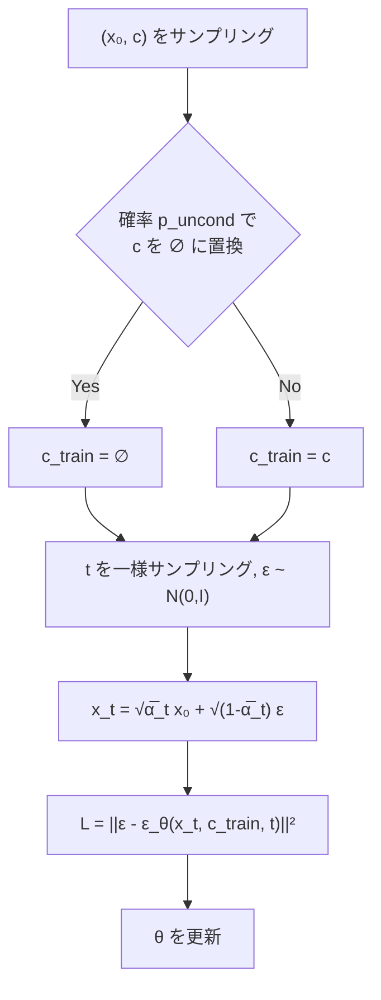

前回ポストでは、DDPMにおけるノイズ予測がスコアマッチングと本質的に等価であることを示しました。前回までは条件無しでの拡散モデルしか取り扱っていませんでしたが、生成するデータをコントロールするためには、条件付き生成が必要です。


## スコア関数とノイズ予測の復習

ここでは、以降の議論に必要な関係式を簡単に再確認します。

拡散過程の条件付き分布 $$q(\boldsymbol{x}_t \mid \boldsymbol{x}_0) = \mathcal{N}(\boldsymbol{x}_t; \sqrt{\bar{\alpha}_t}\boldsymbol{x}_0, (1-\bar{\alpha}_t)\boldsymbol{I})$$ に対して、スコア関数は以下のように計算されました。

$$ \nabla_{\boldsymbol{x}_t} \log q(\boldsymbol{x}_t \mid \boldsymbol{x}_0) = -\frac{\boldsymbol{\epsilon}}{\sqrt{1-\bar{\alpha}_t}} $$

ここで $$\boldsymbol{\epsilon}$$ は $$\boldsymbol{x}_t = \sqrt{\bar{\alpha}_t}\boldsymbol{x}_0 + \sqrt{1-\bar{\alpha}_t}\boldsymbol{\epsilon}$$ における標準正規ノイズです。DDPMのノイズ予測ネットワーク $$\boldsymbol{\epsilon}_{\boldsymbol{\theta}}(\boldsymbol{x}_t, t)$$ とスコアモデル $$\boldsymbol{s}_{\boldsymbol{\theta}}(\boldsymbol{x}_t, t)$$ の間には、以下の関係が成り立ちます。

$$\boldsymbol{s}_{\boldsymbol{\theta}}(\boldsymbol{x}_t, t) = -\frac{\boldsymbol{\epsilon}_{\boldsymbol{\theta}}(\boldsymbol{x}_t, t)}{\sqrt{1-\bar{\alpha}_t}}$$

つまり、ノイズ $$\boldsymbol{\epsilon}$$ とスコア関数（対数確率密度の勾配）は定数倍しただけの関係であるため、これらを予測することは数学的に等価です。この関係が、


## 1. 条件付き拡散モデル

これまでの議論では、データ分布 $$p(\boldsymbol{x})$$ を扱ってきました。しかし、実際の応用では特定のクラス（例えば犬とか猫とか）の画像を生成したい状況や、テキストに対応する画像を生成したいといった、条件付き生成が求められます。条件 $$ c $$ が与えられたとき、条件付き分布 $$p(\boldsymbol{x} \mid c)$$ からサンプリングすることが目標になります。

条件付き分布のスコア関数は以下のように定義されます。

$$ \nabla_{\boldsymbol{x}_t} \log p(\boldsymbol{x}_t \mid c) $$


### 条件付きスコアの導出

ベイズの定理を用いて、条件付きの対数尤度を分解します。

$$ p(\boldsymbol{x}_t \mid c) = \frac{p(c \mid \boldsymbol{x}_t) \cdot p(\boldsymbol{x}_t)}{p(c)} $$

両辺の対数をとると、

$$ \log p(\boldsymbol{x}_t \mid c) = \log p(c \mid \boldsymbol{x}_t) + \log p(\boldsymbol{x}_t) - \log p(c) $$

$$\boldsymbol{x}_t$$ に関する勾配を考える場合、$$\log p(c)$$ は $$\boldsymbol{x}_t$$ に依存しないため消去でき、

$$ \nabla_{\boldsymbol{x}_t} \log p(\boldsymbol{x}_t \mid c) = \nabla_{\boldsymbol{x}_t} \log p(c \mid \boldsymbol{x}_t) + \nabla_{\boldsymbol{x}_t} \log p(\boldsymbol{x}_t) $$

つまり、条件付きスコアは以下のように分解できます。

$$
\underbrace{\nabla_{\boldsymbol{x}_t} \log p(\boldsymbol{x}_t \mid c)}_{\text{条件付きスコア}} = \underbrace{\nabla_{\boldsymbol{x}_t} \log p(\boldsymbol{x}_t)}_{\text{無条件スコア}} + \underbrace{\nabla_{\boldsymbol{x}_t} \log p(c \mid \boldsymbol{x}_t)}_{\text{分類器の勾配}}
\tag{1}
$$

この結果から、条件付き生成を「無条件の生成モデル」と「分類器」の組み合わせで表現できました。無条件スコアは前回と同じようにモデル化し、分類器は別のネットワークで学習したものを使うことができます。


## 2. 分類器付きガイダンス (Classifier Guidance)

Dhariwal & Nichol (2021) [^1] は、式 (1) の分解に基づいて、分類器の勾配をスコアに加えることで条件付き生成を実現する手法を提案しました。

具体的には、条件付きスコアに対してガイダンス強度パラメータ $$w$$ を導入し、分類器の寄与度を決定します。

$$
\nabla_{\boldsymbol{x}_t} \log p_w(\boldsymbol{x}_t \mid c) = \nabla_{\boldsymbol{x}_t} \log p(\boldsymbol{x}_t) + (1 + w) \nabla_{\boldsymbol{x}_t} \log p(c \mid \boldsymbol{x}_t)
\tag{2}
$$

ここで、$$w = 0$$ のとき、通常の条件付きスコアに一致します。$$w > 0$$ に設定すると、分類器による条件 $$c$$ の予測確率が重要視するような方向にスコアが調整されます。


### 2.1 ノイズ予測への変換

スコアとノイズ予測の関係 $$\boldsymbol{s}_{\boldsymbol{\theta}}(\boldsymbol{x}_t, t) = -\frac{\boldsymbol{\epsilon}_{\boldsymbol{\theta}}(\boldsymbol{x}_t, t)}{\sqrt{1-\bar{\alpha}_t}}$$ を用いると、ガイダンス付きのノイズ予測は以下のように書けます。


$$
 \tilde{\boldsymbol{\epsilon}}_{\boldsymbol{\theta}}(\boldsymbol{x}_t, c, t) = \boldsymbol{\epsilon}_{\boldsymbol{\theta}}(\boldsymbol{x}_t, t) - (1+w)\sqrt{1-\bar{\alpha}_t} \nabla_{\boldsymbol{x}_t} \log p_{\boldsymbol{\phi}}(c \mid \boldsymbol{x}_t) 
 $$

ここで $$p_{\boldsymbol{\phi}}(c \mid \boldsymbol{x}_t)$$ は、ノイズ入りの画像 $$\boldsymbol{x}_t$$ からクラス $$c$$ を分類するように別途学習された分類器です。


### 2.2 分類器付きガイダンスの課題

分類器付きガイダンスにおいて、拡散モデルとは別に、ノイズ入りデータに対する分類器 $$p_{\boldsymbol{\phi}}(c \mid \boldsymbol{x}_t)$$ を学習する必要があるという点が課題です。様々なtime step $$t$$ のノイズが入った画像からクラスを予測する分類器が必要であるため、クリーンな画像に対して学習した既存の分類器をそのまま使うことはできません。


## 3. 分類器無しガイダンス (Classifier-Free Guidance)

Ho & Salimans (2021) [^2] は、分類器を使わずに条件付き生成を実現する Classifier-Free Guidance (CFG) という手法を提案しました。

### 3.1 条件付きスコアの導出

式 (1) を変形して、分類器の勾配を生成モデルだけで表現します。ベイズの定理 $$p(c \mid \boldsymbol{x}_t) = \frac{p(\boldsymbol{x}_t \mid c) p(c)}{p(\boldsymbol{x}_t)}$$ の対数をとり、$$\boldsymbol{x}_t$$ で微分すると、$$ \log p(c) $$ が消去されるため、

$$ \nabla_{\boldsymbol{x}_t} \log p(c \mid \boldsymbol{x}_t) = \nabla_{\boldsymbol{x}_t} \log p(\boldsymbol{x}_t \mid c) - \nabla_{\boldsymbol{x}_t} \log p(\boldsymbol{x}_t) $$

つまり、分類器の勾配は条件付きスコアと無条件スコアの差として表現できます。

$$
\nabla_{\boldsymbol{x}_t} \log p(c \mid \boldsymbol{x}_t) = \underbrace{\nabla_{\boldsymbol{x}_t} \log p(\boldsymbol{x}_t \mid c)}_{\text{条件付きスコア}} - \underbrace{\nabla_{\boldsymbol{x}_t} \log p(\boldsymbol{x}_t)}_{\text{無条件スコア}}
\tag{3}
$$


式 (3) を分類器付きガイダンスの式 (2) に代入すると、

$$
\nabla_{\boldsymbol{x}_t} \log p_w(\boldsymbol{x}_t \mid c) = \nabla_{\boldsymbol{x}_t} \log p(\boldsymbol{x}_t) + (1+w)\left[\nabla_{\boldsymbol{x}_t} \log p(\boldsymbol{x}_t \mid c) - \nabla_{\boldsymbol{x}_t} \log p(\boldsymbol{x}_t)\right]
\tag{4}
$$

整理すると、

$$
\nabla_{\boldsymbol{x}_t} \log p_w(\boldsymbol{x}_t \mid c) = (1+w) \nabla_{\boldsymbol{x}_t} \log p(\boldsymbol{x}_t \mid c) - w \nabla_{\boldsymbol{x}_t} \log p(\boldsymbol{x}_t)
\tag{5}
$$

分類器の勾配を使わずに、条件付きスコアと無条件スコアの線形結合だけでガイダンスのスコアを表現することができました。

ノイズ予測で書き直すと、

$$
\tilde{\boldsymbol{\epsilon}}_{\boldsymbol{\theta}}(\boldsymbol{x}_t, c, t) = (1+w) \boldsymbol{\epsilon}_{\boldsymbol{\theta}}(\boldsymbol{x}_t, c, t) - w \boldsymbol{\epsilon}_{\boldsymbol{\theta}}(\boldsymbol{x}_t, t)
\tag{6}
$$

ここで、

条件付きノイズ予測: $$\boldsymbol{\epsilon}_{\boldsymbol{\theta}}(\boldsymbol{x}_t, c, t)$$

無条件ノイズ予測: $$\boldsymbol{\epsilon}_{\boldsymbol{\theta}}(\boldsymbol{x}_t, t)$$

ガイダンススケール: $$w$$


{: .prompt-tip }
> 式 (4) で、簡易的に無条件スコアの微分を $$\vec{a}$$ , 条件付きスコアの微分を $$\vec{b}$$ とすると、$$ \vec{a} + (1+w)(\vec{b} - \vec{a}) $$ と書けます。これは、無条件スコアから条件付きスコアへのベクトル $$\vec{b} - \vec{a}$$ を $$(1+w)$$ 倍して、無条件スコアに加える操作です。つまり、無条件付きスコアから、条件付きスコアの方向に条件付き生成の強度を調整していると解釈できます。


### 3.2 学習

式 (6) を推論時に使うためには、条件付きのノイズと無条件のノイズが必要です。2種類のネットワークを利用する方法も考えられますが、Ho & Salimans による報告 [^2] では、学習時に一定の確率 $$p_{\text{uncond}}$$ で条件 $$ c $$ を空のトークン $$ \varnothing $$ に置き換えることで、単一のネットワークで両方を学習する方法が提案されています。

$$
c_{\text{train}} = \begin{cases} c & \text{with probability } 1 - p_{\text{uncond}} \\ \varnothing & \text{with probability } p_{\text{uncond}} \end{cases}
$$


つまり、学習時には以下のように単一のネットワークを訓練します。


- 条件付きスコア：$$\boldsymbol{\epsilon}_{\boldsymbol{\theta}}(\boldsymbol{x}_t, c, t) \approx -\sqrt{1-\bar{\alpha}_t} \nabla_{\boldsymbol{x}_t} \log p(\boldsymbol{x}_t \mid c)$$（条件 $$c$$ を入力した場合）
- 無条件スコア：$$\boldsymbol{\epsilon}_{\boldsymbol{\theta}}(\boldsymbol{x}_t, \varnothing, t) \approx -\sqrt{1-\bar{\alpha}_t} \nabla_{\boldsymbol{x}_t} \log p(\boldsymbol{x}_t)$$（空トークン $$\varnothing$$ を入力した場合）

推論時には、式 (6) に従って両方のノイズ予測を計算し、線形結合するだけです。

```
学習アルゴリズム（Classifier-Free Guidance）:
    1. データセットから (x_0, c) をサンプリング
    2. 確率 p_uncond で c を ∅ に置き換える
    3. t を {1, ..., T} から一様にサンプリング
    4. ε ~ N(0, I) をサンプリング
    5. x_t = √(α̅_t) x_0 + √(1 - α̅_t) ε を計算
    6. 損失 L = ||ε - ε_θ(x_t, c_train, t)||² を計算
    7. ∇_θ L で パラメータ θ を更新
```



```
サンプリングアルゴリズム（Classifier-Free Guidance）:
    1. x_T ~ N(0, I)
    2. t = T, T-1, ..., 1 について:
        a. ε_cond = ε_θ(x_t, c, t) を計算
        b. ε_uncond = ε_θ(x_t, ∅, t) を計算
        c. ε̃ = (1+w) ε_cond - w ε_uncond
        d. ε̃ を使って x_{t-1} を計算
    3. x_0 を返す
```


### 3.3 分類器付き vs 分類器無しの比較

| | 分類器付きガイダンス | 分類器無しガイダンス |
|---|---|---|
| 追加モデル | ノイズ対応分類器が必要 | 不要 |
| 学習 | 拡散モデル + 分類器を別々に学習 | 単一のネットワークで学習 |
| 推論 | 1回のforward + 分類器の勾配計算 | 2回のforward（条件付き + 無条件） |


### 3.4 Classifier-Free Guidance の課題

後の研究では、Classifier-Free Guidance（CFG）に以下の課題があることが指摘されています。

1. 推論コスト：各Denoisingステップで条件付き・無条件の2回のforward processが必要であり、計算コストが高い。
2. 学習の効率低下：ランダムにラベルをドロップして無条件モデルも同時に学習させるため、本来のタスクである条件付き生成の学習に使える有効なサンプル数が減少する。


## 4. Model-Guidance

直観的に無条件スコアの訓練が無くてもなんとかなりそうな気がして少し調べてみたところ、Tang _et al_. (2025) [^3] によって提案された Model-guidance (MG) という手法があることが分かりました。そんなに引用されていませんが、ななめ読みしたので紹介します。


CFGの推論時に2回のforward processが必要であるという問題に対し、MGでは、推論時に1回のforward processで済むように改良しており、推論時の計算速度が向上することが示されています。

### 暗黙的分類器

Classifier Guidance でのスコアを再掲します。

$$
\nabla_{\boldsymbol{x}_t} \log p_w(\boldsymbol{x}_t \mid c) = \nabla_{\boldsymbol{x}_t} \log p(\boldsymbol{x}_t \mid c) + w \nabla_{\boldsymbol{x}_t} \log p(c \mid \boldsymbol{x}_t)
$$


MGでは、拡散モデル自体を暗黙的な分類器（implicit classifier）として利用します。学習済みの条件付きモデル $$\boldsymbol{\epsilon}_{\boldsymbol{\theta}}(\boldsymbol{x}_t, c, t)$$ と無条件モデル $$\boldsymbol{\epsilon}_{\boldsymbol{\theta}}(\boldsymbol{x}_t, \varnothing, t)$$ から暗黙的に分類器の勾配を推定し、それを学習ターゲットに組み込みます。

具体的には、学習時のターゲットノイズ $$\boldsymbol{\epsilon}'$$ を以下のように修正します。

$$
\boldsymbol{\epsilon}' = \boldsymbol{\epsilon} + w \cdot \text{sg}\left(\boldsymbol{\epsilon}_{\boldsymbol{\theta}}(\boldsymbol{x}_t, c, t) - \boldsymbol{\epsilon}_{\boldsymbol{\theta}}(\boldsymbol{x}_t, \varnothing, t)\right)
\tag{7}
$$

ここで、$$\text{sg}(\cdot)$$ は stop-gradient 演算子で、勾配の伝播を遮断します。$$\boldsymbol{\epsilon}_{\boldsymbol{\theta}}(\boldsymbol{x}_t, c, t) - \boldsymbol{\epsilon}_{\boldsymbol{\theta}}(\boldsymbol{x}_t, \varnothing, t)$$ の部分は、CFGの式 (6) で推論時に計算している条件付きノイズ予測と無条件ノイズ予測の差と同じような形です。


ここで、CFGで出てきた式（3）を再掲します。この式では、条件付きスコアと無条件スコアの差は分類器のスコアであることを示しています。

$$
\nabla_{\boldsymbol{x}_t} \log p(c \mid \boldsymbol{x}_t) = \underbrace{\nabla_{\boldsymbol{x}_t} \log p(\boldsymbol{x}_t \mid c)}_{\text{条件付きスコア}} - \underbrace{\nabla_{\boldsymbol{x}_t} \log p(\boldsymbol{x}_t)}_{\text{無条件スコア}}
\tag{3}
$$


式（7）は条件付きノイズと無条件ノイズの差ですが、スコアとノイズ予測の関係 $$\boldsymbol{s}_{\boldsymbol{\theta}}(\boldsymbol{x}_t, t) = -\frac{\boldsymbol{\epsilon}_{\boldsymbol{\theta}}(\boldsymbol{x}_t, t)}{\sqrt{1-\bar{\alpha}_t}}$$ を用いれば式（3）に対応することが分かります。このことから、式（7）は暗黙的な分類器の勾配をターゲットに加えていると解釈できます。


CFGでは、訓練時は条件付き、無条件ノイズを別々に計算していましたが、推論ではこのように暗黙的に分類器の勾配を利用していたわけです。CFGの論文でもimplicit classifierについて言及があったのですが、当初勉強に使っていた本には記載が無く、MGを読んで初めて知りました。


損失関数は、ノイズ予測ネットワークを、上記のターゲットノイズに近づけるように設計します。

$$
L_{\text{MG}} = \mathbb{E}_{t, (\boldsymbol{x}_0, c), \boldsymbol{\epsilon}} \left[ \|\boldsymbol{\epsilon}_{\boldsymbol{\theta}}(\boldsymbol{x}_t, c, t) - \boldsymbol{\epsilon}'\|^2 \right]
$$

### 4.4 MGの利点

MGには以下の利点があります。

- 推論速度が2倍：推論時には条件付きモデルの1回のforward processのみで済みます。CFGのように無条件モデルの計算が不要になります。
- 学習の高速化：論文では、CFGを用いた拡散モデルと比較して6.5倍以上の収束速度の改善が報告されています。

### 5. まとめ

ここまでの条件付き拡散モデルの発展を整理すると、以下の流れになります。

```
無条件拡散モデル
    ↓ 条件付き生成の需要
条件付きスコアの導出（ベイズの定理）
    ↓
分類器付きガイダンス [Dhariwal & Nichol, 2021]
（外部分類器の勾配を利用、追加モデルが必要）
    ↓
Classifier-Free Guidance [Ho & Salimans, 2021]
（ラベルドロップで条件付き/無条件を同時学習、推論時に2回のforward）
    ↓
Model-Guidance [Tang et al., 2025]
（CFGの効果を学習時に組み込み、推論時に1回のforward）
```


## Reference

[^1]: Dhariwal, Prafulla, and Alexander Nichol. "Diffusion models beat gans on image synthesis." _Advances in neural information processing systems_ 34 (2021): 8780-8794.

[^2]: Ho, Jonathan, and Tim Salimans. "Classifier-Free Diffusion Guidance." _NeurIPS 2021 Workshop on Deep Generative Models and Downstream Applications_.

[^3]: Tang, Zhicong, et al. "Diffusion models without classifier-free guidance." _arXiv preprint_ arXiv:2502.12154 (2025).