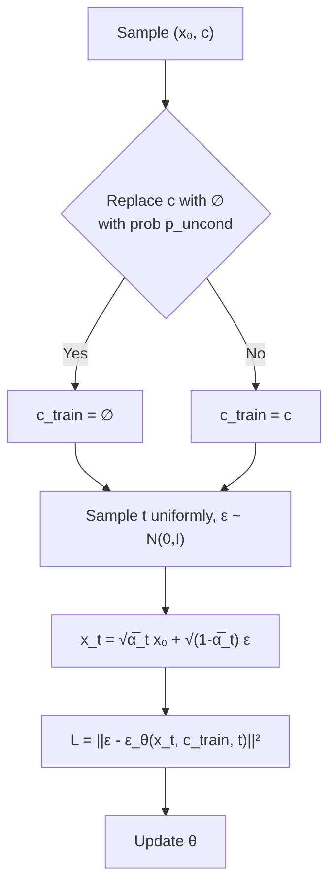

In the previous post, we showed that noise prediction in DDPM is essentially equivalent to score matching. Until now, we have only dealt with unconditional diffusion models, but conditional generation is necessary to control the data being generated.


## Review of Score Function and Noise Prediction

Here, we briefly review the relationships needed for the following discussion.

For the conditional distribution of the diffusion process $$q(\boldsymbol{x}_t \mid \boldsymbol{x}_0) = \mathcal{N}(\boldsymbol{x}_t; \sqrt{\bar{\alpha}_t}\boldsymbol{x}_0, (1-\bar{\alpha}_t)\boldsymbol{I})$$, the score function was computed as follows:

$$ \nabla_{\boldsymbol{x}_t} \log q(\boldsymbol{x}_t \mid \boldsymbol{x}_0) = -\frac{\boldsymbol{\epsilon}}{\sqrt{1-\bar{\alpha}_t}} $$

Here, $$\boldsymbol{\epsilon}$$ is the standard normal noise in $$\boldsymbol{x}_t = \sqrt{\bar{\alpha}_t}\boldsymbol{x}_0 + \sqrt{1-\bar{\alpha}_t}\boldsymbol{\epsilon}$$. The following relationship holds between DDPM's noise prediction network $$\boldsymbol{\epsilon}_{\boldsymbol{\theta}}(\boldsymbol{x}_t, t)$$ and the score model $$\boldsymbol{s}_{\boldsymbol{\theta}}(\boldsymbol{x}_t, t)$$:

$$\boldsymbol{s}_{\boldsymbol{\theta}}(\boldsymbol{x}_t, t) = -\frac{\boldsymbol{\epsilon}_{\boldsymbol{\theta}}(\boldsymbol{x}_t, t)}{\sqrt{1-\bar{\alpha}_t}}$$

In other words, since noise $$\boldsymbol{\epsilon}$$ and the score function (gradient of log probability density) differ only by a constant factor, predicting them is mathematically equivalent. This relationship is


## 1. Conditional Diffusion Models

In the discussion so far, we have dealt with the data distribution $$p(\boldsymbol{x})$$. However, in practical applications, conditional generation is required, such as when we want to generate images of a specific class (e.g., dogs or cats), or when we want to generate images corresponding to text. When condition $$c$$ is given, the goal is to sample from the conditional distribution $$p(\boldsymbol{x} \mid c)$$.

The score function of the conditional distribution is defined as follows:

$$ \nabla_{\boldsymbol{x}_t} \log p(\boldsymbol{x}_t \mid c) $$


### Derivation of Conditional Score

Using Bayes' theorem, we decompose the conditional log-likelihood:

$$ p(\boldsymbol{x}_t \mid c) = \frac{p(c \mid \boldsymbol{x}_t) \cdot p(\boldsymbol{x}_t)}{p(c)} $$

Taking the logarithm of both sides:

$$ \log p(\boldsymbol{x}_t \mid c) = \log p(c \mid \boldsymbol{x}_t) + \log p(\boldsymbol{x}_t) - \log p(c) $$

When considering the gradient with respect to $$\boldsymbol{x}_t$$, $$\log p(c)$$ does not depend on $$\boldsymbol{x}_t$$ and can be eliminated:

$$ \nabla_{\boldsymbol{x}_t} \log p(\boldsymbol{x}_t \mid c) = \nabla_{\boldsymbol{x}_t} \log p(c \mid \boldsymbol{x}_t) + \nabla_{\boldsymbol{x}_t} \log p(\boldsymbol{x}_t) $$

Thus, the conditional score can be decomposed as follows:

$$
\underbrace{\nabla_{\boldsymbol{x}_t} \log p(\boldsymbol{x}_t \mid c)}_{\text{conditional score}} = \underbrace{\nabla_{\boldsymbol{x}_t} \log p(\boldsymbol{x}_t)}_{\text{unconditional score}} + \underbrace{\nabla_{\boldsymbol{x}_t} \log p(c \mid \boldsymbol{x}_t)}_{\text{classifier gradient}}
\tag{1}
$$

From this result, conditional generation can be expressed as a combination of an "unconditional generative model" and a "classifier". The unconditional score can be modeled as before, and the classifier can be a separately trained network.


## 2. Classifier Guidance

Dhariwal & Nichol (2021) [^1] proposed a method to achieve conditional generation by adding the classifier gradient to the score, based on the decomposition in Equation (1).

Specifically, a guidance strength parameter $$w$$ is introduced for the conditional score to determine the contribution of the classifier:

$$
\nabla_{\boldsymbol{x}_t} \log p_w(\boldsymbol{x}_t \mid c) = \nabla_{\boldsymbol{x}_t} \log p(\boldsymbol{x}_t) + (1 + w) \nabla_{\boldsymbol{x}_t} \log p(c \mid \boldsymbol{x}_t)
\tag{2}
$$

Here, when $$w = 0$$, this coincides with the standard conditional score. When $$w > 0$$, the score is adjusted in a direction that emphasizes the classifier's prediction probability for condition $$c$$.


### 2.1 Conversion to Noise Prediction

Using the relationship between score and noise prediction $$\boldsymbol{s}_{\boldsymbol{\theta}}(\boldsymbol{x}_t, t) = -\frac{\boldsymbol{\epsilon}_{\boldsymbol{\theta}}(\boldsymbol{x}_t, t)}{\sqrt{1-\bar{\alpha}_t}}$$, the guided noise prediction can be written as:


$$
 \tilde{\boldsymbol{\epsilon}}_{\boldsymbol{\theta}}(\boldsymbol{x}_t, c, t) = \boldsymbol{\epsilon}_{\boldsymbol{\theta}}(\boldsymbol{x}_t, t) - (1+w)\sqrt{1-\bar{\alpha}_t} \nabla_{\boldsymbol{x}_t} \log p_{\boldsymbol{\phi}}(c \mid \boldsymbol{x}_t)
 $$

Here, $$p_{\boldsymbol{\phi}}(c \mid \boldsymbol{x}_t)$$ is a classifier separately trained to classify class $$c$$ from the noisy image $$\boldsymbol{x}_t$$.


### 2.2 Challenges of Classifier Guidance

A challenge of Classifier Guidance is that it requires training a classifier $$p_{\boldsymbol{\phi}}(c \mid \boldsymbol{x}_t)$$ for noisy data separately from the diffusion model. Since a classifier is needed that can predict classes from images with noise at various timesteps $$t$$, existing classifiers trained on clean images cannot be used directly.


## 3. Classifier-Free Guidance

Ho & Salimans (2021) [^2] proposed Classifier-Free Guidance (CFG), a method that achieves conditional generation without using a classifier.

### 3.1 Derivation of Conditional Score

We transform Equation (1) to express the classifier gradient using only the generative model. Taking the logarithm of Bayes' theorem $$p(c \mid \boldsymbol{x}_t) = \frac{p(\boldsymbol{x}_t \mid c) p(c)}{p(\boldsymbol{x}_t)}$$ and differentiating with respect to $$\boldsymbol{x}_t$$, $$\log p(c)$$ is eliminated:

$$ \nabla_{\boldsymbol{x}_t} \log p(c \mid \boldsymbol{x}_t) = \nabla_{\boldsymbol{x}_t} \log p(\boldsymbol{x}_t \mid c) - \nabla_{\boldsymbol{x}_t} \log p(\boldsymbol{x}_t) $$

In other words, the classifier gradient can be expressed as the difference between the conditional score and the unconditional score:

$$
\nabla_{\boldsymbol{x}_t} \log p(c \mid \boldsymbol{x}_t) = \underbrace{\nabla_{\boldsymbol{x}_t} \log p(\boldsymbol{x}_t \mid c)}_{\text{conditional score}} - \underbrace{\nabla_{\boldsymbol{x}_t} \log p(\boldsymbol{x}_t)}_{\text{unconditional score}}
\tag{3}
$$


Substituting Equation (3) into the Classifier Guidance equation (2):

$$
\nabla_{\boldsymbol{x}_t} \log p_w(\boldsymbol{x}_t \mid c) = \nabla_{\boldsymbol{x}_t} \log p(\boldsymbol{x}_t) + (1+w)\left[\nabla_{\boldsymbol{x}_t} \log p(\boldsymbol{x}_t \mid c) - \nabla_{\boldsymbol{x}_t} \log p(\boldsymbol{x}_t)\right]
\tag{4}
$$

Simplifying:

$$
\nabla_{\boldsymbol{x}_t} \log p_w(\boldsymbol{x}_t \mid c) = (1+w) \nabla_{\boldsymbol{x}_t} \log p(\boldsymbol{x}_t \mid c) - w \nabla_{\boldsymbol{x}_t} \log p(\boldsymbol{x}_t)
\tag{5}
$$

We have expressed the guidance score as a linear combination of the conditional score and the unconditional score, without using the classifier gradient.

Rewriting in terms of noise prediction:

$$
\tilde{\boldsymbol{\epsilon}}_{\boldsymbol{\theta}}(\boldsymbol{x}_t, c, t) = (1+w) \boldsymbol{\epsilon}_{\boldsymbol{\theta}}(\boldsymbol{x}_t, c, t) - w \boldsymbol{\epsilon}_{\boldsymbol{\theta}}(\boldsymbol{x}_t, t)
\tag{6}
$$

Where:

Conditional noise prediction: $$\boldsymbol{\epsilon}_{\boldsymbol{\theta}}(\boldsymbol{x}_t, c, t)$$

Unconditional noise prediction: $$\boldsymbol{\epsilon}_{\boldsymbol{\theta}}(\boldsymbol{x}_t, t)$$

Guidance scale: $$w$$


{: .prompt-tip }
> In Equation (4), for simplicity, if we denote the unconditional score gradient as $$\vec{a}$$ and the conditional score gradient as $$\vec{b}$$, it can be written as $$\vec{a} + (1+w)(\vec{b} - \vec{a})$$. This is an operation of scaling the vector $$\vec{b} - \vec{a}$$ from the unconditional score to the conditional score by $$(1+w)$$ and adding it to the unconditional score. In other words, this can be interpreted as adjusting the strength of conditional generation from the unconditional score toward the conditional score direction.


### 3.2 Training

To use Equation (6) at inference time, both conditional and unconditional noise are needed. While using two separate networks is one approach, Ho & Salimans [^2] proposed a method to train both using a single network by replacing condition $$c$$ with an empty token $$\varnothing$$ with probability $$p_{\text{uncond}}$$ during training.

$$
c_{\text{train}} = \begin{cases} c & \text{with probability } 1 - p_{\text{uncond}} \\ \varnothing & \text{with probability } p_{\text{uncond}} \end{cases}
$$


In other words, during training, a single network is trained as follows:


- Conditional score: $$\boldsymbol{\epsilon}_{\boldsymbol{\theta}}(\boldsymbol{x}_t, c, t) \approx -\sqrt{1-\bar{\alpha}_t} \nabla_{\boldsymbol{x}_t} \log p(\boldsymbol{x}_t \mid c)$$ (when condition $$c$$ is input)
- Unconditional score: $$\boldsymbol{\epsilon}_{\boldsymbol{\theta}}(\boldsymbol{x}_t, \varnothing, t) \approx -\sqrt{1-\bar{\alpha}_t} \nabla_{\boldsymbol{x}_t} \log p(\boldsymbol{x}_t)$$ (when empty token $$\varnothing$$ is input)

At inference time, we simply compute both noise predictions according to Equation (6) and take their linear combination.

```
Training Algorithm (Classifier-Free Guidance):
    1. Sample (x_0, c) from dataset
    2. Replace c with ∅ with probability p_uncond
    3. Sample t uniformly from {1, ..., T}
    4. Sample ε ~ N(0, I)
    5. Compute x_t = √(α̅_t) x_0 + √(1 - α̅_t) ε
    6. Compute loss L = ||ε - ε_θ(x_t, c_train, t)||²
    7. Update parameters θ with ∇_θ L
```



```
Sampling Algorithm (Classifier-Free Guidance):
    1. x_T ~ N(0, I)
    2. For t = T, T-1, ..., 1:
        a. Compute ε_cond = ε_θ(x_t, c, t)
        b. Compute ε_uncond = ε_θ(x_t, ∅, t)
        c. ε̃ = (1+w) ε_cond - w ε_uncond
        d. Compute x_{t-1} using ε̃
    3. Return x_0
```


### 3.3 Comparison: Classifier Guidance vs Classifier-Free Guidance

| | Classifier Guidance | Classifier-Free Guidance |
|---|---|---|
| Additional Model | Noise-aware classifier required | Not required |
| Training | Train diffusion model + classifier separately | Train with a single network |
| Inference | 1 forward pass + classifier gradient computation | 2 forward passes (conditional + unconditional) |


### 3.4 Challenges of Classifier-Free Guidance

Subsequent research has identified the following challenges with Classifier-Free Guidance (CFG):

1. Inference cost: Two forward passes (conditional and unconditional) are required at each denoising step, resulting in high computational cost.
2. Reduced training efficiency: Randomly dropping labels to simultaneously train the unconditional model reduces the effective number of samples available for the main task of conditional generation training.


## 4. Model-Guidance

Intuitively, it seems like training without the unconditional score should somehow be possible. After some research, I found a method called Model-guidance (MG) proposed by Tang _et al_. (2025) [^3]. It hasn't been cited much, but I skimmed through it and will introduce it here.

For the problem that CFG requires two forward passes at inference time, MG improves this by requiring only one forward pass at inference time, demonstrating improved inference speed.

### Implicit Classifier

Let's recall the score for Classifier Guidance:

$$
\nabla_{\boldsymbol{x}_t} \log p_w(\boldsymbol{x}_t \mid c) = \nabla_{\boldsymbol{x}_t} \log p(\boldsymbol{x}_t \mid c) + w \nabla_{\boldsymbol{x}_t} \log p(c \mid \boldsymbol{x}_t)
$$


MG uses the diffusion model itself as an implicit classifier. It estimates the classifier gradient implicitly from the trained conditional model $$\boldsymbol{\epsilon}_{\boldsymbol{\theta}}(\boldsymbol{x}_t, c, t)$$ and unconditional model $$\boldsymbol{\epsilon}_{\boldsymbol{\theta}}(\boldsymbol{x}_t, \varnothing, t)$$, and incorporates this into the training target.

Specifically, the target noise $$\boldsymbol{\epsilon}'$$ during training is modified as follows:

$$
\boldsymbol{\epsilon}' = \boldsymbol{\epsilon} + w \cdot \text{sg}\left(\boldsymbol{\epsilon}_{\boldsymbol{\theta}}(\boldsymbol{x}_t, c, t) - \boldsymbol{\epsilon}_{\boldsymbol{\theta}}(\boldsymbol{x}_t, \varnothing, t)\right)
\tag{7}
$$

Here, $$\text{sg}(\cdot)$$ is the stop-gradient operator, which blocks gradient propagation. The term $$\boldsymbol{\epsilon}_{\boldsymbol{\theta}}(\boldsymbol{x}_t, c, t) - \boldsymbol{\epsilon}_{\boldsymbol{\theta}}(\boldsymbol{x}_t, \varnothing, t)$$ has the same form as the difference between conditional and unconditional noise predictions computed at inference time in CFG's Equation (6).


Let's recall Equation (3) from CFG. This equation shows that the difference between conditional and unconditional scores is the classifier score:

$$
\nabla_{\boldsymbol{x}_t} \log p(c \mid \boldsymbol{x}_t) = \underbrace{\nabla_{\boldsymbol{x}_t} \log p(\boldsymbol{x}_t \mid c)}_{\text{conditional score}} - \underbrace{\nabla_{\boldsymbol{x}_t} \log p(\boldsymbol{x}_t)}_{\text{unconditional score}}
\tag{3}
$$


Equation (7) is the difference between conditional and unconditional noise, but using the relationship between score and noise prediction $$\boldsymbol{s}_{\boldsymbol{\theta}}(\boldsymbol{x}_t, t) = -\frac{\boldsymbol{\epsilon}_{\boldsymbol{\theta}}(\boldsymbol{x}_t, t)}{\sqrt{1-\bar{\alpha}_t}}$$, we can see it corresponds to Equation (3). From this, Equation (7) can be interpreted as adding the implicit classifier gradient to the target.


In CFG, conditional and unconditional noise were computed separately during training, but at inference time, the classifier gradient was implicitly utilized in this way. The CFG paper also mentioned the implicit classifier, but the textbook I was initially using for study didn't cover it, and I only learned about it after reading the MG paper.


The loss function is designed to bring the noise prediction network closer to the above target noise:

$$
L_{\text{MG}} = \mathbb{E}_{t, (\boldsymbol{x}_0, c), \boldsymbol{\epsilon}} \left[ \|\boldsymbol{\epsilon}_{\boldsymbol{\theta}}(\boldsymbol{x}_t, c, t) - \boldsymbol{\epsilon}'\|^2 \right]
$$

### 4.4 Advantages of MG

MG has the following advantages:

- 2x inference speed: At inference time, only one forward pass of the conditional model is needed. Unlike CFG, computation of the unconditional model is not required.
- Faster training: The paper reports a convergence speed improvement of over 6.5x compared to diffusion models using CFG.

### 5. Summary

Summarizing the development of conditional diffusion models so far:

```
Unconditional Diffusion Models
    ↓ Demand for conditional generation
Derivation of Conditional Score (Bayes' Theorem)
    ↓
Classifier Guidance [Dhariwal & Nichol, 2021]
(Uses external classifier gradient, requires additional model)
    ↓
Classifier-Free Guidance [Ho & Salimans, 2021]
(Jointly trains conditional/unconditional via label dropout, 2 forward passes at inference)
    ↓
Model-Guidance [Tang et al., 2025]
(Incorporates CFG effect during training, 1 forward pass at inference)
```


## Reference

[^1]: Dhariwal, Prafulla, and Alexander Nichol. "Diffusion models beat gans on image synthesis." _Advances in neural information processing systems_ 34 (2021): 8780-8794.

[^2]: Ho, Jonathan, and Tim Salimans. "Classifier-Free Diffusion Guidance." _NeurIPS 2021 Workshop on Deep Generative Models and Downstream Applications_.

[^3]: Tang, Zhicong, et al. "Diffusion models without classifier-free guidance." _arXiv preprint_ arXiv:2502.12154 (2025).
